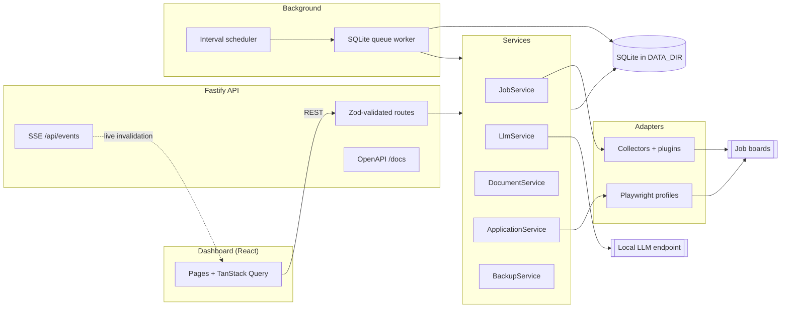

# Deedy Automation

**An autonomous, fully-local AI job search and application platform.**

Deedy Automation continuously collects job postings, de-duplicates and stores them in SQLite,
scores them with a **local** LLM, tailors a resume and cover letter for the ones worth pursuing,
then drives a real browser through the application flow - capturing a screenshot, an HTML snapshot
and a step-by-step audit trail for every attempt. Everything runs on your machine.

---

## The local-first guarantee

- **No cloud AI.** Inference goes to an endpoint *you* configure - Ollama, llama.cpp's server,
  LM Studio, or any OpenAI-compatible local server (`packages/shared/src/enums.ts` →
  `LLM_PROVIDERS`). There is no hosted-API fallback anywhere in the codebase.
- **No model names are hardcoded.** The model is empty by default and must be chosen in
  **Settings**; the app lists whatever your endpoint reports via `GET /api/settings/llm/models`.
- **No telemetry, no analytics, no CDNs.** The dashboard is compiled into the API image and served
  from `/`. Fonts, styles and scripts are all bundled locally.
- **Your data never leaves `DATA_DIR`.** SQLite database, browser profiles, screenshots, generated
  PDFs/DOCX and backups all live under one directory you bind-mount.
- **Secrets are encrypted at rest.** A 32-byte key is generated into `DATA_DIR/.encryption-key`
  (mode `0600`) on first boot and used to encrypt the settings marked secret in
  `SECRET_SETTING_PATHS` (`llm.apiKey`, `notifications.webhookUrl`). Those values are masked in the
  API response and in every log line.
- The **only** outbound network traffic is to the job boards you enable, and to the LLM endpoint you
  point at.

---

## Table of contents

- [Features](#features)
- [Architecture at a glance](#architecture-at-a-glance)
- [Quick start](#quick-start)
- [First-run checklist](#first-run-checklist)
- [URL map](#url-map)
- [Configuration](#configuration)
- [Model choice and performance](#model-choice-and-performance)
- [Data directory layout](#data-directory-layout)
- [Development](#development)
- [Testing](#testing)
- [Documentation](#documentation)
- [Safety and ethics](#safety-and-ethics)
- [License](#license)

---

## Features

Every row below maps to code that exists in this repository.

### Job collection

| Capability | Where it lives |
| --- | --- |
| Greenhouse, Lever, Ashby, SmartRecruiters, Workday and LinkedIn collectors | `apps/api/src/collectors/*.collector.ts` |
| Normalisation into a single job shape (title, company, location, salary, remote type, employment type, experience level, description, skills, apply URL, source, posted date, content hash) | `apps/api/src/collectors/normalize.ts` |
| Duplicate suppression on canonical apply URL and a stable source/company/title/location hash, both enforced by unique indexes | `apps/api/src/repositories/job.repository.ts` |
| Per-run bookkeeping (found / inserted / duplicates / errors) surfaced at `GET /api/collectors/runs` | `apps/api/src/repositories/browser.repository.ts` |
| Third-party collectors dropped into `DATA_DIR/plugins` as `*.collector.js` and loaded at boot, with no core changes | `apps/api/src/collectors/registry.ts` |

### Local LLM

| Capability | Where it lives |
| --- | --- |
| Native Ollama client (`/api/chat`, with `format` schema constraining) | `apps/api/src/services/llm/providers.ts` |
| OpenAI-compatible client (`/v1/chat/completions`, `response_format: json_schema`) covering llama.cpp, LM Studio and local OpenRouter-style proxies | same file |
| Eleven task types: skill extraction, job classification, resume tailoring, cover letter, ATS keywords, application scoring, interview prediction, job summary, company summary, salary extraction, form answering | `LLM_TASKS` in `packages/shared/src/enums.ts` |
| Every call validated against a Zod-derived JSON schema, with retries and repair on malformed output | `apps/api/src/services/llm/llm.service.ts` |
| Editable prompt templates with versions and an active flag (`/api/prompts`) | `apps/api/src/services/llm/prompts.ts`, `observability.routes.ts` |
| Full call log: prompt, response, token counts, duration, error - visible on the **LLM Activity** page | `apps/api/src/repositories/observability.repository.ts` |

### Scoring and documents

| Capability | Where it lives |
| --- | --- |
| 0-100 score with matched skills, missing skills, confidence, reasoning and an `apply` / `skip` / `manual_review` recommendation | `apps/api/src/services/job.service.ts`, `job_scores` table |
| Multiple resume versions, each with Markdown source plus rendered PDF and DOCX | `apps/api/src/services/resume.service.ts`, `document.service.ts` |
| Job-specific tailored resume versions (`POST /api/resumes/:id/tailor`) | `documents.routes.ts` |
| Cover letter generation, regeneration and full version history | `CoverLetterService` |
| PDF rendered through headless Chromium, DOCX through the `docx` library - both offline | `apps/api/src/services/document.service.ts` |

### Browser automation

| Capability | Where it lives |
| --- | --- |
| Playwright with Chromium, Chrome or Firefox, selectable in Settings | `apps/api/src/browser/browser.manager.ts` |
| Persistent per-provider profiles plus a saved `storage-state.json`, so you sign in to LinkedIn once | same file |
| Two appliers: a single-page form applier and a multi-step wizard applier | `apps/api/src/browser/appliers/` |
| Heuristic form filling from your profile settings, with an LLM fallback for unknown questions and a reusable answer bank | `apps/api/src/browser/form.filler.ts`, `answer_bank` table |
| Resumable pipeline steps: `login → navigate → read_description → start_application → upload_resume → upload_cover_letter → fill_form → answer_questions → review → submit → confirm` | `APPLICATION_STEPS` in `packages/shared/src/enums.ts` |
| Screenshot and HTML snapshot per step, stored as artifacts and browsable from the dashboard | `artifacts` table, `GET /api/artifacts/screenshots` |
| **Dry run** (default **on**): everything is prepared, submit is never clicked | `browser.dryRun` in `packages/shared/src/settings.ts` |
| `pauseOnUnknownQuestion` escalates to a `needs_human` application instead of guessing | `apps/api/src/services/application.service.ts` |

### Queue, scheduler and persistence

| Capability | Where it lives |
| --- | --- |
| SQLite-backed persistent queue with priorities, dedupe keys, exponential backoff and per-attempt history | `apps/api/src/queue/`, `queue_jobs` + `queue_attempts` tables |
| Nine task types (`collect.jobs`, `job.score`, `job.enrich`, `resume.tailor`, `cover_letter.generate`, `application.apply`, `company.summarize`, `maintenance.cleanup`, `maintenance.backup`) | `QUEUE_TASKS` in `packages/shared/src/enums.ts` |
| Crash recovery on boot: stalled queue jobs are reclaimed and half-finished applications re-queued | `apps/api/src/index.ts` |
| Interval scheduler with persisted next-run times, so a restart resumes the cadence | `apps/api/src/scheduler/scheduler.ts` |
| Scheduled tasks: `collect`, `score`, `apply`, `cleanup`, `backup` - each runnable on demand via `POST /api/scheduler/:name/run` | same file |
| Online SQLite backups with retention pruning | `apps/api/src/services/backup.service.ts` |
| Structured logs written to SQLite and searchable by level, scope and text | `apps/api/src/core/logger.ts`, `logs` table |

### Dashboard and API

| Capability | Where it lives |
| --- | --- |
| React + Vite + Tailwind dashboard: Overview, Jobs, Applications, Resumes, Cover Letters, Queue, Browser Sessions, LLM Activity, Logs, Analytics, Settings | `apps/web/src/pages/` |
| Live updates over Server-Sent Events (`GET /api/events`) driving TanStack Query invalidation | `apps/web/src/lib/events.ts` |
| Recharts analytics: application funnel, daily volume, source distribution, score distribution, top companies and skills, LLM token usage | `apps/web/src/pages/Analytics.tsx`, `analytics.repository.ts` |
| OpenAPI 3.1 generated from the same Zod schemas that validate requests, browsable at `/docs` | `apps/api/src/api/server.ts` |
| Optional local webhook notifications (e.g. an ntfy or gotify container on the same host) | `apps/api/src/services/notification.service.ts` |

---

## Architecture at a glance



The composition root is `apps/api/src/core/container.ts`: repositories, services, browser, queue and
scheduler are constructed once and injected downward. Nothing reaches into another module's graph.

---

## Quick start

**Requirements:** Docker with Compose v2. Nothing else - Node, Playwright browsers and the
dashboard build all happen inside the image.

```bash
git clone <your-fork-or-path> deedy-automation
cd deedy-automation
docker compose up -d --build
```

Open **<http://localhost:8080>**.

The container creates its schema on first boot (migrations run inside `createContainer`), generates
its encryption key, and starts the queue worker and scheduler. State lives in the `deedy-data`
Docker volume mounted at `/data`.

### Optional: run Ollama alongside it

The compose file ships an `ollama` service behind the `llm` profile:

```bash
docker compose --profile llm up -d --build
docker exec -it deedy-ollama ollama pull qwen3:8b   # or gemma3, llama3.1, deepseek-r1, ...
```

Then, in **Settings → Local LLM**, set the base URL to **`http://ollama:11434`** (the app container
reaches the Ollama container by service name) and pick the model you pulled.

If you already run Ollama or LM Studio **on the host**, skip the profile and use
**`http://host.docker.internal:11434`** instead - the app service declares that host alias.

### Useful commands

```bash
docker compose logs -f app          # follow logs
docker compose ps                   # container + health status
docker compose restart app          # restart the API
docker compose down                 # stop (volumes, and therefore your data, survive)
docker compose down -v              # stop AND delete all data
```

---

## First-run checklist

Work through these in order. The app is deliberately inert until it has a model and a resume.

1. **Choose an LLM model.** Settings → **Local LLM**. Set the provider and base URL, test the
   endpoint (`POST /api/settings/llm/test`), then pick a model from the discovered list. The `model`
   field is empty out of the box on purpose - nothing is hardcoded. Optionally set a smaller
   `fastModel` for cheap classification work.
2. **Add a base resume.** Resume Manager → **New resume**. Paste your resume as Markdown; the app renders the PDF and
   DOCX immediately and every tailored version is derived from it. Set it as the default in
   Settings → **Applications** (`defaultResumeId`).
3. **Fill in your profile.** Settings → **Candidate profile**. Name, email, phone, location, work
   authorisation, notice period and links are what the form filler uses before it ever asks the LLM.
4. **Configure boards and keywords.** Settings → **Search**. Add `keywords`, `locations`, remote and
   experience preferences, and the company slugs per board under `boards`, for example
   `greenhouse: ["stripe", "figma"]`. Board-based collectors stay idle until you list companies for
   them. The same tab has the **Enabled collectors** list.
5. **Sign in to LinkedIn once.** Browser Sessions → the **Attended browser** panel. Press **Open
   browser**, then **Sign in** next to LinkedIn, and complete the login — password and 2FA included —
   in the browser window itself. Press **Re-check** and it should read *signed in*.

   In Docker that window is drawn on a virtual screen inside the container and streamed into the
   **Live screen** in that same panel, so you do this without leaving the dashboard; on a bare-metal
   install it simply opens on your own desktop. Either way the application never sees, types or
   stores your password — only the resulting session, in the persistent profile under
   `DATA_DIR/browser-profiles`. Do it once and you never log in again.

   This replaces the old export-your-cookies-and-paste-them flow, which is still available further
   down the same page for headless installs. See
   [Attended browsing in the container](docs/deployment.md#attended-browsing-in-the-container) for
   the moving parts and the security note on port 6080.
6. **Keep dry run ON until you trust it.** `browser.dryRun` defaults to `true`: the full pipeline
   runs, documents are generated, forms are filled, screenshots are taken - and submit is never
   clicked. Read a few prepared applications end to end. Only then consider Settings →
   **Applications** → `autoApply`, and start with a low `maxApplicationsPerDay`.

Optional: `npm run db:seed` loads the built-in prompt templates as editable rows and a starter
answer bank. It is idempotent. Run it from a source checkout (see [Development](#development)) - the
runtime image ships only the compiled `dist/`, so the `tsx`-based seed and migrate scripts are not
runnable inside the production container.

---

## URL map

| URL | What it is |
| --- | --- |
| <http://localhost:8080/> | Dashboard (Overview). Client-side routes: `/jobs`, `/applications`, `/resumes`, `/cover-letters`, `/queue`, `/browser`, `/llm`, `/logs`, `/analytics`, `/settings` |
| <http://localhost:8080/docs> | Interactive OpenAPI 3.1 reference (Scalar) |
| <http://localhost:8080/api/health> | Full health: database, LLM reachability, queue depth, scheduler state |
| <http://localhost:8080/api/health/live> | Process liveness probe used by the Docker healthcheck |
| <http://localhost:8080/api/events> | Server-Sent Events stream powering live dashboard updates |

Everything under `/api` is documented at `/docs` - the spec is generated from the same Zod schemas
that validate the requests, so it cannot drift.

---

## Configuration

### Application environment variables

All of these are parsed and defaulted in `apps/api/src/config/env.ts`.

| Variable | Type | Default | Purpose |
| --- | --- | --- | --- |
| `NODE_ENV` | `development` \| `production` \| `test` | `production` | Standard Node environment flag. |
| `HOST` | string | `0.0.0.0` | Bind address for the HTTP server. |
| `PORT` | integer 1-65535 | `8080` | Port the API and dashboard listen on. |
| `DATA_DIR` | path | `./data` | Root for **every** piece of persisted state. This is the directory to bind-mount and back up. |
| `LOG_LEVEL` | `trace` \| `debug` \| `info` \| `warn` \| `error` \| `fatal` | `info` | Minimum level for stdout and the SQLite `logs` table. |
| `WEB_DIR` | path | `./public` | Directory holding the compiled dashboard, served at `/`. If it has no `index.html` the process runs API-only and logs a warning. |
| `CORS_ORIGINS` | comma-separated origins | `http://localhost:5173` | Allowed browser origins. Only needed when the Vite dev server is on a different port. |
| `DISABLE_WORKERS` | `true` \| `1` to disable | `false` | Skips the queue worker and scheduler. Used by the test suite and for API-only runs. |
| `ENCRYPTION_KEY` | 64 hex chars (32 bytes) | generated | Key for encrypting secret settings. If unset, a key is generated into `DATA_DIR/.encryption-key` on first boot. Supplying a wrong-length value is a hard startup error. |

Generate a stable key if you would rather manage it yourself:

```bash
openssl rand -hex 32
```

### Compose-level variables

`docker-compose.yml` reads these from your shell or a root `.env` file (which is git-ignored):

| Variable | Default | Effect |
| --- | --- | --- |
| `APP_PORT` | `8080` | Host port mapped to the app container's `8080`. |
| `OLLAMA_PORT` | `11434` | Host port mapped to the Ollama container (`llm` profile only). |
| `LOG_LEVEL` | `info` | Passed straight through to the app. |
| `CORS_ORIGINS` | `http://localhost:5173` | Passed straight through to the app. |
| `ENCRYPTION_KEY` | empty | Passed through; empty means "generate and store in the volume". |

### Runtime settings

Everything else - LLM parameters, browser engine and timeouts, search filters, application limits,
queue concurrency, scheduler intervals, notifications and your profile - is **runtime** configuration
stored in SQLite, edited in the dashboard, and defined by the Zod schemas in
`packages/shared/src/settings.ts`. It is not environment configuration, and it survives restarts and
image rebuilds.

---

## Model choice and performance

Inference speed dominates everything else in this system. A single job goes
through four to six LLM calls (skill extraction, classification, salary,
summary, scoring, interview prediction), so throughput is roughly
`jobs per hour = 3600 / (calls x seconds per call)`.

**Use a GPU if you have one.** Measured on this project with `qwen3:4b`:

| Setup | Seconds per call | Notes |
| --- | --- | --- |
| CPU only | 100-300 | Usable, but expect minutes per job |
| GPU (CUDA/ROCm) | 2-15 | Comfortable for continuous operation |

Check what Ollama picked up:

```bash
docker compose logs ollama | grep "inference compute"
# library=cpu   -> CPU only
# library=cuda  -> GPU in use
```

To give the bundled Ollama a GPU, add a `deploy.resources.reservations.devices`
block to the `ollama` service in `docker-compose.yml`, or point
Settings -> Local LLM at an inference server running on the host
(`http://host.docker.internal:11434`).

### Disable model thinking

Reasoning models (Qwen 3, DeepSeek-R1) emit a chain-of-thought before
answering. These tasks want structured JSON, not deliberation, and on CPU that
thinking block is the single largest cost. Measured on `qwen3:4b`, same prompt,
same schema-constrained output:

| Thinking | Wall time | Output |
| --- | --- | --- |
| Enabled | 180 s | identical |
| Disabled | 4 s | identical |

`Settings -> Local LLM -> Disable model thinking` is **on by default** for this
reason. Turn it off only if you are deliberately comparing reasoning quality.

### Structured outputs and grammar limits

With **Use structured outputs** on, the JSON Schema is sent to the server so it
can constrain decoding. Grammar-based samplers (llama.cpp, and therefore Ollama
and LM Studio) cannot compile string length bounds - a `maxLength` of a few
thousand expands into an enormous grammar and the server answers
`failed to parse grammar`. The app therefore strips `minLength`, `maxLength`,
`pattern` and `format` from the schema it sends. Nothing is actually relaxed:
Zod still validates every response against the full schema, and a violation
triggers a retry with corrective feedback.

If your server rejects the schema entirely, turn **Use structured outputs** off.
The app falls back to prompt-only JSON, which the extractor and Zod validation
still handle.

## Data directory layout

Created and owned by `loadConfig()`. Everything below is relative to `DATA_DIR` (`/data` in Docker).

| Path | Contents |
| --- | --- |
| `deedy.sqlite` | The entire database: jobs, scores, applications, resumes, cover letters, queue, logs, LLM calls, prompts, sessions, settings. |
| `.encryption-key` | 32-byte hex key, mode `0600`. Losing it means encrypted settings must be re-entered. |
| `artifacts/screenshots/` | Per-step PNG screenshots from the browser pipeline. |
| `artifacts/html/` | Per-step HTML snapshots. |
| `documents/resumes/` | Resume Markdown, PDF and DOCX for every version. |
| `documents/cover-letters/` | Generated cover letters, all versions kept. |
| `browser-profiles/` | One persistent Playwright profile per provider, plus `storage-state.json`. **Contains live session cookies - treat as a secret.** |
| `backups/` | `deedy-<timestamp>.sqlite` online backups, pruned to `scheduler.backupsToKeep`. |
| `plugins/` | Drop-in `*.collector.js` / `*.collector.mjs` modules, loaded at boot. |

Back it up by copying the whole directory, or by taking a consistent snapshot with
`POST /api/backups` and copying out of `backups/`.

---

## Development

The dev stack bind-mounts the repository and runs the API and the Vite dev server with hot reload:

```bash
docker compose -f docker-compose.dev.yml up
```

- API: <http://localhost:8080> (tsx watch, `LOG_LEVEL=debug`, data in the `dev-data` volume)
- Dashboard: <http://localhost:5173> (Vite, proxying to the API via `VITE_API_URL`)

Playwright browsers are installed into a cached `playwright-browsers` volume on first start, so the
initial boot takes a few minutes.

### Working on the host

If you prefer running outside Docker - which is also the easiest way to do the one-time LinkedIn
login with a visible browser - you need **Node >= 22** and the Playwright browsers:

```bash
npm install
npx playwright install chromium firefox
npm run build -w @deedy/shared
npm run dev                     # concurrently runs @deedy/api and @deedy/web
```

### Root scripts

| Command | What it does |
| --- | --- |
| `npm run build` | Builds `@deedy/shared`, then `@deedy/api`, then `@deedy/web`. |
| `npm run dev` | Runs the API and the dashboard dev servers side by side. |
| `npm start` | Runs the compiled API (`apps/api/dist/index.js`). |
| `npm run typecheck` | `tsc --noEmit` across every workspace. |
| `npm run lint` / `npm run lint:fix` | ESLint over the monorepo. `any` is an error. |
| `npm run format` / `npm run format:check` | Prettier. |
| `npm run db:migrate` | Applies migrations via the CLI (they also run automatically at boot). |
| `npm run db:seed` | Idempotent seed: default settings, prompt templates, starter answer bank. |

The root `package.json` also declares `db:generate`, but it forwards to a `db:generate` script that
`apps/api` does not define and there is no `drizzle.config.ts` in the repository. Drizzle Kit is
installed but unused: migrations are hand-written SQL under `apps/api/migrations`.

Workspaces are `packages/shared` (`@deedy/shared`), `apps/api` (`@deedy/api`) and `apps/web`
(`@deedy/web`). `@deedy/shared` holds every enum, DTO and settings schema and must be built before
the others.

---

## Testing

```bash
npm test          # Vitest: unit + integration (apps/api)
npm run test:e2e  # Playwright dashboard E2E (apps/web)
```

- **Unit** (`apps/api/tests/unit/`): collector normalisation and de-duplication, core utilities,
  LLM JSON parsing and repair.
- **Integration** (`apps/api/tests/integration/`): the HTTP API against a real temporary SQLite
  database, repositories, the queue worker's retry and backoff behaviour, settings encryption and
  masking, the form filler, and the LLM service against a mocked local endpoint. No network access
  and no real model are required.
- **E2E** (`apps/web/tests/e2e/`): drives the dashboard with Chromium. By default Playwright boots
  `apps/api/dist/index.js` itself, so run `npm run build` first. Point it at an existing instance
  instead with `E2E_BASE_URL=http://localhost:8080 npm run test:e2e`.

Watch mode for the API suite: `npm run test:watch -w @deedy/api`.

---

## Documentation

| Document | Contents |
| --- | --- |
| [`docs/README.md`](docs/README.md) | Index of the documentation set. |
| [`docs/architecture.md`](docs/architecture.md) | Module boundaries, the container/composition root, event flow and the application pipeline. |
| [`docs/installation.md`](docs/installation.md) | Detailed install and upgrade paths, including host-mode setup. |
| [`docs/developer-guide.md`](docs/developer-guide.md) | Developer guide: conventions, adding routes, adding LLM tasks, debugging. |
| [`docs/plugin-guide.md`](docs/plugin-guide.md) | Writing a collector plugin for `DATA_DIR/plugins`. |
| [`docs/database-schema.md`](docs/database-schema.md) | Table-by-table schema reference and migration workflow. |
| [`docs/api.md`](docs/api.md) | REST API reference. The live, always-current version is at `/docs`. |
| [`docs/deployment.md`](docs/deployment.md) | Running it permanently: volumes, backups, resource sizing, reverse proxying. |

---

## Safety and ethics

This tool drives a real browser as you, with your credentials, against sites that have terms of
service. Read them and act accordingly. Some concrete guidance:

- **Dry run is on by default and should stay on until you have read several prepared applications
  end to end.** `browser.dryRun` prevents the submit click while exercising every other step, so you
  can inspect the screenshots, the filled form values and the generated documents first.
- **Respect rate limits.** Keep `queue.browserConcurrency` at `1`, `queue.concurrency` low, and
  `search.maxJobsPerCollectorRun` modest. The LinkedIn collector already paces itself between
  detail pages; do not remove that. Long `scheduler.collectIntervalMinutes` values are kinder than
  short ones and lose you nothing.
- **Cap your volume.** `application.maxApplicationsPerDay` and
  `application.maxApplicationsPerCompanyPerDay` are enforced limits, not suggestions. Low numbers of
  well-tailored applications beat high numbers of generic ones - for you and for the people reading
  them.
- **Stay truthful.** The generated resumes and cover letters are drafts derived from *your* base
  resume and *your* profile. Review them. Never let a model invent an experience or a credential you
  do not have, and keep `application.pauseOnUnknownQuestion` enabled so questions the system cannot
  answer honestly are escalated to you rather than guessed.
- **Some sites prohibit automation outright.** Where a site's terms forbid automated applications,
  use the collector for discovery and apply by hand. `manual_review` and `needs_human` statuses exist
  precisely for that workflow.
- **Protect `DATA_DIR`.** It contains live session cookies and your personal details. It is not
  something to commit, sync to a shared drive, or hand to anyone.

---

## License

MIT.
# jobhunt-automation
