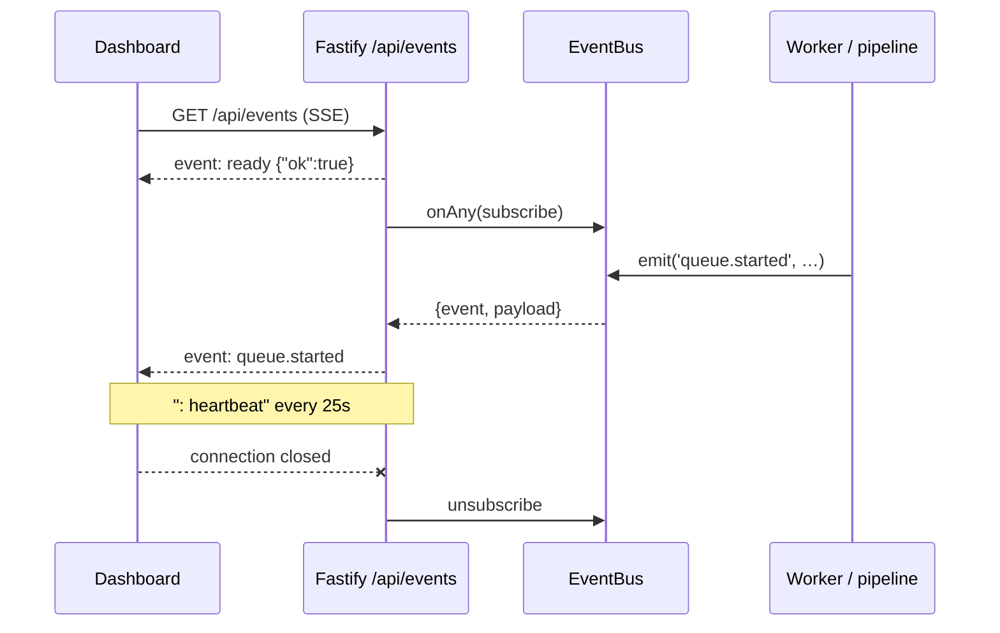

# REST API

Companion reference for the Deedy Automation HTTP API.

> The **source of truth** is the interactive OpenAPI reference served by the running
> instance at **`/docs`**. That document is generated at boot from the very same Zod
> schemas that validate and serialize each request, so it can never drift from the
> implementation. This file is hand-written prose around those schemas: it exists so you
> can read the surface without starting the server.

Everything below runs on the host machine. There are no outbound calls to any third-party
service; the only network dependency is the local LLM endpoint you configure yourself.

## Table of contents

- [Base URL and conventions](#base-url-and-conventions)
- [Error envelope](#error-envelope)
- [Status codes](#status-codes)
- [Pagination](#pagination)
- [Shared enums](#shared-enums)
- [health](#health)
- [settings](#settings)
- [jobs](#jobs)
- [applications](#applications)
- [resumes](#resumes)
- [cover-letters](#cover-letters)
- [queue](#queue)
- [collectors](#collectors)
- [browser](#browser)
- [observability](#observability)
- [analytics](#analytics)
- [Server-Sent Events: `/api/events`](#server-sent-events-apievents)
- [curl examples](#curl-examples)

---

## Base URL and conventions

Every route in this document is registered under the `/api` prefix. With the default
`HOST=0.0.0.0` and `PORT=8080` from `apps/api/src/config/env.ts`, the base URL is:

```
http://localhost:8080/api
```

Two paths live outside `/api`:

| Path    | What it is                                                          |
| ------- | ------------------------------------------------------------------- |
| `/docs` | Interactive OpenAPI 3.1 reference (Scalar), generated from Zod       |
| `/`     | The compiled dashboard, served from `WEB_DIR` when a build is present |

Notes that apply everywhere:

- Requests and responses are `application/json` unless a route explicitly streams a file
  or an event stream.
- There is **no authentication**. The service is designed to be bound to a machine you
  control; do not expose the port to an untrusted network.
- CORS origins come from the `CORS_ORIGINS` environment variable (default
  `http://localhost:5173`, which is the Vite dev server), with credentials enabled.
- The request body limit is 16 MiB.
- All timestamps in responses are ISO-8601 strings.
- Query parameters are coerced from strings by Zod, so `?page=2&archived=true` works as
  written.
- `:id` path parameters are coerced to positive integers; anything else is a `400`.

## Error envelope

Every failure - validation, not-found, conflict, unhandled - is serialized by the single
error handler in `apps/api/src/api/server.ts` as:

```jsonc
{
  "error": "not_found",       // stable machine-readable code
  "message": "Job 42 not found", // human-readable, safe to display
  "details": null              // optional; present on validation and some domain errors
}
```

`details` is omitted when there is nothing to add. For Zod validation failures it holds
the raw `ZodError.issues` array.

The `error` codes come from `apps/api/src/core/errors.ts`:

| `error`               | HTTP | Raised by                                                        |
| --------------------- | ---- | ---------------------------------------------------------------- |
| `validation_error`    | 400  | Request failed schema validation, or a domain `ValidationError`   |
| `not_found`           | 404  | Unknown entity id, or an unmatched `/api` or `/docs` route        |
| `conflict`            | 409  | `ConflictError`                                                   |
| `needs_human`         | 409  | The browser pipeline hit a gate only a person can clear           |
| `configuration_error` | 422  | Required configuration missing or invalid (e.g. no LLM model set) |
| `llm_error`           | 502  | The local LLM endpoint failed or returned something unusable      |
| `internal_error`      | 500  | Anything unhandled                                                |

## Status codes

| Code | Meaning in this API                                                        |
| ---- | -------------------------------------------------------------------------- |
| 200  | Success                                                                    |
| 201  | Resource created - `POST /resumes`, `POST /cover-letters`, `POST /prompts` |
| 400  | Validation error                                                           |
| 404  | Not found                                                                  |
| 409  | Conflict, including `needs_human`                                          |
| 422  | Configuration error                                                        |
| 500  | Unexpected server error                                                    |

`400`, `404`, `409`, `422` and `500` are declared on every documented route so the
generated OpenAPI document describes the envelope for each one. `502` (`llm_error`) can
surface from any route that talks to the model synchronously.

## Pagination

List endpoints that paginate accept:

| Param      | Type | Default | Range   |
| ---------- | ---- | ------- | ------- |
| `page`     | int  | `1`     | >= 1    |
| `pageSize` | int  | `25`    | 1 - 200 |

and return:

```jsonc
{
  "items": [ /* ... */ ],
  "total": 137,
  "page": 1,
  "pageSize": 25,
  "totalPages": 6
}
```

## Shared enums

Defined once in `packages/shared/src/enums.ts` and reused by both the API and the UI.

| Enum                | Values                                                                                                                                                       |
| ------------------- | ------------------------------------------------------------------------------------------------------------------------------------------------------------ |
| `jobStatus`         | `new`, `scored`, `queued`, `applying`, `applied`, `skipped`, `failed`, `manual_review`                                                                        |
| `recommendation`    | `apply`, `skip`, `manual_review`                                                                                                                              |
| `remoteType`        | `remote`, `hybrid`, `onsite`, `unknown`                                                                                                                       |
| `employmentType`    | `full_time`, `part_time`, `contract`, `internship`, `temporary`, `unknown`                                                                                     |
| `experienceLevel`   | `intern`, `entry`, `mid`, `senior`, `staff`, `principal`, `executive`, `unknown`                                                                               |
| `applicationStatus` | `pending`, `in_progress`, `submitted`, `failed`, `abandoned`, `needs_human`, `interview`, `rejected`, `offer`                                                  |
| `applicationStep`   | `login`, `navigate`, `read_description`, `start_application`, `upload_resume`, `upload_cover_letter`, `fill_form`, `answer_questions`, `review`, `submit`, `confirm` |
| `stepStatus`        | `pending`, `running`, `succeeded`, `failed`, `skipped`                                                                                                        |
| `queueStatus`       | `pending`, `active`, `completed`, `failed`, `delayed`, `cancelled`                                                                                             |
| `queueTask`         | `collect.jobs`, `job.score`, `job.enrich`, `resume.tailor`, `cover_letter.generate`, `application.apply`, `company.summarize`, `maintenance.cleanup`, `maintenance.backup` |
| `llmTask`           | `skill_extraction`, `job_classification`, `resume_tailoring`, `cover_letter`, `ats_keywords`, `application_scoring`, `interview_prediction`, `job_summary`, `company_summary`, `salary_extraction`, `form_answer` |
| `logLevel`          | `trace`, `debug`, `info`, `warn`, `error`, `fatal`                                                                                                            |
| `artifactKind`      | `screenshot`, `html`, `pdf`, `docx`, `markdown`, `json`                                                                                                       |
| `browserEngine`     | `chromium`, `chrome`, `firefox`                                                                                                                               |
| `llmProvider`       | `ollama`, `openai_compatible`, `llamacpp`, `lmstudio`, `openrouter_local`                                                                                      |

---

## health

Source: `apps/api/src/api/routes/health.routes.ts`

### `GET /api/health`

Liveness plus dependency status. Reports database reachability, local LLM reachability,
queue depth and scheduler state.

Response `200`:

```jsonc
{
  "status": "ok",            // "ok" only when database AND llm.reachable are true, else "degraded"
  "version": "1.0.0",
  "uptimeSeconds": 8421,
  "database": true,
  "llm": { "reachable": true, "model": "…", "error": null },
  "queue": { "running": true, "paused": false, "pending": 3, "active": 1 },
  "scheduler": {
    "running": true,
    "tasks": [{ "name": "collect", "nextRunAt": "2026-07-31T12:00:00.000Z" }]
  }
}
```

Note that `status: "degraded"` is still returned with HTTP `200` - the request itself
succeeded.

### `GET /api/health/live`

Bare process liveness probe. No dependency checks, so it stays cheap for container health
checks.

Response `200`: `{ "ok": true }`

---

## settings

Source: `apps/api/src/api/routes/settings.routes.ts`. Schema: `packages/shared/src/settings.ts`.

Settings are one nested object with eight sections: `llm`, `browser`, `search`,
`application`, `queue`, `scheduler`, `notifications`, `profile`.

### `GET /api/settings`

Returns the whole settings object. Secret paths (`llm.apiKey`, `notifications.webhookUrl`)
are returned masked - all but the last four characters replaced with `*`.

Response `200`: the full `Settings` object.

### `PATCH /api/settings`

Deep-merges the patch into stored configuration and returns the redacted result. Every
section is optional and every field within a section is optional.

Body: a partial of any subset of sections, for example

```jsonc
{
  "llm": { "model": "…", "temperature": 0.1 },
  "application": { "autoApply": true, "minScoreToApply": 80 }
}
```

Secret values are encrypted at rest with a key kept in `DATA_DIR`. Submitting a value that
still looks like a mask leaves the stored secret untouched, so you can round-trip
`GET` -> edit -> `PATCH` safely.

Response `200`: the full redacted `Settings` object.

### `GET /api/settings/llm/models`

Lists models advertised by the currently configured LLM endpoint.

Response `200`:

```jsonc
{ "models": [{ "id": "…", "name": "…", "sizeBytes": 4108928000 }] }
```

`sizeBytes` is nullable and may be absent depending on the provider.

### `POST /api/settings/llm/test`

Probes the configured endpoint. No body.

Response `200`: `{ "reachable": true, "model": "…", "error": null }`

### `POST /api/settings/queue/pause`

Pauses or resumes the background queue. This is a shortcut for patching `queue.paused`.

Body: `{ "paused": boolean }` -> Response `200`: `{ "ok": true }`

---

## jobs

Source: `apps/api/src/api/routes/jobs.routes.ts`

### `GET /api/jobs`

Search collected jobs.

Query parameters (all optional except the defaults shown):

| Param             | Type                                                       | Default        |
| ----------------- | ---------------------------------------------------------- | -------------- |
| `page`            | int >= 1                                                   | `1`            |
| `pageSize`        | int 1-200                                                  | `25`           |
| `q`               | string, full-text-ish match                                | -              |
| `status`          | `jobStatus`                                                | -              |
| `source`          | string                                                     | -              |
| `company`         | string                                                     | -              |
| `remoteType`      | `remoteType`                                               | -              |
| `experienceLevel` | `experienceLevel`                                          | -              |
| `minScore`        | number 0-100                                               | -              |
| `maxScore`        | number 0-100                                               | -              |
| `recommendation`  | `recommendation`                                           | -              |
| `archived`        | boolean                                                    | -              |
| `sort`            | `collectedAt` \| `postedAt` \| `score` \| `company` \| `title` | `collectedAt` |
| `order`           | `asc` \| `desc`                                            | `desc`         |

Response `200`: paginated `JobDto`.

`JobDto` fields: `id`, `externalId`, `hash`, `title`, `company`, `companyId`, `location`,
`remoteType`, `employmentType`, `experienceLevel`, `salaryMin`, `salaryMax`,
`salaryCurrency`, `salaryPeriod`, `description`, `descriptionHtml`, `summary`,
`skills[]`, `applicationUrl`, `source`, `postedAt`, `collectedAt`, `status`, `score`,
`recommendation`, `archived`.

### `GET /api/jobs/sources`

Distinct sources that have actually produced rows.

Response `200`: `{ "sources": ["greenhouse", "lever"] }`

### `GET /api/jobs/:id`

One job plus its scoring history.

Response `200`: `JobDto` extended with:

- `raw` - the untouched payload from the collector, or `null`
- `scores` - array of `JobScoreDto`
- `applicationId` - id of the application for this job, or `null`

`JobScoreDto`: `id`, `jobId`, `score`, `confidence`, `recommendation`, `matchedSkills[]`,
`missingSkills[]`, `redFlags[]`, `reasoning`, `interviewProbability`, `model`, `resumeId`,
`createdAt`.

### `PATCH /api/jobs/:id`

Update a job's status and/or archive flag.

Body: `{ "status"?: jobStatus, "archived"?: boolean }` -> Response `200`: `JobDto`.

### `DELETE /api/jobs/:id`

Deletes the job and everything derived from it.

Response `200`: `{ "ok": true }`

### `POST /api/jobs/:id/score`

Runs an LLM scoring pass. Queued by default; `immediate: true` runs it inline and blocks
until the model answers.

Body:

```jsonc
{
  "resumeId": 3,        // optional, nullable - which resume to score against
  "immediate": false    // default false
}
```

Response `200`:

```jsonc
{ "queued": true, "queueJobId": 91, "score": null, "recommendation": null }
```

When `immediate` is true: `queued: false`, `queueJobId: null`, and `score` /
`recommendation` are populated.

The queued job uses dedupe key `job.score:<jobId>` and priority `8`.

### `POST /api/jobs/:id/enrich`

Queues skill extraction, classification and summarization. No body.

Response `200`: `{ "queueJobId": 92 }` (dedupe key `job.enrich:<jobId>`, priority `7`).

### `GET /api/jobs/:id/scores`

Scoring history only.

Response `200`: `{ "scores": JobScoreDto[] }`

---

## applications

Source: `apps/api/src/api/routes/applications.routes.ts`, plus the artifact routes in
`documents.routes.ts`.

### `GET /api/applications`

Query: `page`, `pageSize`, `status` (`applicationStatus`), `jobId` (positive int).

Response `200`: paginated `ApplicationDto`.

`ApplicationDto`: `id`, `jobId`, `jobTitle`, `company`, `source`, `resumeId`,
`coverLetterId`, `status`, `currentStep`, `attempts`, `maxAttempts`, `confirmationText`,
`error`, `dryRun`, `startedAt`, `submittedAt`, `createdAt`, `updatedAt`.

### `GET /api/applications/:id`

One application with its full step history.

Response `200`: `ApplicationDto` extended with:

- `events` - `ApplicationEventDto[]`: `id`, `applicationId`, `step`, `status`, `attempt`,
  `message`, `error`, `durationMs`, `createdAt`
- `artifacts` - `ArtifactDto[]`: `id`, `kind`, `path`, `applicationId`, `jobId`, `step`,
  `bytes`, `createdAt`
- `answers` - `{ id, question, answer, fieldType, source, confidence, createdAt }[]`

### `POST /api/applications/apply`

Queues the browser pipeline for a job. `immediate: true` runs it synchronously, which is
useful when debugging a single posting.

Body:

```jsonc
{
  "jobId": 42,                    // required
  "resumeId": 3,                  // optional, nullable
  "dryRun": true,                 // optional; falls back to browser.dryRun setting
  "tailorResume": true,           // optional
  "generateCoverLetter": true,    // optional
  "immediate": false              // default false
}
```

Response `200`:

```jsonc
{
  "queued": true,
  "queueJobId": 101,
  "applicationId": null,
  "status": null,
  "submitted": null,
  "needsHuman": null
}
```

With `immediate: true` the queue fields are null and `applicationId`, `status`,
`submitted` and `needsHuman` carry the result. Queued work uses dedupe key
`application.apply:<jobId>` and priority `10`.

Returns `404` if the job does not exist.

### `POST /api/applications/:id/retry`

Resets the application to `pending`, clears its error, and re-enqueues the pipeline at
priority `12`.

Response `200`: `{ "queueJobId": 105 }`

### `PATCH /api/applications/:id`

Records a real-world outcome such as `interview`, `rejected` or `offer`.

Body: `{ "status": applicationStatus }` -> Response `200`: `ApplicationDto`.

### `GET /api/answers`

The saved answer bank used to auto-fill repeated application questions.

Response `200`: `{ "answers": AnswerBankDto[] }` where `AnswerBankDto` is `id`,
`questionPattern`, `normalized`, `answer`, `fieldType`, `useCount`, `createdAt`.

### `POST /api/answers`

Teach the bank a question/answer pair.

Body: `{ "question": string (min 1), "answer": string, "fieldType": string }`
(`fieldType` defaults to `"text"`) -> Response `200`: `{ "ok": true }`

### `DELETE /api/answers/:id`

Response `200`: `{ "ok": true }`

### `GET /api/artifacts/:id/file`

Streams a stored screenshot or HTML snapshot. Content type is inferred from the file
extension (`.pdf`, `.docx`, `.md`, `.png`, `.html`, `.json`), falling back to
`application/octet-stream`, and `content-length` is set.

Files are only served from inside `DATA_DIR`; anything resolving outside it is rejected
with `400 validation_error`.

### `GET /api/artifacts/screenshots`

Most recent screenshots captured by the browser pipeline.

Query: `limit` (int 1-200, default `24`).

Response `200`:

```jsonc
{
  "screenshots": [
    { "id": 7, "applicationId": 3, "jobId": 42, "step": "submit", "createdAt": "…" }
  ]
}
```

Fetch the bytes for each entry from `GET /api/artifacts/:id/file`.

---

## resumes

Source: `apps/api/src/api/routes/documents.routes.ts`

`ResumeDto`: `id`, `name`, `version`, `targetRole`, `markdown`, `filePath`, `pdfPath`,
`docxPath`, `isBase`, `isDefault`, `parentId`, `jobId`, `generatedBy`, `changeSummary[]`,
`atsScore`, `createdAt`, `updatedAt`.

### `GET /api/resumes`

Query: `includeGenerated` (boolean, default `true`) - set `false` to hide AI-tailored
versions and show only the ones you authored.

Response `200`: `{ "resumes": ResumeDto[] }`

### `GET /api/resumes/:id`

Response `200`: `ResumeDto`. `404` if unknown.

### `POST /api/resumes`

Creates a resume from Markdown and renders its PDF and DOCX.

Body:

```jsonc
{
  "name": "Backend engineer",   // required, 1-200 chars
  "targetRole": "Staff SWE",    // optional, max 200
  "markdown": "# Jane Doe…",    // required, min 1
  "isBase": true,               // default true
  "isDefault": false            // default false
}
```

Response `201`: `ResumeDto`.

### `PATCH /api/resumes/:id`

Body: any subset of the create fields. Changing the Markdown creates a new version rather
than editing in place.

Response `200`: `ResumeDto`.

### `DELETE /api/resumes/:id`

Response `200`: `{ "ok": true }`

### `POST /api/resumes/:id/tailor`

Generates a job-specific version of this resume. Note the default here is **synchronous**.

Body:

```jsonc
{
  "jobId": 42,        // required
  "force": false,     // default false - regenerate even if a tailored version exists
  "immediate": true   // default true - set false to enqueue instead
}
```

Response `200`: `{ "resume": ResumeDto | null, "queueJobId": number | null }`. Exactly one
side is populated: the rendered resume when run inline, the queue id when deferred
(dedupe key `resume.tailor:<jobId>:<baseResumeId>`, priority `6`).

### `GET /api/resumes/:id/download`

Streams the rendered file.

Query: `format` - `pdf` | `docx` | `md`, default `pdf`.

Returns `404` when that format has not been rendered for the resume. The response carries
`content-disposition: attachment` with the on-disk filename.

---

## cover-letters

Source: `apps/api/src/api/routes/documents.routes.ts`

`CoverLetterDto`: `id`, `jobId`, `applicationId`, `resumeId`, `subject`, `body`, `tone`,
`version`, `model`, `pdfPath`, `createdAt`.

### `GET /api/cover-letters`

Query: `jobId` (positive int - when present, returns every letter for that job and the
`limit` is not applied), `limit` (int 1-500, default `200`).

Response `200`: `{ "coverLetters": CoverLetterDto[] }`

### `POST /api/cover-letters`

Generates a letter for a job. Runs synchronously against the local model.

Body:

```jsonc
{
  "jobId": 42,          // required
  "resumeId": 3,        // optional, nullable
  "regenerate": false   // default false - when false an existing letter is reused
}
```

Response `201`: `CoverLetterDto`.

### `DELETE /api/cover-letters/:id`

Response `200`: `{ "ok": true }`

---

## queue

Source: `apps/api/src/api/routes/operations.routes.ts`. The backup and scheduler routes are
also tagged `queue`.

`QueueJobDto`: `id`, `task`, `status`, `priority`, `payload`, `attempts`, `maxAttempts`,
`lastError`, `runAt`, `startedAt`, `finishedAt`, `dedupeKey`, `createdAt`.

### `GET /api/queue`

Query: `page`, `pageSize`, `status` (`queueStatus`), `task` (`queueTask`).

Response `200`: paginated `QueueJobDto`.

### `GET /api/queue/stats`

Response `200`:

```jsonc
{
  "byStatus": { "pending": 4, "active": 1, "completed": 220, "failed": 2 },
  "byTask": [{ "task": "job.score", "status": "completed", "value": 118 }],
  "worker": { "running": true, "inFlight": 1, "workerId": "…" }
}
```

### `GET /api/queue/:id`

One queue job plus its full retry history.

Response `200`: `QueueJobDto` extended with `attempts_history`, an array of
`{ id, attempt, status, error, durationMs, startedAt, finishedAt }`.

### `POST /api/queue/:id/retry`

Resets the job so it runs again. `404` if unknown.

Response `200`: `{ "ok": true }`

### `POST /api/queue/:id/cancel`

Cancels a pending job. `404` if unknown.

Response `200`: `{ "ok": true }`

### `POST /api/queue/retry-failed`

Re-arms every failed job in one shot.

Response `200`: `{ "retried": 7 }`

### `GET /api/backups`

Response `200`: `{ "backups": [{ "name": "…", "bytes": 1048576, "createdAt": "…" }] }`

### `POST /api/backups`

Takes a database backup immediately and prunes old ones per
`scheduler.backupsToKeep`.

Response `200`: `{ "path": "…", "bytes": 1048576, "removed": 1 }`

### `POST /api/scheduler/:name/run`

Runs a scheduled task now without disturbing its interval. `name` is one of `collect`,
`score`, `apply`, `cleanup`, `backup` (see `apps/api/src/scheduler/scheduler.ts`). An
unknown name produces a `500 internal_error` with the message
`Unknown scheduled task: <name>`.

Response `200`: `{ "ok": true }`

---

## collectors

Source: `apps/api/src/api/routes/operations.routes.ts`

### `GET /api/collectors`

Every registered collector, built-in and plugin.

Response `200`:

```jsonc
{
  "collectors": [
    {
      "id": "greenhouse",
      "name": "Greenhouse",
      "source": "greenhouse",
      "description": "…",
      "requiresAuth": false,
      "requiresBoards": true,
      "enabled": true,
      "builtIn": true
    }
  ],
  "planned": ["greenhouse", "lever"]
}
```

`planned` is what the scheduler would run right now given your search settings. A
collector is reported `enabled` if it is listed in `search.enabledCollectors`, or - when
that list is empty - if it appears in `planned`.

### `POST /api/collectors/:collectorId/run`

Runs a collector. `404` if the id is not registered.

Body: `{ "immediate": false }` (default `false`).

Response `200`:

```jsonc
{
  "queueJobId": 88,
  "summary": null
}
```

With `immediate: true`, `queueJobId` is `null` and `summary` is
`{ collectorId, found, inserted, duplicates, errors, message }`. Queued runs use dedupe
key `collect.jobs:<collectorId>` and priority `4`.

### `GET /api/collectors/runs`

Query: `limit` (int 1-200, default `50`).

Response `200`: `{ "runs": CollectorRunDto[] }` where `CollectorRunDto` is `id`,
`collectorId`, `status`, `found`, `inserted`, `duplicates`, `errors`, `message`,
`startedAt`, `finishedAt`.

---

## browser

Source: `apps/api/src/api/routes/operations.routes.ts`

### `GET /api/browser-sessions`

Response `200`:

```jsonc
{
  "sessions": [
    {
      "id": 1, "provider": "linkedin", "engine": "chromium",
      "profilePath": "…", "loggedIn": true,
      "lastUsedAt": "…", "lastCheckAt": "…",
      "storageStatePath": "…", "note": "…", "createdAt": "…"
    }
  ],
  "open": ["linkedin"]
}
```

`open` lists providers whose persistent browser context is currently live in this process.

### `POST /api/browser-sessions/:provider/open`

Launches the persistent context for `provider` and navigates to it so you can sign in
once. Disable headless mode in Settings first, otherwise there is no window to type into.
After the navigation the storage state is written to disk and reused from then on.

Body: `{ "url": "https://…" }` - optional. When omitted the route navigates to
`https://www.<provider>.com/login`.

Response `200`: `{ "provider": "linkedin", "url": "<final url>", "loggedIn": true }`.
`loggedIn` is a heuristic: it is false when the final URL still looks like a login,
sign-in or auth wall.

### `DELETE /api/browser-sessions/:provider`

Closes the live context and deletes the session record.

Response `200`: `{ "ok": true }`

---

## observability

Source: `apps/api/src/api/routes/observability.routes.ts`

### `GET /api/logs`

Query: `page`, `pageSize`, `q` (message substring), `level` (`logLevel`), `scope`,
`since` (ISO timestamp).

Response `200`: paginated `LogDto` = `{ id, level, scope, message, context, createdAt }`.

### `GET /api/logs/scopes`

Response `200`: `{ "scopes": ["http", "queue", "browser"] }`

### `GET /api/llm-calls`

Query: `page`, `pageSize`, `task` (`llmTask`), `success` (boolean).

Response `200`: paginated `LlmCallDto` = `id`, `task`, `provider`, `model`,
`promptTokens`, `completionTokens`, `totalTokens`, `durationMs`, `success`, `attempt`,
`error`, `jobId`, `createdAt`.

### `GET /api/llm-calls/:id`

Same shape plus `systemPrompt`, `userPrompt` and `response` (each nullable). This is the
full record of what was sent to the local model and what came back.

### `GET /api/prompts`

Response `200`:

```jsonc
{
  "templates": [
    {
      "id": 1, "task": "application_scoring", "name": "…",
      "system": "…", "user": "…",
      "isActive": true, "version": 2,
      "createdAt": "…", "updatedAt": "…"
    }
  ],
  "defaults": [{ "task": "application_scoring", "system": "…", "user": "…" }]
}
```

`defaults` are the built-in prompts compiled into the binary, shown so you can diff your
overrides against them.

### `POST /api/prompts`

Creates a new template version for a task.

Body:

```jsonc
{
  "task": "cover_letter",   // llmTask
  "name": "Warmer tone",    // 1-120 chars
  "system": "…",            // min 1
  "user": "…",              // min 1
  "isActive": true          // default true
}
```

Response `201`: the created `PromptTemplateDto`.

### `POST /api/prompts/:id/activate`

Makes this version the active one for its task.

Response `200`: `{ "ok": true }`

### `DELETE /api/prompts/:id`

Response `200`: `{ "ok": true }`

### `GET /api/events`

See [Server-Sent Events](#server-sent-events-apievents) below.

---

## analytics

Source: `apps/api/src/api/routes/observability.routes.ts`, backed by
`apps/api/src/repositories/analytics.repository.ts`.

### `GET /api/analytics/overview`

Headline metrics for the dashboard. The response is a flat object of numbers:
`totalJobs`, `newJobs`, `scoredJobs`, `totalApplications`, `submittedApplications`,
`failedApplications`, `needsHuman`, `interviews`, `offers`, `rejections`, `averageScore`,
`successRate`, `failureRate`, `responseRate`, `interviewRate`, `applicationsToday`,
`jobsToday`, `queuePending`, `queueActive`, `queueFailed`, `llmTokensTotal`,
`llmCallsTotal`.

### `GET /api/analytics`

The full payload used to render every chart.

Query: `days` (int 1-365, default `30`) - the window for the time series.

Response `200`:

| Key                                                          | Shape                                                                     |
| ------------------------------------------------------------ | ------------------------------------------------------------------------- |
| `overview`                                                   | same object as `/analytics/overview`                                      |
| `applicationsPerDay`, `jobsPerDay`, `averageScorePerDay`, `tokensPerDay` | `{ date, value }[]`                                            |
| `funnel`, `sourceDistribution`, `topCompanies`, `topSkills`, `locationDemand`, `scoreHistogram`, `statusBreakdown` | `{ label, count }[]`   |
| `resumeEffectiveness`                                        | `{ resumeId, name, used, submitted, interviews, successRate }[]`           |

---

## Server-Sent Events: `/api/events`

`GET /api/events` upgrades to a `text/event-stream`. It exists purely so the dashboard can
reflect pipeline activity live. **Durable state always lives in SQLite** - a missed event is
never data loss, so a client that reconnects and re-queries is always correct.

Stream mechanics:

- Response headers: `content-type: text/event-stream`, `cache-control: no-cache, no-transform`,
  `connection: keep-alive`, `x-accel-buffering: no`.
- The first frame is always `event: ready` with data `{"ok":true}`.
- A comment heartbeat (`: heartbeat`) is written every 25 seconds to keep intermediaries
  from closing an idle connection.
- Each frame is `event: <name>` followed by `data: <JSON payload>`.
- There is no `id:` field and no replay - the stream is live-only.
- Closing the request tears down the heartbeat and the subscription.



### Event names

Every event defined in `apps/api/src/core/events.ts` is forwarded verbatim.

| Event                     | Payload                                                                  |
| ------------------------- | ------------------------------------------------------------------------ |
| `ready`                   | `{ ok: true }` - synthetic, sent once on connect                         |
| `job.collected`           | `{ jobId, source, title, company }`                                      |
| `job.scored`              | `{ jobId, score, recommendation }`                                       |
| `application.created`     | `{ applicationId, jobId }`                                               |
| `application.step`        | `{ applicationId, step, status, attempt, message? }`                     |
| `application.submitted`   | `{ applicationId, jobId, dryRun }`                                       |
| `application.failed`      | `{ applicationId, jobId, error }`                                        |
| `application.needs_human` | `{ applicationId, jobId, question }`                                     |
| `queue.enqueued`          | `{ id, task }`                                                           |
| `queue.started`           | `{ id, task, attempt }`                                                  |
| `queue.completed`         | `{ id, task, durationMs }`                                               |
| `queue.failed`            | `{ id, task, error, willRetry }`                                         |
| `llm.call`                | `{ task, model, success, totalTokens }`                                  |
| `collector.run`           | `{ collectorId, found, inserted, duplicates }`                           |
| `settings.updated`        | `{ sections }` - the top-level setting sections that changed             |
| `log`                     | `{ level, scope, message, createdAt }`                                   |

Minimal browser client:

```js
const stream = new EventSource('/api/events');
stream.addEventListener('queue.completed', (e) => {
  const { id, task, durationMs } = JSON.parse(e.data);
  console.log(`queue job ${id} (${task}) finished in ${durationMs}ms`);
});
```

---

## curl examples

All examples assume the default `http://localhost:8080`.

Check health and dependency status:

```bash
curl -s http://localhost:8080/api/health | jq
```

Point the app at your local model and pick which one to use:

```bash
curl -s -X PATCH http://localhost:8080/api/settings \
  -H 'content-type: application/json' \
  -d '{"llm":{"provider":"ollama","baseUrl":"http://localhost:11434","model":"llama3.1:8b"}}' | jq '.llm'
```

List what the endpoint actually has installed, then verify reachability:

```bash
curl -s http://localhost:8080/api/settings/llm/models | jq '.models[].id'
curl -s -X POST http://localhost:8080/api/settings/llm/test | jq
```

Run a collector immediately and see what it found:

```bash
curl -s -X POST http://localhost:8080/api/collectors/greenhouse/run \
  -H 'content-type: application/json' \
  -d '{"immediate":true}' | jq '.summary'
```

Browse the highest-scoring remote jobs:

```bash
curl -s 'http://localhost:8080/api/jobs?minScore=80&remoteType=remote&sort=score&order=desc&pageSize=10' \
  | jq '.items[] | {id, title, company, score}'
```

Score a single job inline (blocks until the model answers):

```bash
curl -s -X POST http://localhost:8080/api/jobs/42/score \
  -H 'content-type: application/json' \
  -d '{"immediate":true}' | jq
```

Tailor a resume for that job and download the PDF:

```bash
curl -s -X POST http://localhost:8080/api/resumes/1/tailor \
  -H 'content-type: application/json' \
  -d '{"jobId":42}' | jq '.resume.id'

curl -s -o tailored.pdf \
  'http://localhost:8080/api/resumes/7/download?format=pdf'
```

Queue an application as a dry run (prepares everything, never clicks submit):

```bash
curl -s -X POST http://localhost:8080/api/applications/apply \
  -H 'content-type: application/json' \
  -d '{"jobId":42,"dryRun":true,"tailorResume":true,"generateCoverLetter":true}' | jq
```

Watch the queue drain, then inspect a job's retry history:

```bash
curl -s http://localhost:8080/api/queue/stats | jq
curl -s http://localhost:8080/api/queue/101 | jq '.attempts_history'
```

Sign in to a provider once so the browser profile is reused forever (set
`browser.headless` to `false` in Settings first):

```bash
curl -s -X POST http://localhost:8080/api/browser-sessions/linkedin/open \
  -H 'content-type: application/json' -d '{}' | jq
```

Tail the live event stream:

```bash
curl -N http://localhost:8080/api/events
```

Pull the raw OpenAPI-backed reference in a browser:

```bash
xdg-open http://localhost:8080/docs
```
