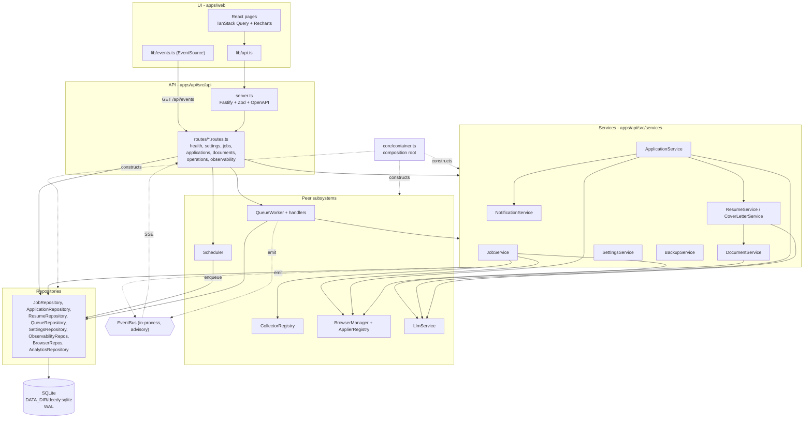
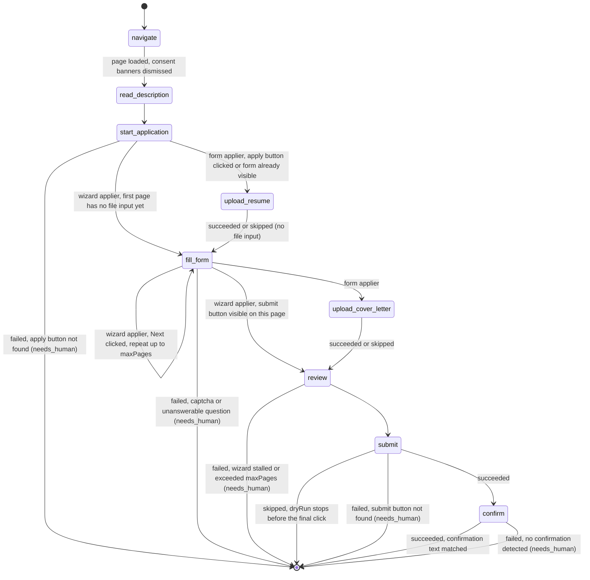

# Architecture

Deedy Automation is a single-process, fully-local job search and application platform. One Node
process owns the HTTP API, the background queue worker, the scheduler and every Playwright browser.
One SQLite file (`DATA_DIR/deedy.sqlite`) holds all durable state. Nothing is sent off the host
except the HTTP requests the collectors make to job boards, the requests the browser makes to
application sites, the calls to the LLM endpoint you configure, and the optional notification
webhook you configure.

## Table of contents

- [Layering rules](#layering-rules)
- [Component diagram](#component-diagram)
- [The autonomous loop](#the-autonomous-loop)
- [The application step machine](#the-application-step-machine)
- [Crash safety and resumability](#crash-safety-and-resumability)
- [The event bus is advisory only](#the-event-bus-is-advisory-only)
- [Directory map of `apps/api/src`](#directory-map-of-appsapisrc)

---

## Layering rules

The backend has one primary chain and four peer subsystems.

```
UI  ->  API  ->  Services  ->  Repositories  ->  Database
```

| Layer | Lives in | May depend on | Must not depend on |
| --- | --- | --- | --- |
| UI | `apps/web/src` | The REST API over HTTP, `@deedy/shared` types | Anything in `apps/api/src` |
| API | `apps/api/src/api` | Services, repositories, `core`, `@deedy/shared` | Nothing above it |
| Services | `apps/api/src/services` | Repositories, peer subsystems, `core` | The API layer |
| Repositories | `apps/api/src/repositories` | `db/schema`, `db/client`, `core/utils` | Services, API, peer subsystems |
| Database | `apps/api/src/db`, `apps/api/migrations` | `better-sqlite3`, Drizzle | Everything else |

Peer subsystems sit beside the services layer rather than under it. They are **Browser**
(`browser/`), **LLM** (`services/llm/`), **Queue** (`queue/`), **Scheduler** (`scheduler/`) and
**Collectors** (`collectors/`). Services call into them; they never call back into a service by
importing it. The queue is the one place where this could look circular and it is deliberately
broken: `queue/worker.ts` knows only the `TaskHandlerMap` interface it is handed, and
`queue/handlers.ts` receives its services through a `HandlerDependencies` object rather than
importing the container.

### No circular dependencies

Every dependency is injected from the composition root in
[`core/container.ts`](../apps/api/src/core/container.ts). `createContainer()` constructs the
database, logger, event bus, every repository, every service and every subsystem in strict
dependency order and hands each constructor exactly what it needs. Modules therefore depend on
*types* of their collaborators (`import type { JobRepository } ...`) rather than on each other's
module graph, and the import graph stays a DAG.

Two consequences worth knowing:

- A service that needs another service takes it as a constructor argument. `ApplicationService`
  receives `ResumeService`, `CoverLetterService`, `LlmService`, `SettingsService` and
  `NotificationService` this way. It never imports the container.
- Cross-cutting helpers live in `core/` (logger, errors, crypto, utils, events). `core/` imports
  nothing from `services/`, `repositories/`, `api/` or the peer subsystems, which is what keeps it
  safe for every layer to import.

This rule is a review convention, not a lint rule. `eslint.config.js` enforces
`@typescript-eslint/no-explicit-any`, `consistent-type-imports`, `no-console` and `eqeqeq`, but it
has no import-boundary rule. Keep the graph clean by hand.

---

## Component diagram



---

## The autonomous loop

Nothing in the loop calls the next stage directly. Each stage finishes by writing to SQLite and
enqueuing the next task, which is why the loop survives a restart at any point.

The chain is driven by `createScheduledTasks()` in
[`scheduler/scheduler.ts`](../apps/api/src/scheduler/scheduler.ts) and `createHandlers()` in
[`queue/handlers.ts`](../apps/api/src/queue/handlers.ts):

`collect.jobs` -> `job.enrich` -> `job.score` -> `application.apply`, with `resume.tailor` and
`cover_letter.generate` invoked inline by `ApplicationService.apply()` (they also exist as
standalone queue tasks so the UI can trigger them on their own).

```mermaid
sequenceDiagram
  autonumber
  participant S as Scheduler
  participant Q as QueueRepository (SQLite)
  participant W as QueueWorker
  participant JS as JobService
  participant C as Collector
  participant JR as JobRepository
  participant L as LlmService
  participant AS as ApplicationService
  participant RS as ResumeService
  participant CL as CoverLetterService
  participant B as BrowserManager + Applier
  participant AR as ApplicationRepository

  Note over S: task "collect" fires every<br/>scheduler.collectIntervalMinutes
  S->>Q: enqueue collect.jobs (dedupeKey collect.jobs:<id>)
  W->>Q: claim(limit, workerId, lockMs)
  Q-->>W: rows moved pending -> active, lock stamped
  W->>JS: runCollector(collectorId)
  JS->>C: collect(context)
  C-->>JS: NormalizedJob[]
  loop per collected job
    JS->>JR: upsert(job)
    Note right of JR: dedupe by canonical URL<br/>or hash(source+company+title+location)
    JR-->>JS: inserted | duplicate
  end
  JS->>Q: (handler) enqueue job.enrich per inserted job

  W->>JS: enrich(jobId)
  JS->>L: skill_extraction, job_classification,<br/>salary_extraction, job_summary
  L-->>JS: parsed JSON per task
  JS->>JR: replaceSkills + updateEnrichment
  JS->>Q: enqueue job.score

  W->>JS: score(jobId, resumeId)
  JS->>L: application_scoring (+ interview_prediction)
  L-->>JS: score, recommendation, reasoning
  JS->>JR: recordScore(...)
  alt autoApply and recommendation = apply and score >= minScoreToApply
    JS->>Q: enqueue application.apply (priority 10)
  end

  W->>AS: apply({ jobId, ... })
  AS->>AR: ensure(application row)
  AS->>AS: assertWithinLimits(company) unless dryRun
  AS->>RS: tailorForJob(...) if score >= minScoreToTailor
  RS->>L: ats_keywords + resume_tailoring
  RS-->>AS: tailored resume (PDF + DOCX rendered)
  AS->>CL: generate({ jobId, resumeId })
  CL-->>AS: cover letter body + PDF path
  AS->>B: newPage(provider); applier.apply(context)
  loop per pipeline step
    B->>AR: recordStep -> applicationEvents row + screenshot/HTML artifact
  end
  B-->>AS: ApplyOutcome { submitted, confirmationText, needsHuman }
  AS->>AR: update status submitted | needs_human | failed | pending
  AS->>JR: setStatus applied | manual_review | failed | queued
  W->>Q: complete(id) or fail(id, error, backoffMs)
```

Notes that matter when reading the diagram:

- Every `enqueue` passes a `dedupeKey`. `QueueRepository.enqueue()` reuses a `pending` or `active`
  row with that key and re-arms a finished one, so the same work is never queued twice.
- The scheduler's `apply` task calls `ApplicationService.recoverStuck()` *before* it queues new
  candidates from `JobRepository.readyToApply()`.
- Retries and backoff belong to the worker, not the handlers. Handlers validate their payload with
  Zod, delegate, and throw on failure.

---

## The application step machine

`APPLICATION_STEPS` in [`packages/shared/src/enums.ts`](../packages/shared/src/enums.ts) defines the
eleven discrete steps. Each transition is written to `application_events` with a `StepStatus` of
`pending`, `running`, `succeeded`, `failed` or `skipped` by the `recordStep` closure built in
`ApplicationService.apply()`, together with a screenshot and an HTML dump on `succeeded` and
`failed`.



Two steps in the enum are reserved and are not emitted by the built-in appliers: `login` and
`answer_questions`. Question answering is currently performed inside `fill_form` through
`ApplyContext.answer()`, and login is handled implicitly by the persistent browser profile rather
than by an explicit step. Both remain valid values for a plugin applier to record.

Step statuses feed resumability: `ApplicationRepository.completedSteps(applicationId)` returns the
set of steps that ever reached `succeeded`, and that set is passed to the applier as
`ApplyContext.completed` so a retry can skip work that already landed.

---

## Crash safety and resumability

The design assumption is that the process can die at any instruction, including mid-click inside a
Playwright browser, and that nothing may be lost or silently repeated.

### SQLite is the only source of truth

- `createDb()` in [`db/client.ts`](../apps/api/src/db/client.ts) opens the file with
  `journal_mode = WAL`, `synchronous = NORMAL`, `foreign_keys = ON`, `busy_timeout = 10000` and
  `temp_store = MEMORY`. Closing performs a `wal_checkpoint(TRUNCATE)`.
- There is no in-memory job list, no Redis, no cache that outlives a request. Queue state,
  application state, step history, logs, LLM call records, settings and scheduler cadence are all
  rows.
- `runMigrations()` runs on every boot from `createContainer()`, applying each unapplied `.sql` file
  from `apps/api/migrations` inside its own transaction and recording it in `_migrations`.
- `BackupService` uses SQLite's online backup API, so a snapshot is consistent even while the
  pipeline writes.

### Queue locks and `reclaimStalled`

`QueueRepository.claim()` runs inside a transaction: it selects due `pending` rows ordered by
`priority DESC, runAt ASC, id ASC`, then updates them to `active` with `lockedBy = workerId`,
`lockExpiresAt = now + queue.stalledAfterMs` and `attempts = attempts + 1`. The update is guarded by
`status = 'pending'`, so two workers can never claim the same row.

If the process dies while a row is `active`, its lock simply expires.
`QueueRepository.reclaimStalled()` returns every `active` row whose `lockExpiresAt` is null or in
the past to `pending` with `lastError = 'Reclaimed after stalled lock'`. It is called from
`src/index.ts` during boot and again from `QueueWorker.start()`.

Failure handling is equally durable. `QueueWorker.execute()` opens a `queue_attempts` row with
`startAttempt()`, closes it with `finishAttempt()`, and then calls either `complete()` or
`fail(id, message, backoffMs)`. The backoff is
`round(queue.backoffBaseMs * queue.backoffFactor ** (attempts - 1))` while `attempts < maxAttempts`;
once attempts are exhausted `retryDelayMs` is `null` and the row becomes `failed` rather than being
rescheduled.

`QueueWorker.stop()` waits up to 30 seconds for in-flight jobs so shutdown does not orphan a
browser, and logs a warning if it gives up. Anything still in flight is reclaimed on the next boot.

### Application step events

Applications get the same treatment one level down. `ApplicationRepository.ensure()` is keyed on
`jobId`, so re-running `application.apply` for a job reuses the existing row instead of creating a
second one, and `ApplicationService.apply()` returns immediately without touching a browser when the
row is already `submitted`. Every step transition is an `application_events` insert, so after a
crash you can read exactly which step was running, with the screenshot and HTML captured at that
moment.

### `recoverStuck` on boot

An application that was `in_progress` when the process died can never finish, because the browser
that was driving it is gone. `ApplicationService.recoverStuck()` finds every `in_progress` row and
resets it to `pending` with the message `Interrupted by a restart; re-queued automatically`. It runs
in two places:

1. `src/index.ts`, immediately after the container is built and before the worker starts.
2. The scheduler's `apply` task, before it looks for new candidates.

The scheduler itself is restart-aware: `SchedulerStateRepository` persists `lastRunAt` and
`nextRunAt` per task, and `Scheduler.initialDelayMs()` honours the persisted `nextRunAt` so a
restart resumes the cadence instead of firing every task at once.

---

## The event bus is advisory only

`EventBus` in [`core/events.ts`](../apps/api/src/core/events.ts) is a thin typed wrapper over Node's
`EventEmitter` with a fixed `AppEvents` map (`job.collected`, `job.scored`, `application.created`,
`application.step`, `application.submitted`, `application.failed`, `application.needs_human`,
`queue.enqueued`, `queue.started`, `queue.completed`, `queue.failed`, `llm.call`, `collector.run`,
`settings.updated`, `log`). `emit()` fires both the named event and a `*` envelope; `onAny()`
subscribes to the envelope.

It exists for exactly one purpose: `GET /api/events` streams the envelope to the dashboard as
Server-Sent Events so the UI updates live, with a 25-second heartbeat comment and cleanup on socket
close.

It is advisory because:

- It is **in-process and in-memory**. Nothing is persisted, buffered or replayed. A listener that
  attaches after an emit never sees it.
- **No consumer of durable state reads it.** Every write that matters happens through a repository
  before the event is emitted, and every reader (the API, the worker, the scheduler, the UI on
  refresh) reads SQLite. A dropped event costs the dashboard a live tick, never data.
- **Emitting is best effort.** The SSE writer swallows write errors and unsubscribes; no producer
  waits for or checks a delivery result.

The practical rule: never put logic in an event listener that changes state. If a stage must
trigger another stage, it enqueues a queue task.

---

## Directory map of `apps/api/src`

| Path | Contents |
| --- | --- |
| `api/` | Fastify bootstrap (`server.ts`): Zod validator and serializer, OpenAPI 3.1 document, Scalar reference at `/docs`, the error handler, and the static dashboard served from `WEB_DIR`. `types.ts` holds the shared route schema helpers. |
| `api/routes/` | The REST surface, all mounted under `/api`: `health`, `settings`, `jobs`, `applications`, `documents`, `operations` (queue, collectors, browser sessions, backups, scheduler) and `observability` (logs, LLM calls, prompt templates, analytics, the SSE `/events` stream). |
| `browser/` | `BrowserManager` owns every Playwright process, one persistent context per provider under `DATA_DIR/browser-profiles`, plus screenshot/HTML capture and PDF rendering. `form.filler.ts` is the provider-agnostic field scanner and filler. |
| `browser/appliers/` | Provider-specific application drivers: `createFormApplier` for single-page ATS forms, `createWizardApplier` for multi-page wizards, the `ApplierDefinition`/`ApplyContext` contract, and the registry that resolves a posting URL to an applier. |
| `collectors/` | One module per job source (Greenhouse, Lever, Ashby, SmartRecruiters, Workday, LinkedIn), the shared `CollectorDefinition` contract and HTTP client, `normalize.ts`, and the registry that also loads `*.collector.js` plugins from `DATA_DIR/plugins`. |
| `config/` | `env.ts`: the Zod environment schema (`NODE_ENV`, `HOST`, `PORT`, `DATA_DIR`, `LOG_LEVEL`, `WEB_DIR`, `CORS_ORIGINS`, `DISABLE_WORKERS`, `ENCRYPTION_KEY`), the resolved on-disk layout, and the local encryption key that is generated into `DATA_DIR/.encryption-key` on first boot. |
| `core/` | Cross-cutting primitives with no dependencies on other layers: the composition root (`container.ts`), the typed event bus, the pino logger with SQLite persistence and credential masking, the `AppError` hierarchy, AES-256-GCM secret encryption, and hashing/normalisation utilities. |
| `db/` | Drizzle schema and row types, the `better-sqlite3` client with its pragmas, the forward-only SQL migration runner plus its CLI, and the idempotent seed for default settings, prompt templates and the starter answer bank. |
| `queue/` | `QueueWorker`, which polls and claims from SQLite, enforces overall and browser-specific concurrency, and owns retries and backoff. `handlers.ts` maps each `QueueTask` to a validated service call. |
| `repositories/` | The only code that talks to Drizzle. One class per aggregate (jobs, applications and the answer bank, resumes and cover letters, queue, settings, observability, browser sessions and collector runs and scheduler state, analytics), each exposing row-to-DTO mappers. |
| `scheduler/` | The interval-driven `Scheduler` with persisted last/next run times, and `createScheduledTasks()` which defines the recurring `collect`, `score`, `apply`, `cleanup` and `backup` tasks. |
| `services/` | Business logic: collection and enrichment and scoring (`job.service.ts`), the browser application pipeline (`application.service.ts`), resume tailoring and cover letters (`resume.service.ts`), PDF/DOCX rendering (`document.service.ts`), settings with encrypted secrets, the optional local notification webhook, and SQLite backups. |
| `services/llm/` | The local LLM integration: provider clients for the configured endpoint, the editable prompt templates, JSON extraction and schema validation of model output, and persistence of every call to `llm_calls`. |
| `index.ts` | Process entry point: load config, build the container, run `recoverStuck()` and `reclaimStalled()`, start the worker and scheduler unless `DISABLE_WORKERS` is set, listen, and handle `SIGTERM`/`SIGINT` graceful shutdown. |
