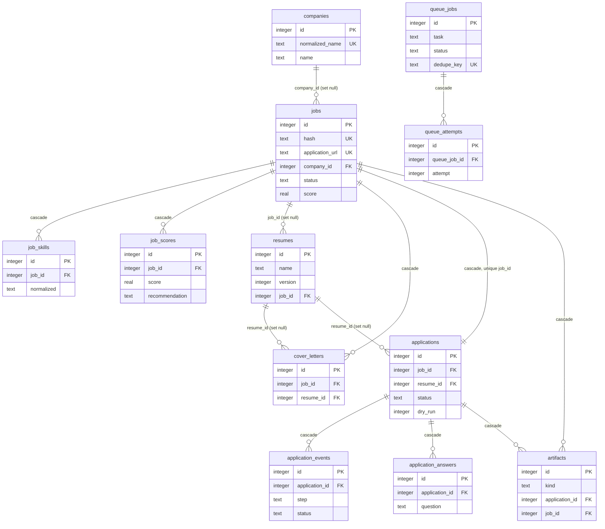

# Database Schema

Reference for the local SQLite database used by the Deedy Automation API.

Sources of truth, both of which must stay in sync:

- `apps/api/migrations/0001_initial.sql` - the SQL actually executed against the database.
- `apps/api/src/db/schema.ts` - the Drizzle table definitions the TypeScript code queries through.

The database file lives at `<DATA_DIR>/deedy.sqlite` (`config.paths.db`, see `apps/api/src/config/env.ts`;
`DATA_DIR` defaults to `./data`). It is opened by `createDb()` in `apps/api/src/db/client.ts`.

## Table of contents

- [Conventions](#conventions)
  - [Timestamps](#timestamps)
  - [JSON columns](#json-columns)
  - [Booleans](#booleans)
  - [Connection pragmas](#connection-pragmas)
  - [Migrations and the `_migrations` table](#migrations-and-the-_migrations-table)
  - [Hard vs soft references](#hard-vs-soft-references)
- [De-duplication and uniqueness guarantees](#de-duplication-and-uniqueness-guarantees)
- [Entity relationship diagram](#entity-relationship-diagram)
- [Tables](#tables)
  - [settings](#settings)
  - [companies](#companies)
  - [jobs](#jobs)
  - [job_skills](#job_skills)
  - [job_scores](#job_scores)
  - [resumes](#resumes)
  - [cover_letters](#cover_letters)
  - [applications](#applications)
  - [application_events](#application_events)
  - [application_answers](#application_answers)
  - [answer_bank](#answer_bank)
  - [artifacts](#artifacts)
  - [queue_jobs](#queue_jobs)
  - [queue_attempts](#queue_attempts)
  - [logs](#logs)
  - [llm_calls](#llm_calls)
  - [prompt_templates](#prompt_templates)
  - [browser_sessions](#browser_sessions)
  - [collector_runs](#collector_runs)
  - [scheduler_state](#scheduler_state)

---

## Conventions

### Timestamps

Every timestamp column is `TEXT` holding an ISO-8601 UTC string. Two producers exist and they
agree on the format:

- SQL defaults use `strftime('%Y-%m-%dT%H:%M:%fZ','now')`, e.g. `2026-07-31T09:14:22.117Z`.
- Application code uses `nowIso()` in `apps/api/src/core/utils.ts`, which is `new Date().toISOString()`.

Because the format is fixed-width, zero-padded and UTC-normalised, plain lexicographic `TEXT`
comparison is chronological ordering. That is why `ORDER BY created_at DESC`, range filters and
the `queue_jobs (status, run_at)` index all work without any date functions. `isoPlusMs()` and
`dayKey()` (also in `core/utils.ts`) build future timestamps and `YYYY-MM-DD` bucket keys off the
same representation.

There is deliberately no `NUMERIC`/epoch timestamp anywhere: mixing the two would break the
lexicographic ordering assumption.

### JSON columns

SQLite has no JSON type here, so structured values are stored as `TEXT` containing JSON, declared
in Drizzle with `text('col', { mode: 'json' })`. Drizzle serialises on write and parses on read, and
`$type<string[]>()` gives the parsed value a real TypeScript type instead of `unknown`.

JSON-backed columns: `companies.culture_points`, `jobs.skills`, `jobs.raw`,
`job_scores.matched_skills`, `job_scores.missing_skills`, `job_scores.red_flags`,
`resumes.change_summary`, `application_events.data`, `artifacts.meta`, `queue_jobs.payload`,
`logs.context`.

The array columns that are `NOT NULL` default to the SQL literal `'[]'`, so a row is never read back
as `null` where the type says `string[]`.

`settings.value` is also JSON text, but it is written by hand (`JSON.stringify` in
`apps/api/src/db/seed.ts` and the settings repository) rather than by Drizzle's JSON mode, because a
secret value is replaced with an `enc:v1:<iv>:<tag>:<data>` ciphertext string instead (see
`apps/api/src/core/crypto.ts`) and flagged with `settings.encrypted = 1`.

### Booleans

Booleans are `INTEGER NOT NULL DEFAULT 0` (or `1`), declared as
`integer('col', { mode: 'boolean' })` so TypeScript sees `boolean` and the driver maps `0`/`1`.

Boolean columns: `settings.encrypted`, `jobs.archived`, `resumes.is_base`, `resumes.is_default`,
`applications.dry_run`, `llm_calls.success`, `prompt_templates.is_active`,
`browser_sessions.logged_in`, `scheduler_state.running`.

Note the safety-first defaults: `applications.dry_run` defaults to `1` and `llm_calls.success`
defaults to `0`.

### Connection pragmas

`createDb(file)` in `apps/api/src/db/client.ts` sets these pragmas on every connection:

| Pragma | Value | Why |
| --- | --- | --- |
| `journal_mode` | `WAL` | Readers (API requests) do not block the writer (worker/collectors). |
| `synchronous` | `NORMAL` | Safe with WAL, far fewer fsyncs than `FULL`. |
| `foreign_keys` | `ON` | SQLite disables FK enforcement by default; the `ON DELETE` rules below only apply because of this. |
| `busy_timeout` | `10000` (ms) | Wait instead of failing immediately when another writer holds the lock. |
| `temp_store` | `MEMORY` | Temp b-trees for sorts and joins stay off disk. |

`DbHandle.close()` runs `pragma('wal_checkpoint(TRUNCATE)')` before closing, so a clean shutdown
folds the `-wal` file back into the main database file - which matters for the backup task and for
copying the database around.

### Migrations and the `_migrations` table

`runMigrations()` in `apps/api/src/db/migrate.ts` is the only migration mechanism. It:

1. Creates the bookkeeping table if missing:

   ```sql
   CREATE TABLE IF NOT EXISTS _migrations (
     name       TEXT PRIMARY KEY,
     applied_at TEXT NOT NULL DEFAULT (strftime('%Y-%m-%dT%H:%M:%fZ','now'))
   );
   ```

2. Reads every `*.sql` file in the migrations directory, sorted lexicographically (hence the
   `0001_` numeric prefix convention).
3. Skips any file whose name is already a row in `_migrations`.
4. Applies each remaining file inside a single transaction that also inserts its `_migrations` row,
   so a migration is either fully applied and recorded or not applied at all.

It returns `{ applied, skipped }` and is safe to run repeatedly. It is invoked from three places:
`createContainer()` on API boot (`apps/api/src/core/container.ts`), the `npm run db:migrate` CLI
(`apps/api/src/db/migrate-cli.ts`), and `npm run db:seed` (`apps/api/src/db/seed.ts`).

The migrations directory is resolved by `migrationsDir()`, which tries `../../migrations`,
`../../../migrations`, `./migrations` and `./apps/api/migrations` relative to the compiled file and
the current working directory, so it works from both `tsx` and the compiled `dist/` layout.

### Hard vs soft references

Some `*_id` columns are real foreign keys with `ON DELETE` behaviour; others are plain integers with
no constraint, used where a cycle would otherwise exist or where the row is intentionally allowed to
outlive its target. The soft (unconstrained) references are:
`job_scores.resume_id`, `resumes.parent_id`, `cover_letters.application_id`,
`applications.cover_letter_id`, `llm_calls.job_id` and `llm_calls.application_id`.
`applications` <-> `cover_letters` in particular reference each other, so only one direction can be
a declared FK.

---

## De-duplication and uniqueness guarantees

Three unique indexes carry real business rules rather than mere hygiene.

**`jobs_hash_idx` on `jobs(hash)`** - `hash` is the stable content identity of a posting:
`sha256(normalizedSource | normalizedCompany | normalizedTitle | normalizedLocation)`, computed by
`jobHash()` in `apps/api/src/core/utils.ts`. `normalizeCompany()` strips legal suffixes (`inc`,
`llc`, `ltd`, `gmbh`, ...) so "Acme, Inc." and "Acme LLC" collapse to the same key. This catches the
same role re-posted under a different URL.

**`jobs_application_url_idx` on `jobs(application_url)`** - the URL is canonicalised before insert by
`canonicalUrl()`: fragment removed, tracking parameters dropped (`utm_*`, `gh_src`, `trk`, `refId`,
`trackingId`, `position`, `pageNum`), hostname lowercased with a leading `www.` removed, trailing
slash trimmed. This catches the same posting arriving from two collectors with different tracking
decoration.

`JobRepository.upsert()` first does a `SELECT ... WHERE hash = ? OR application_url = ?` and returns
`{ outcome: 'duplicate' }` on a hit. The two unique indexes are the backstop: if a concurrent writer
inserts between the check and the insert, the `UNIQUE constraint failed` error is caught, the
existing row is looked up, and the call still reports `duplicate` instead of throwing. That is what
`collector_runs.duplicates` counts.

**`applications_job_idx` on `applications(job_id)`** - one application per job, full stop. A `UNIQUE`
index on a `NOT NULL` FK column makes `jobs` -> `applications` a one-to-one relationship.
`ApplicationRepository.ensure()` relies on it: it returns the existing row for a job if there is one,
so a retried or re-queued `application.apply` task resumes the same application record (incrementing
`attempts`, appending to `application_events`) rather than creating a second one.

Other unique indexes, for reference: `companies(normalized_name)`,
`job_skills(job_id, normalized)`, `resumes(name, version)`, `answer_bank(normalized)`,
`queue_jobs(dedupe_key)`, `prompt_templates(task, name, version)`, `browser_sessions(provider)`.

`queue_jobs.dedupe_key` is nullable, and SQLite treats `NULL`s as distinct in a unique index, so any
number of rows may have no dedupe key while a non-null key can exist only once. `QueueRepository`
additionally checks for an existing unfinished row with the same key before enqueueing.

---

## Entity relationship diagram

Solid relationships below are declared foreign keys. Standalone tables (`settings`, `logs`,
`answer_bank`, `prompt_templates`, `browser_sessions`, `collector_runs`, `scheduler_state`,
`llm_calls`) are omitted from the diagram because they have no FK edges.



---

## Tables

Throughout: `Null` is `no` when the column is `NOT NULL`; `now()` in the Default column is shorthand
for `strftime('%Y-%m-%dT%H:%M:%fZ','now')`.

### settings

Key/value store for every user-configurable setting, seeded from `DEFAULT_SETTINGS`.

| Column | Type | Null | Default | Notes |
| --- | --- | --- | --- | --- |
| `key` | TEXT | no | - | Primary key. Dotted path flattened from the settings object, e.g. `llm.apiKey`. |
| `value` | TEXT | no | - | JSON-encoded value, or an `enc:v1:...` ciphertext when `encrypted = 1`. |
| `encrypted` | INTEGER | no | `0` | Boolean. Set for secrets (`llm.apiKey`, `notifications.webhookUrl`). |
| `updated_at` | TEXT | no | `now()` | |

Indexes: primary key on `key` only.

### companies

One row per distinct employer, keyed by a normalised name so job rows can share company enrichment.

| Column | Type | Null | Default | Notes |
| --- | --- | --- | --- | --- |
| `id` | INTEGER | no | autoincrement | Primary key. |
| `name` | TEXT | no | - | Display name as collected. |
| `normalized_name` | TEXT | no | - | `normalizeCompany()` output; the dedupe key. |
| `website` | TEXT | yes | - | |
| `industry` | TEXT | yes | - | Filled by the `company.summarize` task. |
| `size_estimate` | TEXT | yes | - | Free text, LLM-derived. |
| `summary` | TEXT | yes | - | LLM-generated company summary. |
| `culture_points` | TEXT | yes | - | JSON `string[]`. |
| `created_at` | TEXT | no | `now()` | |
| `updated_at` | TEXT | no | `now()` | Bumped by `updateCompanySummary()`. |

Indexes:

- `companies_normalized_name_idx` UNIQUE on (`normalized_name`) - makes `ensureCompany()` idempotent.

### jobs

Every collected posting; the hub of the schema and the driver of the pipeline state machine.

| Column | Type | Null | Default | Notes |
| --- | --- | --- | --- | --- |
| `id` | INTEGER | no | autoincrement | Primary key. |
| `hash` | TEXT | no | - | `sha256(source\|company\|title\|location)`, normalised. Unique. |
| `external_id` | TEXT | yes | - | The board's own identifier, when the collector exposes one. |
| `source` | TEXT | no | - | One of `JOB_SOURCES`: `linkedin`, `greenhouse`, `lever`, `ashby`, `workday`, `smartrecruiters`, `manual`. |
| `title` | TEXT | no | - | Trimmed on insert. |
| `company` | TEXT | no | - | Denormalised display name; `company_id` is the join. |
| `company_id` | INTEGER | yes | - | FK -> `companies(id)` `ON DELETE SET NULL`. |
| `location` | TEXT | yes | - | Part of the identity hash. |
| `remote_type` | TEXT | no | `'unknown'` | `remote` \| `hybrid` \| `onsite` \| `unknown`. |
| `employment_type` | TEXT | no | `'unknown'` | `full_time` \| `part_time` \| `contract` \| `internship` \| `temporary` \| `unknown`. |
| `experience_level` | TEXT | no | `'unknown'` | `intern` \| `entry` \| `mid` \| `senior` \| `staff` \| `principal` \| `executive` \| `unknown`. |
| `salary_min` | REAL | yes | - | |
| `salary_max` | REAL | yes | - | |
| `salary_currency` | TEXT | yes | - | |
| `salary_period` | TEXT | yes | - | |
| `description` | TEXT | yes | - | Plain text description. |
| `description_html` | TEXT | yes | - | Original markup, kept for the detail view. |
| `summary` | TEXT | yes | - | LLM `job_summary` output. |
| `skills` | TEXT | no | `'[]'` | JSON `string[]`; denormalised mirror of `job_skills`. |
| `application_url` | TEXT | no | - | Canonicalised by `canonicalUrl()` before insert. Unique. |
| `posted_at` | TEXT | yes | - | ISO-8601 UTC, as reported by the source. |
| `collected_at` | TEXT | no | `now()` | Set explicitly to `nowIso()` on insert. |
| `status` | TEXT | no | `'new'` | `new` \| `scored` \| `queued` \| `applying` \| `applied` \| `skipped` \| `failed` \| `manual_review`. |
| `score` | REAL | yes | - | Latest score, mirrored from `job_scores` for cheap sorting. |
| `recommendation` | TEXT | yes | - | `apply` \| `skip` \| `manual_review`. |
| `raw` | TEXT | yes | - | JSON blob of the collector's original payload. |
| `archived` | INTEGER | no | `0` | Boolean; archived jobs are hidden from the default list. |
| `created_at` | TEXT | no | `now()` | |
| `updated_at` | TEXT | no | `now()` | |

Indexes:

- `jobs_hash_idx` UNIQUE on (`hash`) - content de-duplication.
- `jobs_application_url_idx` UNIQUE on (`application_url`) - URL de-duplication.
- `jobs_company_title_source_idx` on (`company`, `title`, `source`) - near-duplicate lookups and grouped queries.
- `jobs_status_idx` on (`status`) - pipeline filters.
- `jobs_score_idx` on (`score`) - "top jobs" ordering.
- `jobs_collected_at_idx` on (`collected_at`) - recency filters and analytics buckets.
- `jobs_source_idx` on (`source`) - per-source breakdowns.

### job_skills

Normalised skill rows extracted from a posting, for exact skill matching and aggregation.

| Column | Type | Null | Default | Notes |
| --- | --- | --- | --- | --- |
| `id` | INTEGER | no | autoincrement | Primary key. |
| `job_id` | INTEGER | no | - | FK -> `jobs(id)` `ON DELETE CASCADE`. |
| `skill` | TEXT | no | - | Display form, trimmed. |
| `normalized` | TEXT | no | - | `normalizeText()` output; the matching key. |
| `kind` | TEXT | no | `'hard'` | Skill category; `replaceSkills()` writes `'hard'` by default. |

Indexes:

- `job_skills_job_normalized_idx` UNIQUE on (`job_id`, `normalized`) - one row per skill per job.
- `job_skills_normalized_idx` on (`normalized`) - cross-job skill aggregation.

### job_scores

Append-only history of match scores; one row per scoring run, never updated in place.

| Column | Type | Null | Default | Notes |
| --- | --- | --- | --- | --- |
| `id` | INTEGER | no | autoincrement | Primary key. |
| `job_id` | INTEGER | no | - | FK -> `jobs(id)` `ON DELETE CASCADE`. |
| `resume_id` | INTEGER | yes | - | Soft reference to `resumes(id)`; no FK, so scores survive resume deletion. |
| `score` | REAL | no | - | Match score for this job/resume pair. |
| `confidence` | REAL | no | `0` | |
| `recommendation` | TEXT | no | - | `apply` \| `skip` \| `manual_review`. |
| `matched_skills` | TEXT | no | `'[]'` | JSON `string[]`. |
| `missing_skills` | TEXT | no | `'[]'` | JSON `string[]`. |
| `red_flags` | TEXT | no | `'[]'` | JSON `string[]`. |
| `reasoning` | TEXT | no | `''` | Model explanation. |
| `interview_probability` | REAL | yes | - | From the `interview_prediction` task. |
| `model` | TEXT | no | `''` | Model id that produced the score, for reproducibility. |
| `created_at` | TEXT | no | `now()` | |

Indexes:

- `job_scores_job_idx` on (`job_id`) - latest score per job.
- `job_scores_created_idx` on (`created_at`) - time-series analytics.

### resumes

Base resumes plus every job-tailored derivative, versioned by name.

| Column | Type | Null | Default | Notes |
| --- | --- | --- | --- | --- |
| `id` | INTEGER | no | autoincrement | Primary key. |
| `name` | TEXT | no | - | Logical resume name; unique together with `version`. |
| `version` | INTEGER | no | `1` | Incremented per new version of the same name. |
| `target_role` | TEXT | yes | - | |
| `markdown` | TEXT | no | - | Canonical content; PDFs and DOCX are rendered from it. |
| `file_path` | TEXT | yes | - | Under `<DATA_DIR>/documents/resumes`. |
| `pdf_path` | TEXT | yes | - | Rendered PDF, if generated. |
| `docx_path` | TEXT | yes | - | Rendered DOCX, if generated. |
| `is_base` | INTEGER | no | `1` | Boolean; a base resume rather than a tailored derivative. |
| `is_default` | INTEGER | no | `0` | Boolean; the resume used when none is specified. |
| `parent_id` | INTEGER | yes | - | Soft reference to the resume this was tailored from; no FK. |
| `job_id` | INTEGER | yes | - | FK -> `jobs(id)` `ON DELETE SET NULL`; set for tailored resumes. |
| `generated_by` | TEXT | yes | - | Model or process that produced it. |
| `change_summary` | TEXT | no | `'[]'` | JSON `string[]` of edits made during tailoring. |
| `ats_score` | REAL | yes | - | Keyword-coverage score. |
| `created_at` | TEXT | no | `now()` | |
| `updated_at` | TEXT | no | `now()` | |

Indexes:

- `resumes_name_version_idx` UNIQUE on (`name`, `version`).
- `resumes_job_idx` on (`job_id`).
- `resumes_parent_idx` on (`parent_id`).

### cover_letters

Generated cover letters, optionally bound to a job, a resume and an application.

| Column | Type | Null | Default | Notes |
| --- | --- | --- | --- | --- |
| `id` | INTEGER | no | autoincrement | Primary key. |
| `job_id` | INTEGER | yes | - | FK -> `jobs(id)` `ON DELETE CASCADE`. |
| `application_id` | INTEGER | yes | - | Soft reference; no FK, because `applications.cover_letter_id` points back. |
| `resume_id` | INTEGER | yes | - | FK -> `resumes(id)` `ON DELETE SET NULL`. |
| `subject` | TEXT | no | `''` | |
| `body` | TEXT | no | - | Markdown body. |
| `tone` | TEXT | yes | - | Requested tone. |
| `version` | INTEGER | no | `1` | |
| `model` | TEXT | yes | - | Model id used. |
| `pdf_path` | TEXT | yes | - | Under `<DATA_DIR>/documents/cover-letters`. |
| `created_at` | TEXT | no | `now()` | |

Indexes:

- `cover_letters_job_idx` on (`job_id`).
- `cover_letters_application_idx` on (`application_id`).

### applications

The single, resumable application record for a job - at most one row per job.

| Column | Type | Null | Default | Notes |
| --- | --- | --- | --- | --- |
| `id` | INTEGER | no | autoincrement | Primary key. |
| `job_id` | INTEGER | no | - | FK -> `jobs(id)` `ON DELETE CASCADE`. **Unique**. |
| `resume_id` | INTEGER | yes | - | FK -> `resumes(id)` `ON DELETE SET NULL`. |
| `cover_letter_id` | INTEGER | yes | - | Soft reference to `cover_letters(id)`; no FK (cycle). |
| `provider` | TEXT | no | `'unknown'` | ATS/applier provider handling the submission. |
| `status` | TEXT | no | `'pending'` | `pending` \| `in_progress` \| `submitted` \| `failed` \| `abandoned` \| `needs_human` \| `interview` \| `rejected` \| `offer`. |
| `current_step` | TEXT | yes | - | One of `APPLICATION_STEPS`, e.g. `upload_resume`, `answer_questions`, `submit`. |
| `attempts` | INTEGER | no | `0` | Incremented per retry. |
| `max_attempts` | INTEGER | no | `3` | |
| `confirmation_text` | TEXT | yes | - | Text scraped from the confirmation page. |
| `error` | TEXT | yes | - | Last failure message. |
| `dry_run` | INTEGER | no | `1` | Boolean; defaults to a dry run so nothing is submitted by accident. |
| `started_at` | TEXT | yes | - | |
| `submitted_at` | TEXT | yes | - | Set once the submission is confirmed. |
| `created_at` | TEXT | no | `now()` | |
| `updated_at` | TEXT | no | `now()` | |

Indexes:

- `applications_job_idx` UNIQUE on (`job_id`) - **the one-application-per-job constraint**. See
  [De-duplication and uniqueness guarantees](#de-duplication-and-uniqueness-guarantees).
- `applications_status_idx` on (`status`).
- `applications_created_idx` on (`created_at`).

### application_events

Append-only step-by-step trace of an application run; the source for the live timeline.

| Column | Type | Null | Default | Notes |
| --- | --- | --- | --- | --- |
| `id` | INTEGER | no | autoincrement | Primary key. |
| `application_id` | INTEGER | no | - | FK -> `applications(id)` `ON DELETE CASCADE`. |
| `step` | TEXT | no | - | One of `APPLICATION_STEPS`. |
| `status` | TEXT | no | - | `pending` \| `running` \| `succeeded` \| `failed` \| `skipped`. |
| `attempt` | INTEGER | no | `1` | Which attempt of the application this event belongs to. |
| `message` | TEXT | yes | - | |
| `error` | TEXT | yes | - | |
| `duration_ms` | INTEGER | yes | - | |
| `data` | TEXT | yes | - | JSON payload; not exposed in `ApplicationEventDto`. |
| `created_at` | TEXT | no | `now()` | |

Indexes:

- `application_events_app_idx` on (`application_id`).
- `application_events_created_idx` on (`created_at`).

### application_answers

The concrete question/answer pairs submitted for one application.

| Column | Type | Null | Default | Notes |
| --- | --- | --- | --- | --- |
| `id` | INTEGER | no | autoincrement | Primary key. |
| `application_id` | INTEGER | no | - | FK -> `applications(id)` `ON DELETE CASCADE`. |
| `question` | TEXT | no | - | Question text as it appeared on the form. |
| `answer` | TEXT | no | - | |
| `field_type` | TEXT | no | `'text'` | Form control type, e.g. `text`, `radio`, `select`. |
| `source` | TEXT | no | `'llm'` | Where the answer came from (`llm`, answer bank, or user). |
| `confidence` | REAL | yes | - | |
| `created_at` | TEXT | no | `now()` | |

Indexes:

- `application_answers_app_idx` on (`application_id`).

### answer_bank

Reusable answers to recurring application questions, matched by normalised question text.

| Column | Type | Null | Default | Notes |
| --- | --- | --- | --- | --- |
| `id` | INTEGER | no | autoincrement | Primary key. |
| `normalized` | TEXT | no | - | `normalizeText(question)`; the lookup key. Unique. |
| `question_pattern` | TEXT | no | - | Human-readable question this entry answers. |
| `answer` | TEXT | no | - | |
| `field_type` | TEXT | no | `'text'` | |
| `use_count` | INTEGER | no | `0` | Incremented each time the answer is reused. |
| `created_at` | TEXT | no | `now()` | |
| `updated_at` | TEXT | no | `now()` | |

Indexes:

- `answer_bank_normalized_idx` UNIQUE on (`normalized`) - keeps the bank collision-free and makes
  seeding idempotent.

### artifacts

Index of files written to disk (screenshots, saved HTML, PDFs) so they can be listed and cleaned up.

| Column | Type | Null | Default | Notes |
| --- | --- | --- | --- | --- |
| `id` | INTEGER | no | autoincrement | Primary key. |
| `kind` | TEXT | no | - | `screenshot` \| `html` \| `pdf` \| `docx` \| `markdown` \| `json`. |
| `path` | TEXT | no | - | Path under `<DATA_DIR>/artifacts`. |
| `application_id` | INTEGER | yes | - | FK -> `applications(id)` `ON DELETE CASCADE`. |
| `job_id` | INTEGER | yes | - | FK -> `jobs(id)` `ON DELETE CASCADE`. |
| `step` | TEXT | yes | - | Application step the artifact was captured during. |
| `bytes` | INTEGER | yes | - | File size. |
| `meta` | TEXT | yes | - | JSON metadata. |
| `created_at` | TEXT | no | `now()` | |

Indexes:

- `artifacts_app_idx` on (`application_id`).
- `artifacts_job_idx` on (`job_id`).
- `artifacts_kind_idx` on (`kind`).

### queue_jobs

The durable background work queue, polled by the in-process worker.

| Column | Type | Null | Default | Notes |
| --- | --- | --- | --- | --- |
| `id` | INTEGER | no | autoincrement | Primary key. |
| `task` | TEXT | no | - | One of `QUEUE_TASKS`: `collect.jobs`, `job.score`, `job.enrich`, `resume.tailor`, `cover_letter.generate`, `application.apply`, `company.summarize`, `maintenance.cleanup`, `maintenance.backup`. |
| `status` | TEXT | no | `'pending'` | `pending` \| `active` \| `completed` \| `failed` \| `delayed` \| `cancelled`. |
| `priority` | INTEGER | no | `0` | Higher runs first among due jobs. |
| `payload` | TEXT | no | - | JSON task arguments. |
| `attempts` | INTEGER | no | `0` | |
| `max_attempts` | INTEGER | no | `3` | |
| `last_error` | TEXT | yes | - | |
| `run_at` | TEXT | no | `now()` | Earliest execution time; how delays and backoff are expressed. |
| `started_at` | TEXT | yes | - | |
| `finished_at` | TEXT | yes | - | |
| `dedupe_key` | TEXT | yes | - | Unique when non-null; `NULL`s are unconstrained. |
| `locked_by` | TEXT | yes | - | Worker id currently holding the job. |
| `lock_expires_at` | TEXT | yes | - | Lease expiry so a crashed worker's job is reclaimed. |
| `created_at` | TEXT | no | `now()` | |
| `updated_at` | TEXT | no | `now()` | |

Indexes:

- `queue_jobs_dedupe_idx` UNIQUE on (`dedupe_key`) - prevents duplicate enqueues of the same unit of work.
- `queue_jobs_status_runat_idx` on (`status`, `run_at`) - the claim query: pending jobs whose `run_at` has passed.
- `queue_jobs_task_idx` on (`task`).

### queue_attempts

One row per execution attempt of a queue job, for retry forensics.

| Column | Type | Null | Default | Notes |
| --- | --- | --- | --- | --- |
| `id` | INTEGER | no | autoincrement | Primary key. |
| `queue_job_id` | INTEGER | no | - | FK -> `queue_jobs(id)` `ON DELETE CASCADE`. |
| `attempt` | INTEGER | no | - | 1-based attempt number. |
| `status` | TEXT | no | - | Outcome of this attempt. |
| `error` | TEXT | yes | - | |
| `duration_ms` | INTEGER | yes | - | |
| `started_at` | TEXT | no | `now()` | |
| `finished_at` | TEXT | yes | - | |

Indexes:

- `queue_attempts_job_idx` on (`queue_job_id`).

### logs

Structured application logs persisted for the in-app log viewer.

| Column | Type | Null | Default | Notes |
| --- | --- | --- | --- | --- |
| `id` | INTEGER | no | autoincrement | Primary key. |
| `level` | TEXT | no | - | `trace` \| `debug` \| `info` \| `warn` \| `error` \| `fatal`. |
| `scope` | TEXT | no | `'app'` | Subsystem, e.g. `app`, a collector id, the worker. |
| `message` | TEXT | no | - | |
| `context` | TEXT | yes | - | JSON structured context. |
| `created_at` | TEXT | no | `now()` | |

Indexes:

- `logs_created_idx` on (`created_at`) - tailing and retention pruning.
- `logs_level_idx` on (`level`).
- `logs_scope_idx` on (`scope`).

### llm_calls

Full audit trail of every local model call, including prompts, token counts and latency.

| Column | Type | Null | Default | Notes |
| --- | --- | --- | --- | --- |
| `id` | INTEGER | no | autoincrement | Primary key. |
| `task` | TEXT | no | - | One of `LLM_TASKS`, e.g. `skill_extraction`, `resume_tailoring`, `cover_letter`, `form_answer`. |
| `provider` | TEXT | no | - | `ollama` \| `openai_compatible` \| `llamacpp` \| `lmstudio` \| `openrouter_local`. |
| `model` | TEXT | no | - | |
| `system_prompt` | TEXT | yes | - | |
| `user_prompt` | TEXT | yes | - | |
| `response` | TEXT | yes | - | Raw model output. |
| `prompt_tokens` | INTEGER | yes | - | |
| `completion_tokens` | INTEGER | yes | - | |
| `total_tokens` | INTEGER | yes | - | |
| `duration_ms` | INTEGER | yes | - | |
| `success` | INTEGER | no | `0` | Boolean. |
| `attempt` | INTEGER | no | `1` | Retry counter within one logical call. |
| `error` | TEXT | yes | - | |
| `job_id` | INTEGER | yes | - | Soft reference; no FK, so the audit trail outlives deleted jobs. |
| `application_id` | INTEGER | yes | - | Soft reference; no FK. |
| `created_at` | TEXT | no | `now()` | |

Indexes:

- `llm_calls_created_idx` on (`created_at`).
- `llm_calls_task_idx` on (`task`).
- `llm_calls_job_idx` on (`job_id`).

### prompt_templates

Editable, versioned copies of the built-in prompts, seeded from `DEFAULT_PROMPTS`.

| Column | Type | Null | Default | Notes |
| --- | --- | --- | --- | --- |
| `id` | INTEGER | no | autoincrement | Primary key. |
| `task` | TEXT | no | - | One of `LLM_TASKS`. |
| `name` | TEXT | no | - | Template name within the task. |
| `system` | TEXT | no | - | System prompt text. |
| `user` | TEXT | no | - | User prompt template. |
| `is_active` | INTEGER | no | `1` | Boolean; which version the service uses. |
| `version` | INTEGER | no | `1` | |
| `created_at` | TEXT | no | `now()` | |
| `updated_at` | TEXT | no | `now()` | |

Indexes:

- `prompt_templates_task_name_version_idx` UNIQUE on (`task`, `name`, `version`) - makes seeding idempotent.

### browser_sessions

Per-provider Playwright profile and login state, so sessions survive restarts.

| Column | Type | Null | Default | Notes |
| --- | --- | --- | --- | --- |
| `id` | INTEGER | no | autoincrement | Primary key. |
| `provider` | TEXT | no | - | One session per provider. Unique. |
| `engine` | TEXT | no | `'chromium'` | `chromium` \| `chrome` \| `firefox`. |
| `profile_path` | TEXT | no | - | Persistent profile directory under `<DATA_DIR>/browser-profiles`. |
| `storage_state_path` | TEXT | yes | - | Playwright storage-state JSON file. |
| `logged_in` | INTEGER | no | `0` | Boolean; last known login state. |
| `last_used_at` | TEXT | yes | - | |
| `last_check_at` | TEXT | yes | - | Last time login state was verified. |
| `note` | TEXT | yes | - | |
| `created_at` | TEXT | no | `now()` | |
| `updated_at` | TEXT | no | `now()` | |

Indexes:

- `browser_sessions_provider_idx` UNIQUE on (`provider`).

### collector_runs

One row per collector execution, with the found/inserted/duplicate/error tallies.

| Column | Type | Null | Default | Notes |
| --- | --- | --- | --- | --- |
| `id` | INTEGER | no | autoincrement | Primary key. |
| `collector_id` | TEXT | no | - | Collector identifier from the registry. |
| `status` | TEXT | no | `'running'` | Set to a terminal value when the run finishes. |
| `found` | INTEGER | no | `0` | Postings seen. |
| `inserted` | INTEGER | no | `0` | New `jobs` rows. |
| `duplicates` | INTEGER | no | `0` | Rejected by the `jobs` unique indexes / pre-check. |
| `errors` | INTEGER | no | `0` | |
| `message` | TEXT | yes | - | Summary or failure reason. |
| `started_at` | TEXT | no | `now()` | |
| `finished_at` | TEXT | yes | - | `NULL` while the run is in flight. |

Indexes:

- `collector_runs_collector_idx` on (`collector_id`).

### scheduler_state

One row per named scheduled task; the scheduler's persistent cursor and mutex.

| Column | Type | Null | Default | Notes |
| --- | --- | --- | --- | --- |
| `name` | TEXT | no | - | Primary key: the scheduled task name. |
| `last_run_at` | TEXT | yes | - | |
| `next_run_at` | TEXT | yes | - | Due-check compares lexicographically against `nowIso()`. |
| `running` | INTEGER | no | `0` | Boolean; guards against overlapping runs. |
| `last_error` | TEXT | yes | - | |

Indexes: primary key on `name` only. Rows are written with `onConflictDoUpdate` keyed on `name`.
