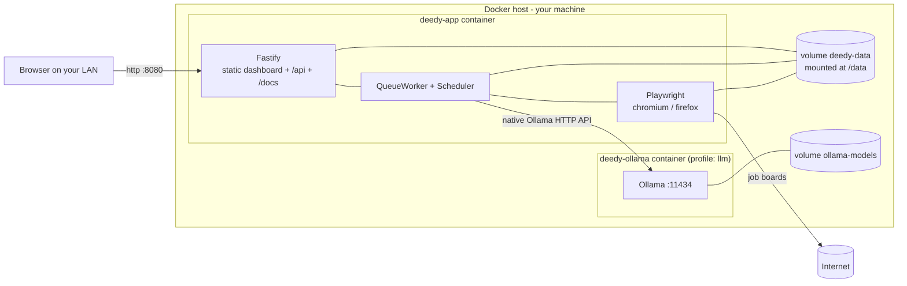

# Deployment

Deedy Automation ships as a **single self-contained container** that runs the Fastify API, the
persistent SQLite database, the background queue, the scheduler, and Playwright's browsers, and
serves the compiled React dashboard from the same origin.

Nothing in this document sends data off the host. The only outbound traffic the application ever
makes is to the job boards you configure and to the local LLM endpoint you point it at.

## Table of contents

- [Topology](#topology)
- [Prerequisites](#prerequisites)
- [Quick start](#quick-start)
- [Compose reference](#compose-reference)
- [Persistent state: the `/data` volume](#persistent-state-the-data-volume)
- [The encryption key](#the-encryption-key)
- [Connecting the local LLM](#connecting-the-local-llm)
- [Resource guidance](#resource-guidance)
- [Networking and reverse proxies](#networking-and-reverse-proxies)
- [Health checks and restart policy](#health-checks-and-restart-policy)
- [Logs](#logs)
- [Backup and restore](#backup-and-restore)
- [Upgrades](#upgrades)
- [Monitoring](#monitoring)
- [Troubleshooting](#troubleshooting)

---

## Topology

Production is **one container**. The API process is also the web server: `apps/web` builds into
`apps/api/public` (`build.outDir` in `apps/web/vite.config.ts`), the Dockerfile copies that
directory into the runtime image, and `createServer()` registers `@fastify/static` on `/` with an
SPA fallback to `index.html` for any non-`/api`, non-`/docs` route.

That single-origin design is deliberate:

- **No CORS in production.** The dashboard calls `/api/...` on its own origin. `CORS_ORIGINS` only
  matters for the split dev server on port 5173.
- **No second process to supervise.** The queue worker (`QueueWorker`) and the scheduler
  (`Scheduler`) run inside the same Node process as the HTTP server and are started from
  `apps/api/src/index.ts`. There is no external broker: the queue is SQLite tables.
- **One writer for one SQLite file.** Splitting the API into replicas would put multiple writers on
  `deedy.sqlite`. The application is explicitly designed as a single-instance, single-user system.
- **The browser lives with the code that drives it.** Playwright's persistent profiles are on the
  same volume as the database, so a container restart resumes with the same logged-in sessions.



The `ollama` service is optional and gated behind a Compose profile. If you already run Ollama, LM
Studio, llama.cpp or any other OpenAI-compatible server on the host, skip it and point the app at
`http://host.docker.internal:<port>` instead.

---

## Prerequisites

| Requirement | Notes |
| --- | --- |
| Docker Engine 24+ with Compose v2 | `docker compose version` must work. |
| ~8 GB free disk for the image | Chromium **and** Firefox via `npx playwright install --with-deps`, plus a XeLaTeX subset for resume rendering. |
| Disk for `/data` | Grows with screenshots and HTML snapshots. Budget 5-20 GB. |
| A local LLM | Ollama, LM Studio, llama.cpp server, or any OpenAI-compatible endpoint. See [Connecting the local LLM](#connecting-the-local-llm). |
| Seccomp relaxation for the app service | Already set in `docker-compose.yml`. Required for the LaTeX sandbox — see below. |

Node.js is **not** required on the host for a container deployment; it is only needed for the
development workflow.

### The LaTeX sandbox and `security_opt`

Resumes are LaTeX documents compiled by a real TeX engine. The LaTeX is written by the local model,
and `POST /api/resumes/compile` takes no authentication, so the input is attacker-influenced. TeX is
Turing-complete, which means the pattern denylist in front of the engine is a filter and not a
boundary — it is bypassable by construction.

The actual containment is `bubblewrap`: the engine runs in a mount namespace holding only the TeX
distribution and a throwaway work directory. That is what stops a crafted document reading
`/data/.encryption-key` (the key protecting your stored provider sessions) and returning it inside
the PDF it produces.

Bubblewrap needs unprivileged user namespaces, which Docker's default seccomp profile blocks, hence:

```yaml
security_opt:
  - seccomp:unconfined
  - apparmor:unconfined
```

Verify it took effect — the API says which path it is on at startup:

```bash
docker compose logs app | grep -i sandbox
# want: "latex compiles run inside a bubblewrap sandbox"
# not:  a warning that compiles are protected by the denylist alone
```

If your policy forbids relaxing seccomp, supply a custom profile permitting `unshare` and `clone`
with the `CLONE_NEW*` flags, or drop the lines and accept that resume compilation is protected by
the denylist alone. Everything else in the application is unaffected either way.

### What the container cannot do

- **VPN exit-location switching.** Settings → VPN drives NetworkManager on the host, so the
  `protonvpn`, `nmcli` and `wg_quick` backends do not work from inside the container. Run the app on
  the host if you need it, or route the container through a tunnel you manage externally.
- **Indeed from a datacentre address.** Indeed answers HTTP 403 "Request Blocked" to hosting and
  commodity VPN ranges. This is a network-reputation decision on their side; no collector setting
  and no exit-country rotation changes it. LinkedIn and the HTTP-only boards are unaffected.

---

## Quick start

```bash
git clone <your-remote> deedy-automation
cd deedy-automation

# Optional but recommended - see "The encryption key" below.
printf 'ENCRYPTION_KEY=%s\n' "$(openssl rand -hex 32)" >> .env

docker compose up -d --build
```

Then open <http://localhost:8080>. The API reference (Scalar, generated from the same Zod schemas
the routes validate with) is at <http://localhost:8080/docs>.

To start the bundled Ollama alongside it:

```bash
docker compose --profile llm up -d --build
docker compose exec ollama ollama pull qwen3:8b   # any model you like; none are hardcoded
```

Then in the dashboard go to **Settings -> Local LLM** and set the base URL to `http://ollama:11434` and
the model to whatever you pulled. See [Connecting the local LLM](#connecting-the-local-llm) for why
the default `http://localhost:11434` will not work from inside the container.

---

## Compose reference

`docker-compose.yml` is the production stack. Every setting in it, and why it is there:

### Service `app`

| Setting | Value | Why |
| --- | --- | --- |
| `build.context` / `build.target` | `.` / `runtime` | Builds the multi-stage `Dockerfile` and stops at the `runtime` stage, which contains only the compiled output, the pruned dependency tree, and the Playwright browsers. |
| `image` | `deedy-automation:latest` | Names the built image so you can `docker save`/`docker load` it onto an air-gapped host. |
| `container_name` | `deedy-app` | Stable name for `docker logs deedy-app` and `docker exec`. |
| `restart` | `unless-stopped` | Survives host reboots and crashes, but stays down if you deliberately `docker compose stop`. |
| `ports` | `${APP_PORT:-8080}:8080` | Publishes the dashboard/API. Override `APP_PORT` in `.env`. See the binding warning in [Networking](#networking-and-reverse-proxies). |
| `environment.NODE_ENV` | `production` | Parsed by the Zod env schema in `apps/api/src/config/env.ts`. |
| `environment.DATA_DIR` | `/data` | Root of all persisted state; matches the volume mount. |
| `environment.LOG_LEVEL` | `${LOG_LEVEL:-info}` | One of `trace debug info warn error fatal`. Applies to both stdout and the SQLite `logs` table. |
| `environment.CORS_ORIGINS` | `${CORS_ORIGINS:-http://localhost:5173}` | Comma-separated allow-list. Irrelevant in single-container production because the dashboard is same-origin. |
| `environment.ENCRYPTION_KEY` | `${ENCRYPTION_KEY:-}` | 64 hex characters. Empty means "generate and store a key file inside `/data`". |
| `volumes` | `deedy-data:/data` | The entire application state. See below. |
| `shm_size` | `1gb` | Chromium crashes with `SIGBUS` / "Target closed" on Docker's default 64 MB `/dev/shm`. |
| `extra_hosts` | `host.docker.internal:host-gateway` | Lets the container reach an LLM server running directly on the host. |
| `healthcheck` | `curl -fsS http://127.0.0.1:8080/api/health/live` | Cheap liveness probe. See [Health checks](#health-checks-and-restart-policy). |

The image itself also declares `VOLUME ["/data"]`, `EXPOSE 8080`, an identical `HEALTHCHECK`, and
runs as the unprivileged `node` user under `tini` as PID 1 so `SIGTERM` reaches Node and the
graceful shutdown path in `apps/api/src/index.ts` runs (scheduler stop -> worker drain -> browsers
closed -> `wal_checkpoint(TRUNCATE)` -> `sqlite.close()`).

### Service `ollama`

Only started with `--profile llm`. It publishes `${OLLAMA_PORT:-11434}` and stores models in the
separate `ollama-models` volume, which is intentionally *not* part of your application backups -
models are re-pullable, your job history is not.

### Environment file

Compose reads `.env` from the project directory automatically. The variables it interpolates are:

```dotenv
APP_PORT=8080
LOG_LEVEL=info
CORS_ORIGINS=http://localhost:5173
ENCRYPTION_KEY=
OLLAMA_PORT=11434
```

`.env` is gitignored. Treat it as a secret file: it holds the key that decrypts your stored LLM
token and notification webhook.

### Development stack

`docker-compose.dev.yml` is a separate project (`deedy-automation-dev`) that bind-mounts the source
tree and runs the API (`tsx watch`) and the Vite dev server (port 5173) as two containers with
hot reload. It uses its own `dev-data` volume, so it never touches production state.

```bash
docker compose -f docker-compose.dev.yml up
```

---

## Persistent state: the `/data` volume

`DATA_DIR` (`/data` in the container, the named volume `deedy-data`) is **the whole application**.
The image is disposable; the volume is not. `loadConfig()` creates and owns this exact layout:

```
/data
├── deedy.sqlite            # the database - jobs, applications, queue, logs, settings, LLM calls
├── deedy.sqlite-wal        # write-ahead log (journal_mode = WAL)
├── deedy.sqlite-shm        # WAL shared-memory index
├── .encryption-key         # 32-byte hex key, mode 0600 - only when ENCRYPTION_KEY is unset
├── artifacts/
│   ├── screenshots/        # PNGs captured at each automation step
│   └── html/               # HTML snapshots of pages the applier touched
├── documents/
│   ├── resumes/            # generated .md / .pdf / .docx resume versions
│   └── cover-letters/      # generated .md / .pdf / .docx cover letters
├── browser-profiles/       # one Playwright persistent context per provider (cookies, sessions)
├── backups/                # deedy-<timestamp>.sqlite snapshots
└── plugins/                # drop-in collector plugins, loaded at boot
```

Why the volume is the entire state:

- **Every operation persists to SQLite.** The queue, retry history, logs, LLM prompts and responses,
  settings, and application step history are all rows. Nothing important lives in memory, which is
  what makes the app restart-safe: on boot it calls `recoverStuck()` and `reclaimStalled()` to make
  interrupted work runnable again.
- **The database is *three* files, not one.** WAL mode means `deedy.sqlite` alone is not a complete
  snapshot while the process is running. Copy all three, or - much better - use the backup endpoint,
  which uses SQLite's online backup API to produce one consistent standalone file.
- **`browser-profiles/` is why you log into LinkedIn once.** Delete it and every provider needs a
  fresh interactive sign-in.
- **`.encryption-key` decrypts your secrets.** Rows containing `llm.apiKey` and
  `notifications.webhookUrl` are AES-256-GCM ciphertext (`enc:v1:<iv>:<tag>:<data>`). Lose the key
  and those two settings are unrecoverable; everything else still opens fine.
- **`plugins/` is code.** Collector plugins are loaded from here at startup by
  `CollectorRegistry.loadPlugins()`, so a plugin you added is part of your deployment.

To inspect the volume from the host:

```bash
docker volume inspect deedy-automation_deedy-data
docker compose exec app ls -la /data
```

If you prefer a host directory over a named volume, replace the mount with a bind mount and make
sure the directory is writable by UID 1000 (the `node` user in the image):

```yaml
volumes:
  - /srv/deedy/data:/data
```

```bash
sudo mkdir -p /srv/deedy/data && sudo chown -R 1000:1000 /srv/deedy/data
```

---

## The encryption key

`resolveEncryptionKey()` in `apps/api/src/config/env.ts` applies exactly two strategies:

1. **`ENCRYPTION_KEY` is set** - it must decode to 32 bytes, i.e. **64 hex characters**. Anything
   else throws `ENCRYPTION_KEY must be 32 bytes encoded as 64 hex characters` at startup and the
   container exits. Nothing is written to disk.
2. **`ENCRYPTION_KEY` is empty or absent** - the app reads `/data/.encryption-key`; if that file is
   missing or malformed it generates 32 random bytes and writes them there with mode `0600`.

Use the explicit variable for any deploy you want to be reproducible:

```bash
openssl rand -hex 32
```

Put the result in `.env` as `ENCRYPTION_KEY=...`. Then a fresh volume plus a restored database
decrypts correctly, and you can move the deployment between hosts by carrying `.env` and a backup
file rather than the whole volume.

Rely on the generated key file when you want zero configuration and you always back up the volume
as a unit.

**Do not switch strategies with existing data.** The two keys differ, so previously encrypted
values will fail to decrypt. If you must rotate: before changing the key, clear and re-enter the
affected settings (**Settings -> Local LLM -> API key**, **Settings -> Notifications -> webhook URL**)
after the new key is in place.

---

## Connecting the local LLM

The default `llm.baseUrl` in the settings schema is `http://localhost:11434`. Inside the container
`localhost` is the container itself, so that default **will not reach anything**. Pick the form that
matches where your server runs and set it in **Settings -> Local LLM**:

| Where the LLM runs | Base URL to use |
| --- | --- |
| The bundled `ollama` Compose service | `http://ollama:11434` |
| Ollama / LM Studio / llama.cpp on the Docker host | `http://host.docker.internal:11434` |
| Another machine on your LAN | `http://192.168.x.y:11434` |

Verify from the dashboard with **Settings -> Test connection** (`POST /api/settings/llm/test`), and
list what the endpoint offers with `GET /api/settings/llm/models`. Model names are never hardcoded
anywhere in the codebase - you choose them in Settings.

---

## Resource guidance

The container runs three memory-hungry things: Node with an in-process SQLite, one or more
Playwright browser contexts, and (optionally, in its own container) the model server.

| Component | RAM | CPU | Notes |
| --- | --- | --- | --- |
| API + SQLite + queue | 0.5-1 GB | 1 core | Baseline. |
| Each Playwright context | 0.4-0.8 GB | 0.5-1 core | Scales with **Settings -> Queue -> concurrency** and the browser engine. |
| Ollama, 8B model, Q4 | ~6 GB | 4+ cores, or a GPU | 14B quantised needs ~10-12 GB. |

Practical starting points:

- **App container only, LLM elsewhere:** 4 GB RAM, 2 cores.
- **Everything on one machine with an 8B model on CPU:** 16 GB RAM, 8 cores. Expect scoring to be
  the bottleneck; raise `llm.requestTimeoutMs` in Settings if calls time out.

`shm_size: '1gb'` is not optional. Chromium maps its renderer shared memory into `/dev/shm`, and
Docker's 64 MB default causes tab crashes that surface as `Target page, context or browser has been
closed` mid-application. If you run many concurrent contexts, raise it further.

Optional caps (Compose does not set these by default, so the container may use everything the host
has):

```yaml
services:
  app:
    deploy:
      resources:
        limits:
          memory: 8g
          cpus: '4.0'
```

Keep automation concurrency modest regardless of hardware. Job boards rate-limit, and the
application's value comes from careful applications rather than parallel ones.

---

## Networking and reverse proxies

> [!WARNING]
> **This application has no authentication, no user accounts, and no authorization layer.** Every
> endpoint under `/api` is open to anyone who can reach the port. It holds your résumés, your
> personal profile, your logged-in job-board sessions, and it can submit applications on your
> behalf. **Never expose it to the internet.** Do not port-forward it, do not put it on a public
> hostname, do not attach it to a Cloudflare tunnel without an access policy in front.

Safe deployment patterns, in order of preference:

1. **Loopback only.** Bind the published port to localhost and reach it over SSH:

   ```yaml
   ports:
     - '127.0.0.1:8080:8080'
   ```

   ```bash
   ssh -N -L 8080:127.0.0.1:8080 user@host
   ```

2. **LAN plus a VPN.** Leave the default binding, keep the host off the public internet, and reach
   it through WireGuard/Tailscale when away.
3. **Reverse proxy on the LAN with authentication in the proxy.** The proxy must add the auth layer
   the app does not have (basic auth, mTLS, an SSO forward-auth). Fastify is created with
   `trustProxy: true`, so `X-Forwarded-*` headers from your proxy are honoured.

A minimal Caddy site that adds basic auth and TLS on a LAN hostname:

```caddyfile
deedy.lan {
  tls internal
  basic_auth {
    you $2a$14$...   # caddy hash-password
  }
  reverse_proxy 127.0.0.1:8080 {
    flush_interval -1   # required: /api/events is Server-Sent Events
  }
}
```

The nginx equivalent for the SSE endpoint:

```nginx
location /api/events {
  proxy_pass http://127.0.0.1:8080;
  proxy_http_version 1.1;
  proxy_set_header Connection '';
  proxy_buffering off;
  proxy_read_timeout 24h;
}
```

The application already sends `X-Accel-Buffering: no` and a 25-second heartbeat comment on that
stream, but a proxy that buffers responses will still break live dashboard updates. Also allow at
least a 16 MB request body if you upload résumés through the proxy - that is Fastify's configured
`bodyLimit`.

---

## Health checks and restart policy

Two endpoints, for two different purposes:

| Endpoint | Cost | Use for |
| --- | --- | --- |
| `GET /api/health/live` | Trivial - returns `{"ok":true}` without touching the database | Container health checks, proxy upstream probes |
| `GET /api/health` | Queries SQLite and pings the LLM endpoint | Dashboards, alerting, manual diagnosis |

The container health check (identical in the `Dockerfile` and in `docker-compose.yml`) is:

```
interval: 30s   timeout: 5s   retries: 3   start_period: 25s
```

`start_period: 25s` covers migrations, plugin loading and Playwright startup on a cold boot without
counting early failures against the retry budget.

**Do not** point a container health check at `/api/health`: it reports `degraded` whenever the LLM
endpoint is unreachable, which is a perfectly normal state (model server restarting, laptop asleep)
and must not restart a container that is otherwise collecting jobs happily.

`restart: unless-stopped` restarts the container after crashes and host reboots. It is safe because
every unit of work is a durable SQLite row: on boot the app re-arms interrupted applications and
reclaims stalled queue jobs, so a hard kill costs at most the in-flight step, which the retry system
picks up again.

Compose's `restart` policy does not act on health-check failures - it only reacts to process exit.
If you want unhealthy-means-restart, run a supervisor such as Docker Swarm mode or add an external
watchdog; the process is designed to exit on fatal startup errors, which is the case that matters.

---

## Logs

Logs go to **two places at once**, from `AppLogger`:

1. **stdout as JSON lines** via pino, with ISO timestamps and a `scope` field.
2. **the `logs` table in SQLite**, which is what the dashboard's Logs page and
   `GET /api/logs` search (filter by level, scope and free text; `GET /api/logs/scopes` lists the
   scopes seen so far).

Keys matching `api_key`, `apikey`, `password`, `passwd`, `secret`, `token`, `authorization` or
`cookie` are replaced with `[REDACTED]` before either sink sees them.

Reading the container stream:

```bash
docker compose logs -f app
docker compose logs --since 15m app | jq 'select(.level=="error")'
```

The stream is unbounded by default. Cap it so a long-running deployment cannot fill the disk:

```yaml
services:
  app:
    logging:
      driver: json-file
      options:
        max-size: '10m'
        max-file: '5'
```

The SQLite copy prunes itself: the scheduled `cleanup` task enqueues `maintenance.cleanup`, which
deletes logs, LLM call records and completed queue jobs older than
**Settings -> Scheduler -> retention days** (default 90). Adjust `cleanupIntervalMinutes` and
`retentionDays` there, or run it on demand with `POST /api/scheduler/cleanup/run`.

Set `LOG_LEVEL=debug` in `.env` and `docker compose up -d` to get per-request `/api` lines while
diagnosing; return it to `info` afterwards, since debug logging is also written to the database.

---

## Backup and restore

### What to back up

| Path | Back up? | Why |
| --- | --- | --- |
| `/data/backups/*.sqlite` | **Yes** | Consistent, standalone database snapshots. |
| `/data/documents/` | **Yes** | Generated résumés and cover letters. |
| `/data/artifacts/` | Optional | Screenshots and HTML snapshots; large, regenerable evidence trail. |
| `/data/browser-profiles/` | Optional | Saves you from logging in again after a restore. Contains live session cookies - encrypt it. |
| `/data/plugins/` | **Yes**, if you use plugins | Custom collectors are code. |
| `.env` on the host | **Yes** | Holds `ENCRYPTION_KEY`. Store separately from the backups. |
| `/data/.encryption-key` | **Yes**, if you do not set `ENCRYPTION_KEY` | Without it the two encrypted settings cannot be read. |

### Automatic backups

`BackupService.run()` uses SQLite's online backup API, so it produces a consistent snapshot while
the application keeps writing - no downtime and no need to touch the WAL files. Output is
`/data/backups/deedy-<ISO-timestamp>.sqlite`, and it prunes to the newest
**Settings -> Scheduler -> backups to keep** (default 14).

The scheduler enqueues `maintenance.backup` every `backupIntervalMinutes` (default 1440, i.e.
daily).

### On-demand backup

```bash
# Take one now
curl -fsS -X POST http://localhost:8080/api/backups

# List what exists
curl -fsS http://localhost:8080/api/backups | jq
```

Or trigger the scheduled task by name with `POST /api/scheduler/backup/run`. The dashboard has no
run-now control for scheduled tasks; the endpoint is the only trigger.

### Copy backups off the volume

```bash
mkdir -p ~/deedy-backups
docker cp deedy-app:/data/backups/. ~/deedy-backups/
docker cp deedy-app:/data/documents ~/deedy-backups/documents
```

Full-volume archive (do this with the container **stopped** so the WAL is checkpointed and the tar
is coherent):

```bash
docker compose stop app
docker run --rm \
  -v deedy-automation_deedy-data:/data:ro \
  -v "$PWD":/out \
  debian:bookworm-slim \
  tar czf /out/deedy-data-$(date +%F).tar.gz -C /data .
docker compose start app
```

### Restore a database snapshot

A backup file is a complete database. Replace the live one and delete the stale WAL sidecars, which
belong to the old file and would otherwise be replayed on top of the restored one.

```bash
docker compose stop app

# Put the snapshot where the container can see it.
docker run --rm -v deedy-automation_deedy-data:/data -v "$PWD":/in debian:bookworm-slim \
  sh -c 'cp /in/deedy-2026-07-30T02-00-00-000Z.sqlite /data/deedy.sqlite.restore'

docker run --rm -v deedy-automation_deedy-data:/data debian:bookworm-slim \
  sh -c 'rm -f /data/deedy.sqlite /data/deedy.sqlite-wal /data/deedy.sqlite-shm \
         && mv /data/deedy.sqlite.restore /data/deedy.sqlite \
         && chown 1000:1000 /data/deedy.sqlite'

docker compose start app
docker compose logs -f app   # migrations run automatically against the restored file
```

Documents and artifacts referenced by restored rows are file paths under `/data`. If you restore the
database without the matching `documents/` tree, those rows will point at files that no longer
exist; regenerate them from the Resume Manager and Cover Letters pages, or restore both together.

### Restore a whole volume

```bash
docker compose down
docker volume rm deedy-automation_deedy-data
docker volume create deedy-automation_deedy-data
docker run --rm -v deedy-automation_deedy-data:/data -v "$PWD":/in debian:bookworm-slim \
  sh -c 'tar xzf /in/deedy-data-2026-07-30.tar.gz -C /data && chown -R 1000:1000 /data'
docker compose up -d
```

Make sure `ENCRYPTION_KEY` in `.env` is the same value the backup was written under, or that the
restored volume still contains its `.encryption-key`.

---

## Upgrades

Migrations are applied automatically. `createContainer()` calls `runMigrations()` before anything
else touches the database: every not-yet-applied `.sql` file in `apps/api/migrations` runs in
lexicographic order, each inside its own transaction, and is recorded in the `_migrations` table.
Re-running is a no-op, so an upgrade needs no manual migration step.

Runbook:

```bash
# 1. Back up first - migrations are forward-only and have no down scripts.
curl -fsS -X POST http://localhost:8080/api/backups | jq
docker cp deedy-app:/data/backups/. ~/deedy-backups/

# 2. Get the new code.
git pull

# 3. Rebuild and replace the container. The volume is untouched.
docker compose up -d --build

# 4. Watch migrations apply and the server come up.
docker compose logs -f app
```

Expected log lines, in order: `database migrations applied` (only when something was pending),
`starting Deedy Automation`, optionally `recovered interrupted work`, then `server listening`.

Verify:

```bash
curl -fsS http://localhost:8080/api/health | jq '{status, version, database, llm, queue}'
docker compose ps    # STATUS should reach "healthy"
```

Rolling back means restoring the pre-upgrade backup **and** checking out the previous revision -
a newer schema is not readable by older code. Restore in that order: `git checkout <old-ref>`,
restore the snapshot, `docker compose up -d --build`.

Housekeeping after a few upgrades:

```bash
docker image prune -f      # removes superseded deedy-automation images
```

If you need to run migrations against the data directory outside the container (for example on a
host install), the workspace exposes `npm run db:migrate`, which loads the same config and applies
the same files.

---

## Monitoring

### Liveness and dependencies

`GET /api/health` returns everything you need for an at-a-glance alert:

```json
{
  "status": "ok",
  "version": "1.0.0",
  "uptimeSeconds": 84213,
  "database": true,
  "llm": { "reachable": true, "model": "qwen3:8b", "error": null },
  "queue": { "running": true, "paused": false, "pending": 12, "active": 1 },
  "scheduler": { "running": true, "tasks": [{ "name": "collect", "nextRunAt": "..." }] }
}
```

`status` is `ok` only when the database responds **and** the LLM endpoint is reachable; otherwise
`degraded`. Alert-worthy conditions:

| Condition | Meaning |
| --- | --- |
| `database: false` | The SQLite file is unreadable. Investigate immediately; nothing else works. |
| `llm.reachable: false` | Model server down or `llm.baseUrl` wrong. Scoring and generation stall; collection continues. `llm.error` carries the message. |
| `queue.running: false` while `queue.paused: false` | The worker is not processing. Check `DISABLE_WORKERS` and the logs. |
| `queue.pending` climbing steadily | Throughput below arrival rate - usually a slow or unreachable LLM. |
| `scheduler.running: false` | Set **Settings -> Scheduler -> enabled**, or check `DISABLE_WORKERS`. |

A minimal poll loop, if you have no monitoring stack:

```bash
watch -n 30 'curl -fsS localhost:8080/api/health | jq "{status, database, llm: .llm.reachable, pending: .queue.pending}"'
```

### Operational metrics

| Endpoint | What it gives you |
| --- | --- |
| `GET /api/analytics/overview` | Headline counters: totals and today's counts for jobs and applications, scored jobs, average score, submitted / failed / needs-human / interview / offer / rejected, plus `responseRate` and `interviewRate`. |
| `GET /api/analytics?days=30` | Full payload: applications per day, jobs per day, average score per day, LLM tokens per day, the application funnel, source distribution, top companies and skills. |
| `GET /api/queue/stats` | Queue depth by status and by task, plus worker `running` / `inFlight` / `workerId`. |
| `GET /api/collectors/runs?limit=50` | Per-run found / inserted / duplicate / error counts - the fastest way to spot a collector that a site change has broken. |
| `GET /api/llm-calls?success=false` | Failed LLM calls with their errors. |
| `GET /api/logs?level=error` | Persisted error log search. |
| `GET /api/backups` | Backup filenames, sizes and timestamps - check the newest is recent. |
| `GET /api/browser-sessions` | Per-provider login state; a provider flipping to logged-out is why applications start failing. |
| `GET /api/events` | Server-sent event stream of queue, job, application, LLM and log events. Convenience only - durable state is always in SQLite. |

All of these are rendered by the dashboard's Overview, Analytics, Automation Queue and LLM Activity
pages, and all are documented with schemas at `/docs`.

A weekly review worth doing: `GET /api/analytics?days=7` for the funnel and response rate,
`GET /api/collectors/runs` for silently broken sources, and `GET /api/backups` to confirm the
scheduled backup is still running.

---

## Troubleshooting

| Symptom | Cause and fix |
| --- | --- |
| Container exits at once with `ENCRYPTION_KEY must be 32 bytes encoded as 64 hex characters` | The value is not 64 hex chars. Regenerate with `openssl rand -hex 32`. |
| Log line `dashboard build not found; API only` | The `apps/api/public` build was missing from the image. Rebuild with `docker compose build --no-cache app`. |
| Browsers crash mid-application, `Target page, context or browser has been closed` | `/dev/shm` too small. Confirm `shm_size: '1gb'` is present and the container was recreated, not just restarted. |
| `llm.reachable: false` with the bundled Ollama running | `llm.baseUrl` is still `http://localhost:11434`. Set it to `http://ollama:11434`, or `http://host.docker.internal:11434` for a host-side server. |
| `SQLITE_BUSY` in the logs | Two processes have the database open. Only one container may mount `deedy-data` - check for a stray dev container or a host process. |
| Permission errors writing `/data` after switching to a bind mount | `chown -R 1000:1000` the host directory; the container runs as `node`. |
| Dashboard loads but live updates never arrive | A reverse proxy is buffering `/api/events`. Disable response buffering for that path. |
| Encrypted settings read back as gibberish or fail after a move | The key changed. Restore the original `ENCRYPTION_KEY` / `.encryption-key`, or re-enter the LLM API key and webhook URL. |

Container shell access for anything else:

```bash
docker compose exec app sh
docker compose exec app ls -la /data
docker compose exec app node -e "console.log(process.env.DATA_DIR)"
```
