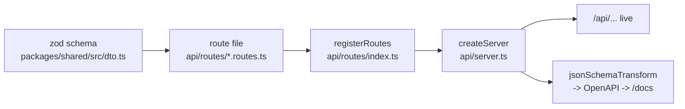
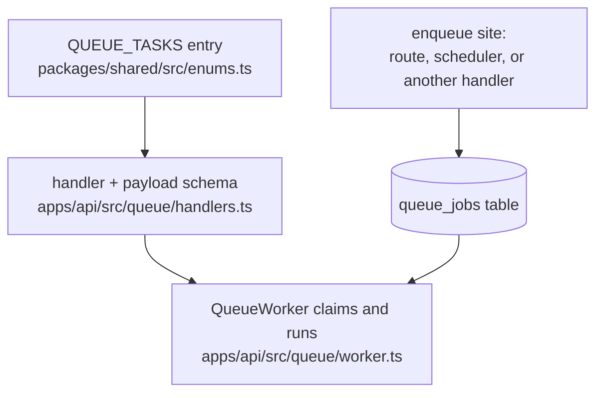
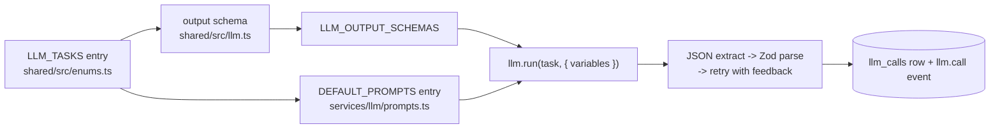

# Developer Guide

Everything you need to work on Deedy Automation: how the workspace fits together, how to run it,
and the exact steps for the five changes you will make most often (a REST endpoint, a queue task,
an LLM task, a migration, a test).

The platform is fully local. There are no cloud APIs, no CDNs, no telemetry and no external fonts
anywhere in the codebase, and contributions must keep it that way. Model inference goes to a local
server you configure yourself (Ollama, llama.cpp, LM Studio or any OpenAI-compatible endpoint).

## Table of contents

- [Repository layout](#repository-layout)
- [Prerequisites](#prerequisites)
- [The dev loop](#the-dev-loop)
  - [Docker Compose (recommended)](#docker-compose-recommended)
  - [On the host](#on-the-host)
  - [Environment variables](#environment-variables)
- [`@deedy/shared` is the contract](#deedyshared-is-the-contract)
- [Code quality rules](#code-quality-rules)
- [Adding a REST endpoint](#adding-a-rest-endpoint)
- [Adding a queue task](#adding-a-queue-task)
- [Adding an LLM task](#adding-an-llm-task)
- [Adding a database migration](#adding-a-database-migration)
- [Testing](#testing)
- [Debugging](#debugging)
- [Known rough edges](#known-rough-edges)

---

## Repository layout

npm workspaces, declared in the root `package.json` as `packages/*` and `apps/*`.

```
deedy-automation/
├── package.json                 # workspace root: build/dev/lint/test scripts
├── tsconfig.base.json           # strict compiler options every project extends
├── eslint.config.js             # flat ESLint config (typescript-eslint + prettier)
├── .prettierrc
├── Dockerfile                   # deps -> build -> runtime stages
├── docker-compose.yml           # production stack (+ optional `llm` profile for Ollama)
├── docker-compose.dev.yml       # bind-mounted dev stack with hot reload
├── packages/
│   └── shared/                  # @deedy/shared - types + Zod schemas, no runtime deps but zod
│       └── src/{enums,llm,settings,dto,index}.ts
└── apps/
    ├── api/                     # @deedy/api - Fastify + Drizzle + better-sqlite3 + Playwright
    │   ├── migrations/          # numbered .sql files, applied at boot
    │   ├── src/
    │   │   ├── index.ts         # process entrypoint: config -> container -> server -> listen
    │   │   ├── config/env.ts    # env parsing + DATA_DIR layout + encryption key
    │   │   ├── core/            # container (composition root), logger, events, errors, crypto, utils
    │   │   ├── db/              # drizzle schema, client, migrate, migrate-cli, seed
    │   │   ├── repositories/    # all SQL lives here
    │   │   ├── services/        # business logic; services/llm/* owns model access
    │   │   ├── collectors/      # one module per job board + plugin registry
    │   │   ├── browser/         # Playwright manager, form filler, appliers
    │   │   ├── queue/           # worker + task handlers
    │   │   ├── scheduler/       # interval-driven task enqueuing
    │   │   └── api/             # server.ts, types.ts, routes/*.routes.ts
    │   └── tests/{unit,integration}/
    └── web/                     # @deedy/web - React + Vite + Tailwind + TanStack Query + Recharts
        ├── src/{pages,components,lib}/
        └── tests/e2e/           # Playwright
```

Two facts about the layout that are easy to miss:

1. `apps/web` builds into `apps/api/public` (`build.outDir` in `apps/web/vite.config.ts`). The API
   serves that directory at `/` via `@fastify/static`, with an SPA fallback to `index.html` for any
   non-`/api`, non-`/docs` path. One process serves both in production.
2. Everything mutable lives under `DATA_DIR`. `apps/api/src/config/env.ts` creates and hands out the
   full layout: `deedy.sqlite`, `artifacts/screenshots`, `artifacts/html`, `documents/resumes`,
   `documents/cover-letters`, `browser-profiles`, `backups`, `plugins` and `.encryption-key`.

## Prerequisites

- Node.js >= 22 (`engines` in the root `package.json`); the Docker images use `node:22-bookworm-slim`.
- A C toolchain for `better-sqlite3` when no prebuild matches your platform. The Dockerfile installs
  `python3 make g++` for exactly this reason.
- Playwright browsers (`chromium` and `firefox`) for the browser-driven collectors, the appliers,
  PDF rendering and the browser-backed tests.
- A local model server if you want the AI tasks to do anything. `docker-compose.yml` ships an
  optional `ollama` service behind the `llm` profile.

## The dev loop

### Docker Compose (recommended)

```bash
docker compose -f docker-compose.dev.yml up
```

This builds the `deps` stage of the `Dockerfile` and starts two containers that bind-mount the repo:

| Service | Container | What it runs | Port |
| --- | --- | --- | --- |
| `api` | `deedy-api-dev` | `playwright install chromium firefox`, then builds `@deedy/shared`, then `npm run dev -w @deedy/api` (`tsx watch src/index.ts`) | `8080` |
| `web` | `deedy-web-dev` | builds `@deedy/shared`, then `npm run dev -w @deedy/web -- --host 0.0.0.0` | `5173` |

Named volumes keep `node_modules` (per service), `/data` and the Playwright browser cache out of
your working tree. `shm_size: 1gb` is set on the API because Chromium needs more shared memory than
Docker's 64 MB default. The dev API runs with `LOG_LEVEL=debug` and
`CORS_ORIGINS=http://localhost:5173` already set.

Open:

- `http://localhost:5173` - the dashboard with hot reload. Vite proxies `/api` to
  `VITE_API_URL` (default `http://localhost:8080`).
- `http://localhost:8080/docs` - the Scalar-rendered OpenAPI reference.
- `http://localhost:8080/api/health` - database, LLM, queue and scheduler status in one payload.

To reach a model server running on your host from inside the container, use
`http://host.docker.internal:11434`; `extra_hosts` maps it to the host gateway. To run Ollama as a
container instead, start the production stack's optional profile:

```bash
docker compose --profile llm up -d ollama
```

### On the host

```bash
npm install                        # once (also builds nothing - see the next section)
npm run build -w @deedy/shared     # ALWAYS first
npm run dev                        # concurrently: API on :8080, web on :5173
```

`npm run dev` at the root starts both apps but does **not** build `@deedy/shared` for you. If you
have never built it, or you just changed it, build it first, or run
`npm run dev -w @deedy/shared` (`tsc --watch`) in a third terminal so the other two pick up changes
automatically.

Useful root scripts:

| Script | Effect |
| --- | --- |
| `npm run build` | builds shared, then api, then web (order matters) |
| `npm run dev` | `concurrently` runs the API and web dev servers |
| `npm start` | runs the compiled API: `node apps/api/dist/index.js` |
| `npm run typecheck` | `tsc --noEmit` across every workspace |
| `npm run lint` / `npm run lint:fix` | ESLint over the repo |
| `npm run format` / `npm run format:check` | Prettier |
| `npm test` | the API vitest suite |
| `npm run test:e2e` | the web Playwright suite |
| `npm run db:migrate` | applies pending SQL migrations via `apps/api/src/db/migrate-cli.ts` |
| `npm run db:seed` | seeds default settings, prompt templates and the answer bank (idempotent) |

### Environment variables

Parsed and defaulted by `envSchema` in `apps/api/src/config/env.ts`:

| Variable | Default | Purpose |
| --- | --- | --- |
| `NODE_ENV` | `production` | `development` \| `production` \| `test` |
| `HOST` | `0.0.0.0` | listen address |
| `PORT` | `8080` | listen port |
| `DATA_DIR` | `./data` | root of every piece of persisted state |
| `LOG_LEVEL` | `info` | `trace` \| `debug` \| `info` \| `warn` \| `error` \| `fatal` |
| `WEB_DIR` | `./public` | directory containing the built dashboard |
| `CORS_ORIGINS` | `http://localhost:5173` | comma-separated; only needed for the split dev server |
| `DISABLE_WORKERS` | `false` | `true`/`1` boots the API without the queue worker and scheduler |
| `ENCRYPTION_KEY` | (generated) | 64 hex chars (32 bytes). If unset, a key is generated once and written to `$DATA_DIR/.encryption-key` with mode `0600` |

Other variables read outside that schema: `VITE_API_URL` (Vite dev proxy target),
`E2E_BASE_URL` and `CI` (`apps/web/playwright.config.ts`), and `APP_PORT` / `OLLAMA_PORT` /
`LOG_LEVEL` / `CORS_ORIGINS` / `ENCRYPTION_KEY` interpolated by `docker-compose.yml`.

Everything else - LLM provider and model, scoring thresholds, auto-apply, queue concurrency,
scheduler intervals, capture toggles - is **runtime settings** stored in the `settings` table and
edited on the Settings page, not environment configuration. See
`packages/shared/src/settings.ts`.

## `@deedy/shared` is the contract

`packages/shared` is the single source of truth for every type and validation schema that crosses a
boundary. It exports four modules through `src/index.ts`:

| Module | Contents |
| --- | --- |
| `enums.ts` | the closed vocabularies: `JOB_SOURCES`, `JOB_STATUSES`, `APPLICATION_STATUSES`, `APPLICATION_STEPS`, `QUEUE_STATUSES`, `QUEUE_TASKS`, `LLM_PROVIDERS`, `LLM_TASKS`, `BROWSER_ENGINES`, `LOG_LEVELS`, `ARTIFACT_KINDS`, each with a matching `z.enum` and inferred type |
| `llm.ts` | one Zod schema per LLM task plus the `LLM_OUTPUT_SCHEMAS` map |
| `settings.ts` | `settingsSchema`, `DEFAULT_SETTINGS`, `SECRET_SETTING_PATHS` |
| `dto.ts` | the DTO and query schemas the REST API serves (`jobDtoSchema`, `logQuerySchema`, `llmCallDtoSchema`, `paginationSchema`, …) |

Because the package is consumed through its **built output** (`"main": "./dist/index.js"`,
`"types": "./dist/index.d.ts"`), it must be compiled before the API or the web app can typecheck or
run:

```bash
npm run build -w @deedy/shared   # tsc -p tsconfig.json
npm run dev   -w @deedy/shared   # tsc --watch, for an editing session
```

The root `build` script and both Compose services already do this in the right order. If you see
`Cannot find module '@deedy/shared'` or stale-looking types, this is almost always the cause.

Rule of thumb: if a shape is used by more than one workspace, or is persisted, or is sent over
HTTP, it belongs in `packages/shared`. Anything private to the API (repository row types, service
options, container wiring) stays in `apps/api`.

## Code quality rules

`tsconfig.base.json` is strict and then some: `strict`, `noImplicitAny`, `noImplicitOverride`,
`noImplicitReturns`, `noFallthroughCasesInSwitch`, `noUncheckedIndexedAccess`,
`useUnknownInCatchVariables`, `isolatedModules`, `declaration`.

`noUncheckedIndexedAccess` deserves a warning: every index access is `T | undefined`. The test
helpers show the accepted pattern - narrow explicitly and throw, do not assert.

ESLint (`eslint.config.js`, flat config) adds:

| Rule | Setting |
| --- | --- |
| `@typescript-eslint/no-explicit-any` | `error` - **`any` is banned**, and `@ts-ignore` is not an escape hatch. Use `unknown` plus a Zod parse, or a real type |
| `@typescript-eslint/no-unused-vars` | `error`, with `^_` ignored for args and vars |
| `@typescript-eslint/consistent-type-imports` | `error`, inline `import { type X }` style |
| `no-console` | `error`, only `console.error` allowed - use the injected `Logger` |
| `eqeqeq` | `always` |

`eslint-config-prettier` is applied last, so formatting is Prettier's job alone: semicolons, single
quotes, trailing commas everywhere, 100-column width, 2-space indent, always-parenthesised arrow
params (`.prettierrc`).

Two conventions the compiler cannot enforce:

- The API is ESM with `moduleResolution: NodeNext`, so **relative imports carry the `.js`
  extension** even though the source is `.ts` (`import { runMigrations } from './migrate.js'`).
- Comments explain *why*, not *what*, and never use em-dashes.

Before pushing:

```bash
npm run typecheck && npm run lint && npm run format:check && npm test
```

## Adding a REST endpoint

The chain is: Zod schema in `@deedy/shared` (or locally, if the shape is route-specific) -> a route
file under `apps/api/src/api/routes/` -> registration in `routes/index.ts` -> the endpoint appears
in the OpenAPI document and at `/docs` with no extra work.



That last edge is the point of the setup: `createServer` registers `@fastify/swagger` with
`transform: jsonSchemaTransform` from `fastify-type-provider-zod`, so the *same* Zod schemas that
validate requests generate the OpenAPI 3.1 document. There is no second schema to maintain.

1. **Define the shapes.** Reusable DTOs go in `packages/shared/src/dto.ts`; one-off request bodies
   are declared inline in the route file (see `jobDetailSchema` at the top of `jobs.routes.ts`).

2. **Write the handler** in the route module that owns the tag. Every route uses the shared helpers
   from `apps/api/src/api/types.ts`: `ApiInstance` (Fastify with the Zod type provider),
   `idParamSchema`, `okSchema`, `paginatedSchema()` and `commonErrors`.

   ```ts
   app.get(
     '/jobs/sources',
     {
       schema: {
         tags: ['jobs'],
         summary: 'List the sources that have produced jobs',
         response: { 200: z.object({ sources: z.array(z.string()) }), ...commonErrors },
       },
     },
     async () => ({ sources: jobs.distinctSources() }),
   );
   ```

   Notes drawn from the existing routes:
   - Reach the domain through `container.repositories.*` and `container.services.*`. Routes stay
     thin; SQL belongs in repositories.
   - Throw the typed errors from `core/errors.ts` (`NotFoundError`, `ValidationError`,
     `ConfigurationError`, …). `app.setErrorHandler` maps `AppError` to `{ error, message, details }`
     with the right status and logs 5xx separately from 4xx; a raw `ZodError` becomes a 400
     `validation_error`.
   - Always spread `...commonErrors` into `response` so 400/404/409/422/500 are documented.
   - Return `{ ok: true as const }` for side-effect endpoints, matching `okSchema`.
   - `tags` must be one of the tags declared in `createServer` (`health`, `settings`, `jobs`,
     `applications`, `resumes`, `cover-letters`, `queue`, `collectors`, `browser`, `observability`,
     `analytics`), otherwise it will not be grouped in `/docs`.

3. **Register it.** New *file* only: add the import and one `await` line to
   `apps/api/src/api/routes/index.ts`. Adding a route to an existing file needs no wiring.

   ```ts
   export async function registerRoutes(app: ApiInstance, container: Container): Promise<void> {
     await healthRoutes(app, container);
     // ...
     await observabilityRoutes(app, container);
   }
   ```

   `registerRoutes` is mounted under the `/api` prefix, so `'/jobs'` is served at `/api/jobs`.

4. **Verify.** Restart (or let `tsx watch` restart) and check `http://localhost:8080/docs`. Add a
   case to `apps/api/tests/integration/api.test.ts`, which boots the real container and server with
   `app.inject`.

## Adding a queue task

The queue is a SQLite table polled by `QueueWorker`. Every state transition is a durable write, so
killing the process mid-task loses nothing: stalled locks are reclaimed on the next boot
(`queue.reclaimStalled()` runs in `apps/api/src/index.ts` and again in `QueueWorker.start`).



1. **Add the task name** to `QUEUE_TASKS` in `packages/shared/src/enums.ts`. It is a
   `const` tuple feeding `queueTaskSchema` and the `QueueTask` type, so this one edit gives you
   runtime validation and exhaustiveness checking. Rebuild `@deedy/shared`.

2. **Add the handler** in `apps/api/src/queue/handlers.ts`. `createHandlers` returns a
   `Record<QueueTask, (payload: unknown) => Promise<void>>`, so the compiler will now fail until the
   new key exists. Declare a Zod payload schema next to the others and validate through the local
   `parse()` helper, which throws `ValidationError` on bad input:

   ```ts
   const companyPayload = z.object({ companyId: z.number().int().positive() });

   'company.summarize': async (payload) => {
     const { companyId } = parse(companyPayload, payload);
     await deps.jobService.summarizeCompany(companyId);
   },
   ```

   Handlers are deliberately thin: validate, delegate to a service, return. Retries, attempt
   counting, timing, events and persistence are the worker's job. If your handler needs a service
   that is not yet injected, add it to `HandlerDependencies` and pass it from `createHandlers({...})`
   in `apps/api/src/core/container.ts`.

3. **Enqueue it.** `QueueRepository.enqueue` takes
   `{ task, payload, priority?, maxAttempts?, runAt?, dedupeKey? }`. When `dedupeKey` is set, an
   existing pending/active job with the same key is reused instead of duplicated - the standard
   convention in this codebase is `` `${task}:${entityId}` ``:

   ```ts
   deps.queue.enqueue({
     task: 'job.score',
     payload: { jobId },
     dedupeKey: `job.score:${jobId}`,
     priority: 6,
   });
   ```

   The three places work gets enqueued:
   - **Routes** - `POST /api/jobs/:id/score`, `/api/jobs/:id/enrich`, `/api/applications/apply`,
     `/api/applications/:id/retry`, `/api/resumes/:id/tailor`, `/api/collectors/:collectorId/run`.
   - **The scheduler** - `createScheduledTasks` in `apps/api/src/scheduler/scheduler.ts` enqueues
     `collect.jobs`, `job.enrich`, `application.apply`, `maintenance.cleanup` and
     `maintenance.backup` on the intervals configured under `settings.scheduler`.
   - **Other handlers** - the pipeline chains itself: `collect.jobs` enqueues `job.enrich`, which
     enqueues `job.score`, which enqueues `application.apply` when `settings.application.autoApply`
     is on and the score clears `minScoreToApply`.

4. **Concurrency.** `QueueWorker` respects `settings.queue.concurrency` overall and a separate,
   smaller `settings.queue.browserConcurrency` for the tasks listed in `BROWSER_TASKS`
   (`application.apply`, `collect.jobs`). If your task drives Playwright, add it to that array.

5. **Test it.** `apps/api/tests/integration/queue.test.ts` drives a real `QueueWorker` against a
   file-backed database with stub handlers - the cheapest place to prove claiming, retries and
   dedupe behave.

## Adding an LLM task

Every model call in the system goes through `LlmService.run()`. Each task is schema-constrained,
validated with Zod, retried with corrective feedback, and recorded in `llm_calls`. There is no way
to add a task without structured-output validation, by design.



1. **Add the task name** to `LLM_TASKS` in `packages/shared/src/enums.ts`.

2. **Declare the output schema** in `packages/shared/src/llm.ts` and register it in
   `LLM_OUTPUT_SCHEMAS`. Keep the bounds tight (`.max()` on arrays and strings); they are converted
   to JSON Schema by `zodToJsonSchema` and sent to the model as a structured-output constraint when
   `settings.llm.useStructuredOutputs` is on.

   ```ts
   export const formAnswerSchema = z.object({
     answer: z.string().max(4000),
     confidence: z.number().min(0).max(1),
     needsHuman: z.boolean(),
   });
   export type FormAnswer = z.infer<typeof formAnswerSchema>;
   ```

   Skipping this step is a compile error, not a runtime surprise: `LlmService` indexes
   `LLM_OUTPUT_SCHEMAS[task]` with an `LlmTask`.

3. **Write the prompt** in `DEFAULT_PROMPTS` in `apps/api/src/services/llm/prompts.ts`. That map is
   typed `Record<LlmTask, PromptTemplate>`, so a missing entry also fails to compile. Templates use
   `{{placeholder}}` syntax filled by `renderTemplate` from a flat `Record<string, string>`; unknown
   placeholders render as empty strings. Append the shared `JSON_RULE` to the system prompt so the
   model is told to emit bare JSON.

4. **Call it** from a service, never from a route or a handler:

   ```ts
   const skills = await this.llm.run('skill_extraction', { variables, jobId, useFastModel: true });
   this.jobs.replaceSkills(jobId, skills.data.hardSkills);
   ```

   `RunTaskOptions` accepts `variables`, `jobId`, `applicationId`, `useFastModel` (prefer
   `settings.llm.fastModel` for cheap classification work) and `signal`. The result is
   `{ data, model, totalTokens, durationMs, callId }`, where `data` is the inferred type of your
   schema.

5. **What `run()` does for you.** It resolves the model, renders the active DB prompt template for
   the task (falling back to `DEFAULT_PROMPTS`), calls the provider, pulls the first balanced JSON
   object out of the response with `extractJson` (local models love to wrap JSON in prose or
   fences), parses it with your schema, and on failure appends the rejection reason to the
   conversation and retries up to `settings.llm.maxRetries`. Every attempt - success or failure -
   writes an `llm_calls` row with the system prompt, user prompt, raw response, token counts,
   duration and error, and emits an `llm.call` event.

6. **Prompt iteration without a rebuild.** Prompts are also editable at runtime: the LLM Activity
   page posts new versions to `POST /api/prompts` and activates them with
   `POST /api/prompts/:id/activate`. `GET /api/prompts` returns stored templates alongside the
   built-in defaults so you can diff them. `npm run db:seed` copies the current `DEFAULT_PROMPTS`
   into the table as editable versions.

7. **Test it.** `apps/api/tests/unit/llm.test.ts` covers `extractJson` and asserts every
   `LLM_TASKS` entry has a schema and a prompt; `apps/api/tests/integration/llm.service.test.ts`
   runs `LlmService` against a stubbed local endpoint, including the retry-with-feedback path.

## Adding a database migration

Migrations are plain SQL files applied at boot. There is no ORM-generated migration step in the
loop - Drizzle is used as a typed query builder, and `db/schema.ts` must be kept in sync by hand.

1. **Write the SQL.** Create the next numbered file in `apps/api/migrations/`, e.g.
   `0002_add_company_tags.sql`. Files are applied in lexicographic order, so keep the four-digit
   prefix. Follow the conventions in `0001_initial.sql`:
   - `INTEGER PRIMARY KEY AUTOINCREMENT` ids.
   - Timestamps are ISO-8601 UTC **text**, defaulting to
     `(strftime('%Y-%m-%dT%H:%M:%fZ','now'))`, so they sort lexicographically.
   - Booleans are `INTEGER NOT NULL DEFAULT 0`.
   - JSON payloads are `TEXT`.
   - Declare indexes in the same file, named `<table>_<columns>_idx`.
   - Migrations are append-only: never edit a file that has already shipped, add a new one.

2. **Mirror it in Drizzle.** Add or extend the `sqliteTable` in `apps/api/src/db/schema.ts` with
   matching column names (`snake_case` in SQL, `camelCase` in TypeScript), `mode: 'boolean'` for
   integer booleans, `mode: 'json'` with `$type<T>()` for JSON text columns, and `.default(now)` for
   timestamps. Indexes are declared in the table's second callback argument, e.g.
   `(t) => [uniqueIndex('companies_normalized_name_idx').on(t.normalizedName)]`.

3. **Nothing else to run.** `createContainer` calls `runMigrations(sqlite)` before anything else is
   constructed. `runMigrations` creates `_migrations` if needed, lists `*.sql` sorted, skips names
   already recorded, and applies each remaining file **inside its own transaction** together with
   the `INSERT INTO _migrations` row - so a failing migration rolls back completely and is retried
   on the next boot. Applied files are logged as `database migrations applied`.
   `migrationsDir()` probes several locations so it works from source, from `dist/`, and from the
   repo root.

4. **Apply without booting the server** (useful in scripts and CI):

   ```bash
   npm run db:migrate     # apps/api/src/db/migrate-cli.ts, prints applied/skipped counts
   npm run db:seed        # idempotent defaults: settings, prompt templates, answer bank
   ```

5. **Local reset.** The database is a single file. Stop the app and delete `$DATA_DIR/deedy.sqlite`
   (plus the `-wal`/`-shm` siblings) to start clean; keep `.encryption-key` if you want stored
   secrets to remain decryptable.

Connection pragmas live in `apps/api/src/db/client.ts`: WAL journaling, `synchronous = NORMAL`,
`foreign_keys = ON`, a 10 s busy timeout, and a `wal_checkpoint(TRUNCATE)` on close.

## Testing

Three suites, three tools.

| Suite | Location | Runner | Command |
| --- | --- | --- | --- |
| Unit | `apps/api/tests/unit/` | vitest | `npm test -w @deedy/api` |
| Integration | `apps/api/tests/integration/` | vitest | same run |
| Dashboard E2E | `apps/web/tests/e2e/` | Playwright | `npm run test:e2e` |

```bash
npm test                     # root: the full API suite (vitest run)
npm run test:watch -w @deedy/api
npm test -w @deedy/api -- tests/unit/llm.test.ts     # a single file
npm run test:e2e             # root: Playwright against the dashboard
```

**Unit tests** are pure and fast: `core.test.ts` (crypto, canonical URLs, job hashing, text
normalisation), `collectors.test.ts` (salary parsing, remote/seniority detection, filter matching,
Workday board parsing), `llm.test.ts` (`extractJson` edge cases, plus the invariant that every
`LLM_TASKS` entry has a schema and a prompt).

**Integration tests** use the real dependencies, never mocks of them:

- `repositories.test.ts`, `settings.test.ts`, `queue.test.ts`, `llm.service.test.ts` each create a
  temp directory, open a real SQLite file, and call `runMigrations` - the same code path production
  uses.
- `api.test.ts` boots the *actual* container and Fastify server and exercises routes with
  `app.inject`. It raises the vitest timeout to 120 s because booting migrates the database and can
  render documents with Playwright.
- `form.filler.test.ts` launches a real Chromium and scans real DOM forms.
- `llm.service.test.ts` stubs only the HTTP endpoint of the model server, so the JSON extraction,
  Zod validation and retry logic under test are the real ones.

`apps/api/vitest.config.ts` runs `environment: 'node'`, `pool: 'forks'` (each file gets a clean
process, which matters for SQLite handles) and a 30 s default timeout. Because
`noUncheckedIndexedAccess` is on, tests use small helpers like `at(fields, 0)` that throw on a
missing element rather than non-null assertions.

**E2E** (`apps/web/playwright.config.ts`) walks the sidebar, asserting each route renders its
`<h2>` heading, and fails on unexpected console errors (connection noise from a machine with no
model server is explicitly tolerated). By default Playwright starts `node ../api/dist/index.js` and
tests `http://localhost:8080`, which means **the API and web bundle must be built first**:

```bash
npm run build
npm run test:e2e
```

To test something already running (the dev stack, a container), point at it instead and Playwright
will skip `webServer`:

```bash
E2E_BASE_URL=http://localhost:5173 npm run test:e2e
```

Guidelines for new tests: put anything touching SQLite, Playwright or the container under
`tests/integration/`; keep `tests/unit/` free of I/O; always work in a `mkdtempSync` directory and
clean it up in `afterAll`; and prefer asserting on repository/API output over internal calls.

## Debugging

**Turn up the logs.** `LOG_LEVEL=debug` (already the default in `docker-compose.dev.yml`) enables
per-request lines from the `http` scope - method, URL, status, duration - plus the debug output of
the LLM, browser, queue, scheduler and collector scopes. `trace` is available if you need more.
Logs are structured (pino) and go to stdout *and* to the `logs` table, so history survives restarts.

**Secrets are masked automatically.** `maskContext` in `core/logger.ts` recursively replaces any
value whose key matches `api_key|password|secret|token|authorization|cookie` with `[REDACTED]`.
Do not defeat it by interpolating a secret into a message string.

**The Logs page** (`/logs`) queries `GET /api/logs` with level, scope and time-window filters, and
`GET /api/logs/scopes` populates the scope dropdown. Scopes come from `logger.child('name')` calls -
`bootstrap`, `http`, `settings`, `llm`, `browser`, `jobs`, `resumes`, `cover-letters`,
`applications`, `queue`, `handlers`, `scheduler`, `collectors`, `appliers`, `backups`,
`notifications`, `documents`.

**The LLM Activity page** (`/llm`) is the first place to look when a model behaves badly. The list
comes from `GET /api/llm-calls` (filterable by `task` and `success`); clicking a row loads
`GET /api/llm-calls/:id`, which returns the exact `systemPrompt`, `userPrompt` and raw `response`
that were persisted, alongside provider, model, token counts, duration, attempt number and error.
Because failed attempts are recorded too, a schema-validation failure shows you the malformed JSON
verbatim and the Zod issues that rejected it. The same page manages prompt template versions, so
you can edit a prompt, activate it and re-run without touching the code.

**Application artifacts.** When `settings.browser.captureScreenshots` / `captureHtml` are enabled,
`BrowserManager.capture()` writes a full-page PNG under `$DATA_DIR/artifacts/screenshots` and the
serialised DOM under `$DATA_DIR/artifacts/html`, named
`<timestamp>_<applicationId>-<step>-<status>`. `ApplicationService` captures on every step that
succeeds or fails - `login`, `navigate`, `read_description`, `start_application`, `upload_resume`,
`upload_cover_letter`, `fill_form`, `answer_questions`, `review`, `submit`, `confirm` - and
registers each as an `artifacts` row tagged with the application, job and step. The Application
Detail page renders the timeline with them; the files are served by
`GET /api/artifacts/:id/file`, and `GET /api/artifacts/screenshots` lists recent captures. When an
apply run goes wrong, the screenshot and HTML for the failing step tell you what the page actually
looked like.

**Other levers:**

- `GET /api/health` - one call telling you whether the database is readable, the local model server
  is reachable (and which model is configured), how deep the queue is, and when each scheduled task
  runs next. `status` is `degraded` if either the DB or the LLM is unreachable.
- `GET /api/events` - a Server-Sent Events stream of queue, job, application, LLM and log events.
  `curl -N http://localhost:8080/api/events` is a good live trace. Durable state always lives in
  SQLite, so a missed event is never data loss.
- `/docs` - the Scalar API reference, generated from the route schemas; use it to try endpoints
  without writing a client.
- `DISABLE_WORKERS=true` - boot the API with no worker or scheduler when you want to poke at
  endpoints without background work racing you.
- `GET /api/queue`, `GET /api/queue/stats`, `GET /api/queue/:id` and the retry/cancel endpoints -
  a failed job keeps its `lastError` and its attempt history, so nothing is lost to a stack trace
  that scrolled away.
- Open the SQLite file directly (`sqlite3 $DATA_DIR/deedy.sqlite`) for anything the UI does not
  show. Every table is documented by `apps/api/migrations/0001_initial.sql`.

## Known rough edges

- The root `npm run db:generate` script forwards to `npm run db:generate -w @deedy/api`, but
  `apps/api/package.json` defines no such script and there is no `drizzle.config.ts` in the repo.
  Drizzle Kit is installed as a dev dependency but is not part of the workflow today: write
  migrations by hand as described above.
- `npm run dev` at the root does not build `@deedy/shared` first, unlike `npm run build` and both
  Compose files. Build it yourself, or keep `tsc --watch` running.
