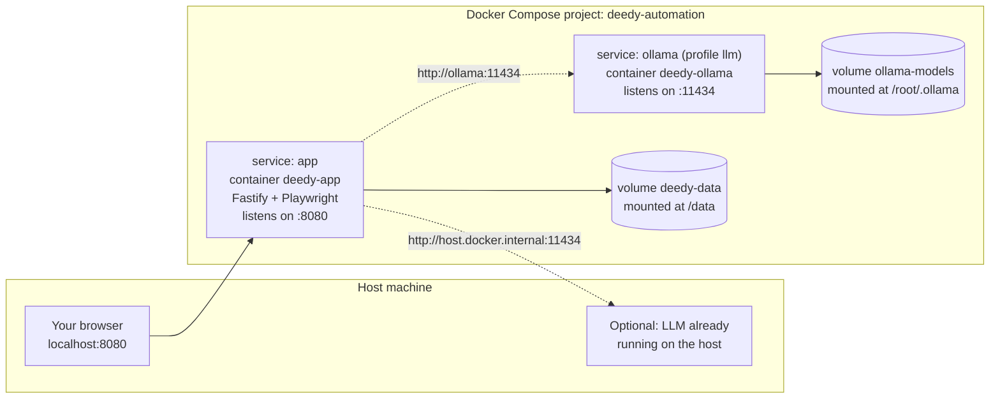
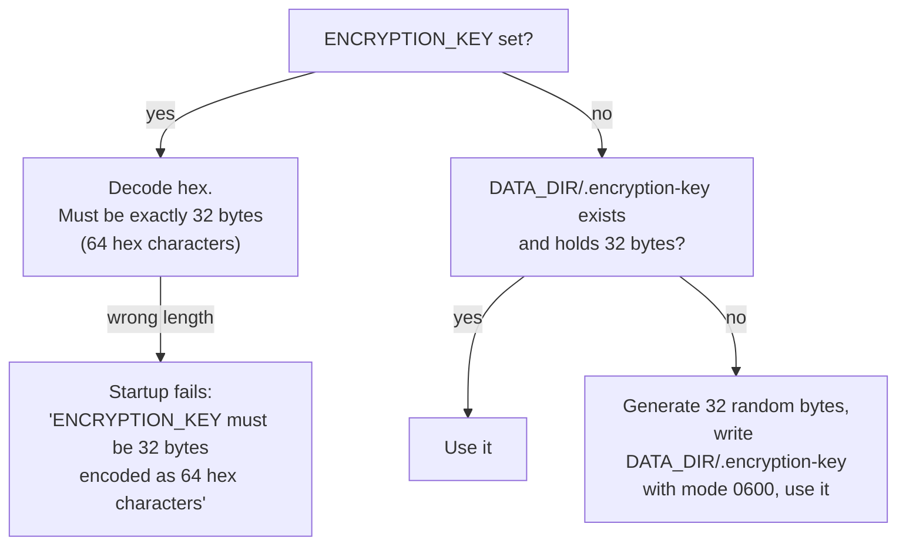

# Installation

Deedy Automation is a fully-local job search and application platform. It runs on one machine,
stores everything in one directory, and talks to nothing except the job boards you configure and
the LLM endpoint you point it at. There is no cloud component, no telemetry and no account.

The supported way to run it is Docker Compose. A bare-metal appendix is included for people who
need it, but it is not supported.

## Table of contents

- [Prerequisites](#prerequisites)
- [What gets installed where](#what-gets-installed-where)
- [Install with Docker (supported)](#install-with-docker-supported)
  - [1. Get the source](#1-get-the-source)
  - [2. Create an `.env` file](#2-create-an-env-file)
  - [3. Build and start](#3-build-and-start)
  - [4. First-run configuration](#4-first-run-configuration)
- [The `ENCRYPTION_KEY` variable](#the-encryption_key-variable)
- [Ports](#ports)
- [Volumes and the data directory](#volumes-and-the-data-directory)
- [Why `shm_size` matters](#why-shm_size-matters)
- [Connecting an LLM](#connecting-an-llm)
  - [Option A: the bundled Ollama profile](#option-a-the-bundled-ollama-profile)
  - [Option B: an LLM already running on the host](#option-b-an-llm-already-running-on-the-host)
  - [Option C: LM Studio, llama.cpp, or any OpenAI-compatible server](#option-c-lm-studio-llamacpp-or-any-openai-compatible-server)
  - [Verifying the connection](#verifying-the-connection)
- [Upgrading](#upgrading)
- [Backups and restore](#backups-and-restore)
- [Troubleshooting](#troubleshooting)
- [Appendix: bare-metal install (unsupported)](#appendix-bare-metal-install-unsupported)
- [Appendix: the development stack](#appendix-the-development-stack)
- [Environment variable reference](#environment-variable-reference)

---

## Prerequisites

Exactly two things, both on the host:

| Requirement    | Minimum                     | Check with               |
| -------------- | --------------------------- | ------------------------ |
| Docker Engine  | 24.x (BuildKit is required) | `docker --version`       |
| Docker Compose | v2 (`docker compose`, not `docker-compose`) | `docker compose version` |

Nothing else is installed on the host. Node.js, npm, SQLite, Chromium, Firefox, the Playwright
browser builds, the XeLaTeX engine used for resumes and the `bubblewrap` sandbox that contains it
all live inside the image.

Rough resource guidance: the image ships both Chromium and Firefox builds plus a TeX subset, so
expect several GB of disk for the image alone, plus whatever your data directory grows to. If you
also run the bundled Ollama profile, model weights land in a separate volume and are usually the
largest thing on disk.

### One Docker setting you should not skip

`docker-compose.yml` sets `security_opt: [seccomp:unconfined, apparmor:unconfined]` on the app
service. That is there so `bubblewrap` can create the user namespace it sandboxes the TeX engine in.

Resumes are LaTeX, the LaTeX is written by a local model (and the compile endpoint takes no
authentication), and TeX is a Turing-complete language — so the pattern check in front of the engine
is a filter, not a security boundary. The namespace is what actually stops a crafted document from
reading your data directory and returning the credential encryption key inside the PDF.

Docker's default seccomp profile blocks the `unshare` call bubblewrap needs. Without those two
lines the container still runs, but on the pattern check alone; the API says so loudly at startup.
If your policy forbids relaxing seccomp, either supply a custom profile permitting `unshare` and
`clone` with the `CLONE_NEW*` flags, or remove the lines and accept the weaker posture knowingly.

### Running on the host instead of in Docker

A bare-metal install needs a few things the image provides for you:

- **A LaTeX engine.** The resume class uses `fontspec`, so it needs XeLaTeX — `pdflatex` cannot
  build it. On Debian/Ubuntu: `apt install texlive-xetex texlive-latex-extra
  texlive-fonts-recommended latexmk`. On Arch: `pacman -S texlive-xetex texlive-latex
  texlive-latexextra texlive-fontsrecommended texlive-binextra`. A `tectonic` binary on `PATH`
  works too. Without any engine the API still runs — the `.tex` is saved and every compile reports
  the engine is missing.
- **`bubblewrap`**, for the reason above.
- **Playwright browsers**: `npx playwright install chromium`. LinkedIn and Indeed drive a real
  browser and fail with a message naming this command when it is absent; the HTTP-only collectors
  (Greenhouse, Lever, Ashby, Workday, …) are unaffected.
- Note that `HOST` defaults to `127.0.0.1` outside Docker. The API is unauthenticated, so widen it
  only deliberately.

## What gets installed where



The `app` container serves both the REST API (under `/api`) and the compiled dashboard (at `/`) on
a single port. There is no separate frontend server in production.

## Install with Docker (supported)

### 1. Get the source

Compose builds the image locally from this repository (`build.context: .`, `target: runtime`).
There is no pre-published image to pull, so you need the source tree:

```bash
git clone <your-repository-url> deedy-automation
cd deedy-automation
```

### 2. Create an `.env` file

`docker-compose.yml` reads a handful of variables from the environment or from an `.env` file next
to it. All of them have defaults except `ENCRYPTION_KEY`, which you should set explicitly.

```bash
cat > .env <<EOF
# Host port the dashboard and API are published on.
APP_PORT=8080

# trace | debug | info | warn | error | fatal
LOG_LEVEL=info

# Only needed if you run the Vite dev server against this API.
CORS_ORIGINS=http://localhost:5173

# 32 bytes of hex. See "The ENCRYPTION_KEY variable" below.
ENCRYPTION_KEY=$(openssl rand -hex 32)

# Host port for the optional bundled Ollama service.
OLLAMA_PORT=11434
EOF
```

`.env` is in `.gitignore`, so it will not be committed.

### 3. Build and start

```bash
docker compose up -d --build
```

The first build compiles the shared contracts package, the API and the dashboard, then installs the
Chromium and Firefox builds that match the pinned Playwright version. It is slow once and fast
afterwards.

Watch it come up:

```bash
docker compose logs -f app
```

The container has a healthcheck that polls `GET /api/health/live` every 30 seconds, with a 25 second
start period. Once `docker compose ps` reports `healthy`, open:

- Dashboard: <http://localhost:8080>
- API reference (Scalar, served locally): <http://localhost:8080/docs>
- Full health report: <http://localhost:8080/api/health>

Database migrations run automatically on every boot, inside a transaction per migration file and
recorded in a `_migrations` table. There is no separate migrate step for Docker installs.

### 4. First-run configuration

Everything else is configured from the dashboard's **Settings** page (or via `PATCH /api/settings`),
not through environment variables. The minimum to make the system useful:

1. **Settings → Local LLM** - provider, base URL and **model**. The model is never hardcoded anywhere in
   the codebase; it defaults to an empty string and you must pick one.
2. **Settings → Candidate profile** - name, contact details, work-authorisation answers. These feed the form
   filler.
3. **Settings → Search** - keywords, locations, and the boards/company slugs per collector.
4. Upload at least one resume from the **Resumes** page.

`browser.dryRun` defaults to `true`: the pipeline prepares applications and stops before clicking
submit. Leave it on until you have watched a few runs end to end.

## The `ENCRYPTION_KEY` variable

Secret settings are encrypted at rest with AES-256-GCM. Today that is the two paths listed in
`SECRET_SETTING_PATHS`:

- `llm.apiKey`
- `notifications.webhookUrl`

The key is resolved on startup in this order:



Generate one with:

```bash
openssl rand -hex 32
```

**If you lose the key**, the two secret settings above can no longer be decrypted. The application
does not crash: it logs `failed to decrypt setting; returning empty value` and returns an empty
string for that setting. Everything else - jobs, applications, resumes, cover letters, logs,
analytics - is stored unencrypted in SQLite and is unaffected. Recovery is simply re-entering the
LLM API key and the notification webhook URL in Settings.

Practical advice:

- Set `ENCRYPTION_KEY` in `.env` and back that file up somewhere safe. It is the one piece of state
  that does not live in the data volume.
- If you leave it unset, the key is auto-generated inside the data volume at
  `/data/.encryption-key`. That is fine, but it means a backup of `deedy.sqlite` alone is not enough
  to restore secrets - back up the key file too.
- Changing the key does not re-encrypt existing values. Change it only when you are prepared to
  re-enter the secrets.

## Ports

| Port    | Service                | Where it comes from                              |
| ------- | ---------------------- | ------------------------------------------------ |
| `8080`  | Dashboard + REST API   | `APP_PORT` maps to the container's fixed `8080`  |
| `11434` | Bundled Ollama (optional) | `OLLAMA_PORT` maps to the container's `11434` |
| `5173`  | Vite dev server        | Development stack only, see the appendix          |

To move the dashboard to another host port, change `APP_PORT` - the port inside the container stays
`8080` because the healthcheck and `EXPOSE` are hardcoded to it:

```bash
APP_PORT=9090 docker compose up -d
```

If you publish the dashboard on a non-default port and also intend to run the Vite dev server
against it, update `CORS_ORIGINS` to match.

## Volumes and the data directory

Two named volumes are declared:

| Volume          | Mounted at       | Contents                                    |
| --------------- | ---------------- | ------------------------------------------- |
| `deedy-data`    | `/data`          | The entire application state                |
| `ollama-models` | `/root/.ollama`  | Model weights, only if the `llm` profile runs |

`DATA_DIR` is `/data` in the image. The layout underneath it is created on startup:

```
/data
├── deedy.sqlite            # SQLite database (WAL mode; .sqlite-wal / .sqlite-shm sit beside it)
├── .encryption-key         # only when ENCRYPTION_KEY is not supplied (mode 0600)
├── artifacts/
│   ├── screenshots/        # per-step screenshots when browser.captureScreenshots is on
│   └── html/               # captured page HTML when browser.captureHtml is on
├── documents/
│   ├── resumes/
│   └── cover-letters/
├── browser-profiles/       # one persistent Playwright profile per provider
├── backups/                # SQLite snapshots, see "Backups and restore"
└── plugins/                # collector plugins picked up by the registry
```

To inspect the volume:

```bash
docker compose exec app ls -la /data
docker volume inspect deedy-automation_deedy-data
```

You can swap the named volume for a host bind mount if you would rather see the files directly. Edit
`docker-compose.yml`:

```yaml
volumes:
  - ./data:/data
```

The container runs as the unprivileged `node` user (UID/GID 1000), so the host directory must be
writable by that UID - see [Troubleshooting](#troubleshooting).

## Why `shm_size` matters

Both compose files set:

```yaml
shm_size: '1gb'
```

Docker gives a container a 64 MB `/dev/shm` by default. Chromium uses shared memory heavily for
renderer and GPU buffers, and on a 64 MB `/dev/shm` it typically dies part-way through a page load
with errors along the lines of "Target closed", "Page crashed" or a bare renderer crash - usually on
the heaviest pages, which for this application means Workday and LinkedIn.

Raising `shm_size` is the fix. The alternative some projects use, `--disable-dev-shm-usage`, is not
passed by the browser manager; the launch arguments for Chromium-family engines are
`--disable-blink-features=AutomationControlled` and `--no-sandbox` only. So do not remove
`shm_size` from the compose file.

## Connecting an LLM

The LLM endpoint is application configuration, not an environment variable. It lives at
`Settings → Local LLM` and is persisted in the database. Supported `provider` values:

| Provider            | Client used            | Wire protocol                                |
| ------------------- | ---------------------- | -------------------------------------------- |
| `ollama`            | native Ollama client   | `POST {baseUrl}/api/chat`, `GET {baseUrl}/api/tags` |
| `openai_compatible` | OpenAI-compatible client | `POST {baseUrl}/v1/chat/completions`, `GET {baseUrl}/v1/models` |
| `llamacpp`          | OpenAI-compatible client | as above                                    |
| `lmstudio`          | OpenAI-compatible client | as above                                    |
| `openrouter_local`  | OpenAI-compatible client | as above                                    |

The OpenAI-compatible client accepts a base URL written with or without the trailing `/v1` - it adds
the suffix only when it is missing.

Structured output is on by default (`llm.useStructuredOutputs`). For `ollama` the JSON Schema is
sent as the `format` field; for OpenAI-compatible servers it is sent as
`response_format: { type: "json_schema", strict: true, ... }`. If your server does not understand
either, turn the toggle off - responses are still validated with Zod after the fact.

### Option A: the bundled Ollama profile

The `ollama` service sits behind a compose profile, so it does not start unless you ask for it:

```bash
docker compose --profile llm up -d
```

Pull a model into the `ollama-models` volume:

```bash
docker compose exec ollama ollama pull <model-name>
docker compose exec ollama ollama list
```

Then in **Settings → Local LLM**:

- Provider: `ollama`
- Base URL: `http://ollama:11434` - container to container, using the compose service name
- Model: the exact tag reported by `ollama list`

Pick a model that fits your hardware and that reliably emits JSON. The context window you configure
in Settings (`llm.contextWindow`, default 16384) should not exceed what the model and your machine
can actually serve; long resume-tailoring prompts are the ones that will hit the limit first.

> Note: the app reaches the Ollama container over the compose network as `http://ollama:11434`.
> `http://localhost:11434` would refer to the app container itself and will not work. The published
> `OLLAMA_PORT` is for reaching Ollama from the host, not for the app.

### Option B: an LLM already running on the host

If Ollama is installed on the host rather than in Compose, do not start the `llm` profile. The `app`
service already declares:

```yaml
extra_hosts:
  - 'host.docker.internal:host-gateway'
```

so the container can reach the host by name on Linux as well as on Docker Desktop. In
**Settings → Local LLM**:

- Provider: `ollama`
- Base URL: `http://host.docker.internal:11434`

Host-side Ollama binds to `127.0.0.1` by default, which the container cannot reach. Make it listen
on all interfaces before testing, for example by setting `OLLAMA_HOST=0.0.0.0:11434` in the
environment of the host service and restarting it.

### Option C: LM Studio, llama.cpp, or any OpenAI-compatible server

Any server that speaks `/v1/chat/completions` and `/v1/models` works. Set the provider to the label
that matches your server (`lmstudio`, `llamacpp`, or the generic `openai_compatible`) and point the
base URL at it:

| Server                    | Typical base URL from inside the container      |
| ------------------------- | ----------------------------------------------- |
| LM Studio (local server)  | `http://host.docker.internal:1234/v1`           |
| `llama-server` (llama.cpp) | `http://host.docker.internal:8081/v1`          |
| vLLM / LocalAI / a local gateway | `http://host.docker.internal:<port>/v1`   |

Two things to watch:

- Bind the server to `0.0.0.0`, not `127.0.0.1`, or the container cannot reach it.
- `llama-server` defaults to port `8080`, which collides with this application's default host port.
  Run it on another port (the table above assumes `8081`) or move `APP_PORT`.

If your local gateway requires a bearer token, put it in `llm.apiKey`. It is sent as
`Authorization: Bearer <token>`, encrypted at rest, and masked when displayed.

### Verifying the connection

From the dashboard, use the test button on **Settings → Local LLM**. From the shell:

```bash
# Reachability probe: { "reachable": true, "model": "...", "error": null }
curl -sX POST http://localhost:8080/api/settings/llm/test

# Models the endpoint advertises
curl -s http://localhost:8080/api/settings/llm/models

# Overall status: "ok" only when the database AND the LLM are both reachable
curl -s http://localhost:8080/api/health
```

`GET /api/health` reports `status: "degraded"` whenever the LLM is unreachable, along with the
underlying error string, the queue depth and the scheduler's next run times.

## Upgrading

```bash
# 1. Snapshot first - the online backup API is safe to call while running.
curl -sX POST http://localhost:8080/api/backups

# 2. Pull the new source.
git pull

# 3. Rebuild and restart.
docker compose up -d --build

# 4. Watch migrations apply on boot.
docker compose logs -f app
```

Notes:

- Migrations are applied automatically at startup, one transaction per file, tracked in
  `_migrations`. Already-applied files are skipped, so restarting is idempotent.
- Your data lives in the `deedy-data` volume, which survives `docker compose down`. Do **not** use
  `docker compose down -v` unless you intend to erase everything.
- Settings live in the database, not in the image, so they survive upgrades untouched.
- `ENCRYPTION_KEY` must stay the same across the upgrade, otherwise the two secret settings will
  read back empty.

To roll back, check out the previous revision and rebuild. If a migration in the newer version
changed the schema, restore the backup you took in step 1.

## Backups and restore

### What the app does on its own

The scheduler registers a `backup` task. It uses SQLite's online backup API, so snapshots are
consistent even while the application keeps writing.

| Setting                            | Default | Meaning                             |
| ---------------------------------- | ------- | ----------------------------------- |
| `scheduler.enabled`                | `true`  | Master switch for all scheduled tasks |
| `scheduler.backupIntervalMinutes`  | `1440`  | How often a backup is taken (daily)  |
| `scheduler.backupsToKeep`          | `14`    | Older snapshots beyond this count are pruned |

Files are written to `DATA_DIR/backups/` as `deedy-<ISO timestamp with : and . replaced by ->.sqlite`,
for example `deedy-2026-07-31T09-15-00-123Z.sqlite`.

### Taking and listing backups manually

```bash
# Take one now -> { "path": "...", "bytes": 1234567, "removed": 0 }
curl -sX POST http://localhost:8080/api/backups

# List what exists -> name, bytes, createdAt
curl -s http://localhost:8080/api/backups

# Or trigger the scheduled task by name
curl -sX POST http://localhost:8080/api/scheduler/backup/run
```

### Copying backups off the volume

```bash
docker compose exec app ls -lh /data/backups
docker cp deedy-app:/data/backups ./backups-$(date +%F)
```

For a full-fidelity copy, also grab `/data/documents`, `/data/artifacts` and, if you did not set
`ENCRYPTION_KEY` yourself, `/data/.encryption-key`.

### Restoring

Restore is a file swap. The database must not be open while you do it.

```bash
# 1. Stop the application.
docker compose stop app

# 2. Swap the file in, using a throwaway helper container mounted on the same volume.
docker run --rm -v deedy-automation_deedy-data:/data -v "$PWD/backups-2026-07-31:/restore" \
  busybox sh -c '
    cp /data/deedy.sqlite /data/deedy.sqlite.pre-restore 2>/dev/null;
    rm -f /data/deedy.sqlite /data/deedy.sqlite-wal /data/deedy.sqlite-shm;
    cp /restore/deedy-2026-07-31T09-15-00-123Z.sqlite /data/deedy.sqlite;
    chown 1000:1000 /data/deedy.sqlite
  '

# 3. Start again.
docker compose start app
docker compose logs -f app
```

Why the `-wal` and `-shm` files are deleted: the database runs in WAL mode, and a stale write-ahead
log next to a freshly restored database file is inconsistent with it. Removing them lets SQLite
start clean. (A clean shutdown checkpoints and truncates the WAL, so they are usually empty anyway -
delete them regardless.)

The restored file already contains its `_migrations` table, so booting a newer build against an older
snapshot simply applies the missing migrations.

If you bind-mounted `./data` instead of using the named volume, step 2 collapses to a plain `cp` on
the host - just keep the ownership right.

## Troubleshooting

### Browser launch failures

Symptoms: applications fail with browser or navigation errors, "Target closed", "Page crashed", or
`browserType.launchPersistentContext` timeouts. Sessions and their errors are visible on the
**Browser Sessions** and **Logs** pages, and via `GET /api/browser-sessions`.

Check, in order:

1. **`shm_size`** - confirm it survived any compose edits:
   `docker compose exec app df -h /dev/shm` should show roughly 1G, not 64M. See
   [Why `shm_size` matters](#why-shm_size-matters).
2. **Browser binaries** - the runtime image installs Chromium and Firefox under
   `/ms-playwright` (`PLAYWRIGHT_BROWSERS_PATH`). Verify with
   `docker compose exec app ls /ms-playwright`. If it is empty, the image was built incorrectly:
   `docker compose build --no-cache app`.
3. **Engine setting** - `browser.engine` accepts `chromium`, `chrome` and `firefox`. `chrome` uses
   the branded Google Chrome channel, which is **not** installed in the image. Inside Docker, use
   `chromium` or `firefox`.
4. **Headless** - `browser.headless` defaults to `true`. Turning it off inside the container gives
   you a browser with no display to draw on. Keep headless enabled in Docker; if you need to sign in
   to a provider interactively, run the bare-metal setup for that one-off login and copy the
   resulting profile, or use a container with a display server of your own.
5. **Memory** - Playwright plus a large local model on the same machine will get one of them killed
   by the OOM reaper. Check `docker compose logs app` for an abrupt exit and the host's kernel log
   for OOM messages.

### LLM unreachable

`GET /api/health` returns `status: "degraded"` and `llm.error` contains the failure. The client
reports one of three shapes: `Could not reach LLM endpoint at <url>: ...`,
`LLM request timed out after <n>ms`, or `LLM endpoint returned <status>: ...`.

| Message                                | Cause                                        | Fix                                                                             |
| -------------------------------------- | -------------------------------------------- | ------------------------------------------------------------------------------- |
| Could not reach ... `localhost`        | `localhost` inside the container is the container | Use `http://ollama:11434` (bundled service) or `http://host.docker.internal:<port>` (host) |
| Could not reach ... `host.docker.internal` | Host server bound to `127.0.0.1`         | Rebind it to `0.0.0.0`; check a host firewall is not blocking the docker bridge  |
| Returned `404`                          | Wrong protocol for the provider              | `ollama` expects `/api/chat`; the others expect `/v1/chat/completions` - fix the provider or the base URL |
| Returned `400` mentioning `response_format` or `format` | Server does not support schema-constrained decoding | Turn off `llm.useStructuredOutputs`                          |
| Timed out                               | Model too large / prompt too long            | Raise `llm.requestTimeoutMs` (default 300000) or use a smaller `llm.fastModel`   |
| Reachable but every task fails          | `llm.model` empty or not pulled              | Set it to a tag returned by `GET /api/settings/llm/models`                       |

Test the endpoint from inside the container to eliminate host-vs-container confusion:

```bash
docker compose exec app curl -s http://ollama:11434/api/tags
docker compose exec app curl -s http://host.docker.internal:11434/api/tags
```

### Port conflicts

`docker compose up` fails with "port is already allocated" or "address already in use".

```bash
# Find the offender
ss -ltnp | grep -E ':(8080|11434)\b'

# Move the app off 8080
APP_PORT=9090 docker compose up -d

# Move the bundled Ollama off 11434
OLLAMA_PORT=11500 docker compose up -d
```

Remember that `llama-server` also defaults to `8080`. Only the host-side port changes; container
ports and the healthcheck stay on `8080`.

### Permissions on the data volume

The container runs as `node` (UID 1000). The Dockerfile `chown`s `/data` at build time, which covers
the named-volume case, but a **host bind mount keeps the host's ownership** and the app will fail at
startup while creating its directories, or later with `SQLITE_CANTOPEN` / `EACCES`.

```bash
# For a bind mount at ./data
sudo chown -R 1000:1000 ./data

# Confirm what the container sees
docker compose exec app id
docker compose exec app ls -la /data
docker compose exec app touch /data/.writetest && docker compose exec app rm /data/.writetest
```

Two other cases worth knowing:

- **SELinux hosts** (Fedora, RHEL): add the `:Z` flag to a bind mount, e.g. `./data:/data:Z`.
- **Rootless Docker**: UID 1000 in the container maps to a subordinate UID on the host, so
  `chown 1000:1000` on the host is wrong. Prefer the named volume there.

### Everything looks up but nothing happens

- The queue may be paused: check `queue.paused` on `GET /api/health`, or
  `curl -sX POST http://localhost:8080/api/settings/queue/pause -H 'content-type: application/json' -d '{"paused":false}'`.
- The scheduler may be disabled: `scheduler.enabled` in Settings; `GET /api/health` lists each task
  and its `nextRunAt`.
- No collectors enabled or no boards configured: `GET /api/collectors` shows what is registered and
  which are enabled. Force one with
  `curl -sX POST http://localhost:8080/api/collectors/<id>/run -H 'content-type: application/json' -d '{"immediate":true}'`.
- `browser.dryRun` is `true` by default, so applications are prepared but never submitted. That is
  the intended default, not a bug.

## Appendix: bare-metal install (unsupported)

> **Unsupported.** This path exists for development and for hosts where Docker is not an option. You
> are responsible for the system libraries Playwright needs, for the toolchain `better-sqlite3` may
> need to compile against, and for process supervision. Use Docker if you can.

Requirements: **Node.js 22 or newer** (`"engines": { "node": ">=22" }`), npm, and a C++ toolchain
(`python3`, `make`, `g++`) in case no `better-sqlite3` prebuild matches your platform.

```bash
git clone <your-repository-url> deedy-automation
cd deedy-automation

# 1. Install the workspace (npm workspaces: packages/*, apps/*).
npm install

# 2. Install browsers and their OS dependencies. Needs sudo for --with-deps.
npx playwright install --with-deps

# 3. Compile shared -> api -> web. The dashboard builds into apps/api/public.
npm run build

# 4. Run it.
DATA_DIR=./data WEB_DIR=apps/api/public PORT=8080 npm start
```

Then open <http://localhost:8080>.

Points to get right:

- `npm start` runs `node apps/api/dist/index.js` from the repository root. `WEB_DIR` defaults to
  `./public`, which is resolved relative to the working directory and will not exist there - set
  `WEB_DIR=apps/api/public` or the dashboard will not be served. The API still works; the server
  logs `dashboard build not found; API only` with the path it tried, and runs API-only.
- `DATA_DIR` defaults to `./data`, which is `.gitignore`d. Everything described in
  [Volumes and the data directory](#volumes-and-the-data-directory) is created underneath it.
- Set `ENCRYPTION_KEY` in the environment, or accept the auto-generated `./data/.encryption-key`.
- Migrations still run automatically on boot. To run them by hand:
  `npm run db:migrate`. To load the default prompt templates and the starter answer bank explicitly:
  `npm run db:seed` (idempotent).
- Headed browsing works here, which makes this the easiest way to do a one-time interactive login to
  a provider: set `browser.headless` to `false`, then
  `curl -sX POST http://localhost:8080/api/browser-sessions/<provider>/open -H 'content-type: application/json' -d '{}'`.
  The persistent profile is written under `DATA_DIR/browser-profiles/`.
- `DISABLE_WORKERS=true` starts the API without the background worker and scheduler, which is useful
  when you want to inspect data without the pipeline running.

## Appendix: the development stack

`docker-compose.dev.yml` bind-mounts the source and runs both servers with hot reload - the API with
`tsx watch` on `:8080`, and Vite on `:5173` proxying `/api` to the API.

```bash
docker compose -f docker-compose.dev.yml up
```

It uses the `deps` build stage, keeps `node_modules` and the Playwright browsers in their own
volumes, and writes to a separate `dev-data` volume, so it will not touch your production data. Do
not use it to run a real instance: it builds nothing ahead of time and runs with `LOG_LEVEL=debug`.

## Environment variable reference

These are the only variables the application itself reads; everything else is in Settings.

| Variable          | Default                 | In the Docker image | Notes                                                             |
| ----------------- | ----------------------- | ------------------- | ----------------------------------------------------------------- |
| `NODE_ENV`        | `production`            | `production`        | `development`, `production` or `test`                              |
| `HOST`            | `0.0.0.0`               | `0.0.0.0`           | Bind address                                                       |
| `PORT`            | `8080`                  | `8080`              | Container port; publish it with `APP_PORT` in Compose              |
| `DATA_DIR`        | `./data`                | `/data`             | Root of all persisted state                                        |
| `LOG_LEVEL`       | `info`                  | from `LOG_LEVEL`    | `trace` \| `debug` \| `info` \| `warn` \| `error` \| `fatal`       |
| `WEB_DIR`         | `./public`              | `/app/apps/api/public` | Compiled dashboard, served at `/`                               |
| `CORS_ORIGINS`    | `http://localhost:5173` | from `CORS_ORIGINS` | Comma-separated; only needed for the split dev server              |
| `DISABLE_WORKERS` | `false`                 | unset               | `true` or `1` starts the API without the worker and scheduler      |
| `ENCRYPTION_KEY`  | auto-generated          | from `ENCRYPTION_KEY` | 64 hex characters; see [above](#the-encryption_key-variable)     |

Compose-only variables, read by `docker-compose.yml` rather than by the application:

| Variable      | Default | Purpose                              |
| ------------- | ------- | ------------------------------------ |
| `APP_PORT`    | `8080`  | Host port for the dashboard and API  |
| `OLLAMA_PORT` | `11434` | Host port for the bundled Ollama     |
