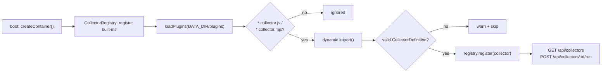
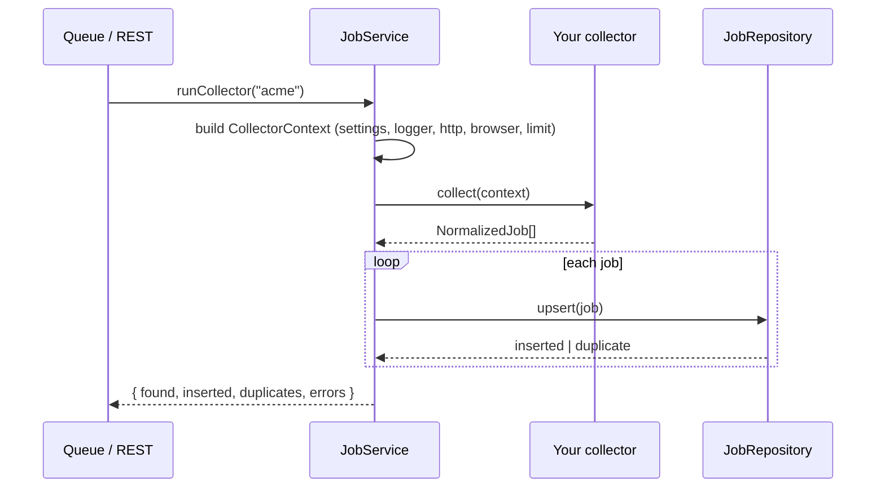

# Plugin Guide: Adding Job Providers

Deedy ships with six built-in collectors (Greenhouse, Lever, Ashby, SmartRecruiters, Workday,
LinkedIn). You can add your own job sources **without touching core code**: drop an ESM module into
`DATA_DIR/plugins` and restart the API.

Everything here runs on your machine. A collector plugin is ordinary JavaScript executed inside the
API process, so it can reach any host you point it at - and nothing else in the platform sends your
data anywhere.

## Table of contents

- [How plugins are discovered](#how-plugins-are-discovered)
- [The CollectorDefinition interface](#the-collectordefinition-interface)
- [The CollectorContext](#the-collectorcontext)
- [Collectors must be pure](#collectors-must-be-pure)
- [The NormalizedJob shape](#the-normalizedjob-shape)
- [Filtering with the user's search settings](#filtering-with-the-users-search-settings)
- [Complete example plugin](#complete-example-plugin)
- [Configuring boards for a custom source](#configuring-boards-for-a-custom-source)
- [Testing a plugin](#testing-a-plugin)
- [Troubleshooting](#troubleshooting)
- [Adding an applier for a new ATS](#adding-an-applier-for-a-new-ats)

---

## How plugins are discovered

`loadConfig()` (`apps/api/src/config/env.ts`) creates `DATA_DIR/plugins` on every boot, where
`DATA_DIR` defaults to `./data` and is `/data` in the Docker image. During container construction
(`apps/api/src/core/container.ts`) the registry scans that directory once:

```ts
const collectors = new CollectorRegistry(logger.child('collectors'));
const loadedPlugins = await collectors.loadPlugins(config.paths.plugins);
```

Rules enforced by `CollectorRegistry.loadPlugins` (`apps/api/src/collectors/registry.ts`):

| Rule | Detail |
| --- | --- |
| File name | Must end in `.collector.js` or `.collector.mjs`. Anything else in the directory is ignored. |
| Module format | ESM, loaded with a dynamic `import()` of the file URL. Use `export default`, not `module.exports`. |
| Export | `export default collector`, `export default [collectorA, collectorB]`, or a named `export const collectors = [...]` (the named `collectors` export wins when both are present). |
| Validation | Each candidate must have string `id`, `name`, `source` and a `collect` function, or it is skipped with a `plugin export is not a valid collector` warning. |
| Failure mode | A module that throws on import is logged (`failed to load collector plugin`) and skipped. It never stops the server. |
| Reload | Discovery happens once at boot. **Restart the API after adding or editing a plugin.** |
| Overwrite | Registering an `id` that already exists logs `collector id already registered; overwriting` and replaces it - which is how you override a built-in. |

Plugins are registered with `builtIn: false`, so the UI and `GET /api/collectors` can tell them
apart from shipped collectors.



### Where to put the file

```
$DATA_DIR/
  plugins/
    acme-board.collector.mjs
  deedy.sqlite
  artifacts/
  documents/
  browser-profiles/
  backups/
```

With the default `DATA_DIR=./data`, that is `./data/plugins/acme-board.collector.mjs`. With Docker
it is `/data/plugins/...` inside the bind mount you already map for the database.

---

## The CollectorDefinition interface

From `apps/api/src/collectors/types.ts`:

```ts
export interface CollectorDefinition {
  readonly id: string;
  readonly name: string;
  readonly source: string;
  readonly description: string;
  readonly requiresAuth: boolean;
  readonly requiresBoards: boolean;
  readonly builtIn?: boolean;
  collect(context: CollectorContext): Promise<NormalizedJob[]>;
}
```

| Field | Required by the loader | What it does |
| --- | --- | --- |
| `id` | yes | Registry key. Used in the URL `POST /api/collectors/:collectorId/run`, in `search.enabledCollectors`, and as the `collectorId` on every row in the collector-run history. Keep it stable, lowercase, no spaces. |
| `name` | yes | Human label. `registry.all()` sorts collectors by `name`, so this is the display order in Settings. |
| `source` | yes | The provenance tag. It is copied onto every job you return (`NormalizedJob.source`), it is the key looked up in `settings.search.boards[source]` when `requiresBoards` is true, and `ApplierRegistry.resolve()` falls back to matching an applier whose `provider` equals this value. |
| `description` | practically yes | Shown in the Settings → Collectors list and returned by `GET /api/collectors`. The DTO types it as a plain string, so omit it only if you enjoy `undefined` in your UI. Say what the collector reads and what the user must configure. |
| `requiresAuth` | practically yes | Declares that the collector needs a logged-in persistent browser profile (like the LinkedIn collector). Informational: it is surfaced in the UI so the user knows to sign in from Browser Sessions. It does not gate execution. |
| `requiresBoards` | practically yes | **Behavioural.** When `true` and the user has not set an explicit collector allowlist, `CollectorRegistry.enabled()` runs this collector only if `settings.search.boards[source]` is a non-empty array. Set `false` for a keyword-driven source that needs no per-company configuration. |
| `builtIn` | no | Set by the platform, not by you. The loader forces `builtIn: false` on plugins regardless of what you export. |
| `collect` | yes | The one method that matters. Returns the jobs found in this run. |

`id` and `source` are usually the same string, but they do not have to be: several collectors could
share one `source` (and therefore one applier and one boards list) while having distinct `id`s.

### Which collectors actually run

`CollectorRegistry.enabled(enabledIds, boards)` decides:

1. If `settings.search.enabledCollectors` is non-empty, exactly those ids run (unknown ids are
   silently dropped). Your plugin must be listed there by `id`.
2. Otherwise every registered collector runs, except those with `requiresBoards: true` and no
   entries under `settings.search.boards[source]`.

---

## The CollectorContext

```ts
export interface CollectorContext {
  settings: Settings;
  logger: Logger;
  http: HttpClient;
  browser: BrowserManager;
  limit: number;
  signal?: AbortSignal;
}
```

**`settings`** - the full, decrypted `Settings` object (`packages/shared/src/settings.ts`). The parts
a collector normally reads live under `settings.search`:

| Setting | Type | Typical use |
| --- | --- | --- |
| `search.keywords` | `string[]` | Query terms. Also used by `matchesSearchFilters` as an OR-match over title + location + description. |
| `search.excludedKeywords` | `string[]` | Hard reject. |
| `search.locations` | `string[]` | Location filter; the literal value `remote` matches anywhere the word "remote" appears. |
| `search.excludedCompanies` | `string[]` | Case-insensitive exact company match, rejected. |
| `search.postedWithinDays` | `number` (1-365) | Age cutoff, applied only when the posting has a `postedAt`. |
| `search.boards` | `Record<string, string[]>` | Per-source company slugs. Read `settings.search.boards[yourSource]`. |
| `search.maxJobsPerCollectorRun` | `number` (1-2000) | Already handed to you as `context.limit`; do not re-read it. |

`search.remotePreference`, `employmentTypes`, `experienceLevels`, `minSalary`, `maxSalary` and
`currency` are **not** applied by `matchesSearchFilters`. They are used later, for scoring and for
the apply pipeline. A collector may consult them to build a smarter query, but it is not expected to
enforce them.

**`logger`** - a scoped `Logger` (`trace|debug|info|warn|error|fatal`, each taking
`(message, context?)`). It writes to stdout, persists to the database and streams to the dashboard's
log view. Any context key that looks like a credential (`token`, `password`, `secret`,
`authorization`, `cookie`, `api_key`, …) is automatically replaced with `[REDACTED]`. Log a warning
and return `[]` when configuration is missing - that is the convention every built-in follows.

**`http`** - the shared fetch wrapper (`createHttpClient()`), with a 30s timeout, two retries on 5xx
and network errors, and browser-like default headers:

```ts
interface HttpClient {
  getJson<T>(url: string, init?: RequestInit): Promise<T>;
  getText(url: string, init?: RequestInit): Promise<string>;
  postJson<T>(url: string, body: unknown, init?: RequestInit): Promise<T>;
}
```

Non-2xx responses under 500 throw immediately; a persistent 5xx throws after the retries are
exhausted. The thrown value is an `HttpError` carrying `status` and `url`. Prefer `context.http`
over bare `fetch` so your plugin inherits the timeout, retry and header behaviour.

**`browser`** - a lazily-started `BrowserManager`. HTTP-only collectors never touch it and Playwright
is never launched on their behalf. If you do need a real browser, `await context.browser.newPage(provider)`
returns a Playwright `Page` bound to the persistent profile for `provider`, and
`await context.browser.saveStorageState(provider)` persists cookies after a login. Close what you
open; the LinkedIn collector uses `try { … } finally { await page.close(); }`.

**`limit`** - a hard cap on how many jobs to return this run, taken from
`settings.search.maxJobsPerCollectorRun`. Check `results.length >= context.limit` in your loops and
stop. Returning more is not fatal, but it wastes enrichment work downstream.

**`signal`** - an optional `AbortSignal` for cooperative cancellation. Today neither the queue handler
nor the REST route supplies one, so treat it as advisory: check `context.signal?.aborted` in long
loops and pass it through to `context.http` calls via `init.signal` if you want to be future-proof.

---

## Collectors must be pure

A collector **fetches and normalizes. It never writes to the database.**

De-duplication and persistence belong to the caller. `JobService.runCollector()`
(`apps/api/src/services/job.service.ts`) takes the array you return and, for each entry, calls
`JobRepository.upsert()`, which:

- canonicalizes `applicationUrl`,
- computes a stable content hash over `source + company + title + location`,
- skips the row if either the hash or the canonical URL already exists (unique indexes make this
  safe against a concurrent writer),
- creates or links the company record,
- emits a `job.collected` event and counts `found` / `inserted` / `duplicates` / `errors` into the
  collector-run history.

Consequences for you:

- **Do not filter out jobs because you think you have seen them before.** Return everything that
  matches the user's search settings; duplicates are cheap and are reported honestly in the run
  summary.
- **Do not open the SQLite file, and do not import repositories or services.** A plugin that writes
  rows itself bypasses hashing, company linking, events and the run counters.
- **Do not cache to disk.** If you need per-run state, keep it in local variables.
- **Throwing is allowed.** An exception marks the run `failed` with your message. Prefer catching
  per-board errors, logging them, and continuing - that is what the Greenhouse collector does, so one
  dead board does not lose the other twenty.



---

## The NormalizedJob shape

From `apps/api/src/repositories/job.repository.ts`:

```ts
export interface NormalizedJob {
  source: string;
  externalId?: string | null;
  title: string;
  company: string;
  location?: string | null;
  remoteType?: string;
  employmentType?: string;
  experienceLevel?: string;
  salaryMin?: number | null;
  salaryMax?: number | null;
  salaryCurrency?: string | null;
  salaryPeriod?: string | null;
  description?: string | null;
  descriptionHtml?: string | null;
  skills?: string[];
  applicationUrl: string;
  postedAt?: string | null;
  raw?: unknown;
}
```

Only four fields are required: `source`, `title`, `company`, `applicationUrl`.

**The ones that really matter**

- `applicationUrl` - the page the applier will navigate to. It is canonicalized and used for
  de-duplication, so give the stable public posting URL, not a search-result link with tracking
  parameters. Getting this wrong is the only way to make the apply pipeline unusable.
- `company` - used for the content hash, for company linking, and for the `excludedCompanies` filter.
  Resolve the real display name if the API gives you one; falling back to the slug is acceptable
  (Greenhouse does exactly that) but produces uglier data.
- `title` - hashed, scored, and matched against keywords.
- `source` - must equal your definition's `source`. It selects the applier fallback and drives the
  source breakdown in analytics. Note that `JOB_SOURCES` in `packages/shared/src/enums.ts` lists the
  built-ins, but the database column and the job DTO are plain strings, so a custom source value is
  stored and served correctly.
- `description` - plain text. Everything downstream (scoring, skill extraction, resume tailoring,
  salary inference) reads this. Strip HTML before assigning; keep the original markup in
  `descriptionHtml` if you have it.
- `postedAt` - ISO 8601 string. Required for the `postedWithinDays` filter to do anything; when it is
  `null` the job is never rejected on age.

**Nice to have**

- `externalId` - the provider's own id. Stored for traceability; it is not part of the dedupe key.
- `location` - part of the hash and of the location filter. `null` is fine for a genuinely
  location-less posting.
- `remoteType`, `employmentType`, `experienceLevel` - default to `'unknown'` when omitted. Valid
  values come from `packages/shared/src/enums.ts`: `remote|hybrid|onsite|unknown`,
  `full_time|part_time|contract|internship|temporary|unknown`,
  `intern|entry|mid|senior|staff|principal|executive|unknown`.
- `salaryMin` / `salaryMax` / `salaryCurrency` / `salaryPeriod` - numbers, an ISO currency code, and
  one of `hour|day|month|year`. Leave them `null` if you are guessing; the LLM salary-extraction task
  is the fallback.
- `skills` - a string array, if the provider hands you one. Otherwise enrichment fills it in.
- `raw` - the untouched provider payload, stored as JSON for debugging. Cheap and worth including.

---

## Filtering with the user's search settings

The built-in collectors share helpers in `apps/api/src/collectors/normalize.ts`:
`searchFilters(settings)`, `matchesSearchFilters(job, filters)`, `detectRemoteType`,
`detectEmploymentType`, `detectExperienceLevel`, `parseSalary`, `toIsoDate` and
`decodeHtmlEntities`.

Those are TypeScript modules compiled to `apps/api/dist/collectors/normalize.js`. A plugin *can*
import them:

```js
import { matchesSearchFilters, searchFilters } from '../../apps/api/dist/collectors/normalize.js';
```

but that path depends on where the API is installed (it is `/app/apps/api/dist/...` in the Docker
image), and it couples your plugin to internals that are not a published API. **The recommended
approach is a self-contained plugin** that implements the handful of checks it needs, as the example
below does. Then the file works unchanged on a dev checkout, in Docker, and after an upgrade.

At minimum, honour: `excludedKeywords`, `excludedCompanies`, `keywords` (OR-match), `locations` and
`postedWithinDays`. Skipping them means the user's Settings page silently lies about what is being
collected.

---

## Complete example plugin

A hypothetical public JSON board at `https://jobs.example.com`, with two endpoints:

```
GET /api/v1/boards/<slug>            -> { "name": "Acme Corp" }
GET /api/v1/boards/<slug>/postings   -> { "postings": [ … ] }
```

Save as `$DATA_DIR/plugins/acme-board.collector.mjs`. It is plain JavaScript - no build step, no
dependencies, no network access beyond the host you configure.

```js
// Acme Board collector. Reads a public JSON job board and normalizes its
// postings. Configure company slugs under settings.search.boards.acme.

const API_ROOT = 'https://jobs.example.com/api/v1';
const SOURCE = 'acme';
const DAY_MS = 86400000;

/** Everything this collector filters on, pulled out of the user's settings. */
function readFilters(settings) {
  return {
    keywords: settings.search.keywords,
    excludedKeywords: settings.search.excludedKeywords,
    locations: settings.search.locations,
    excludedCompanies: settings.search.excludedCompanies,
    postedWithinDays: settings.search.postedWithinDays,
  };
}

function matches(job, filters) {
  const haystack = `${job.title} ${job.location ?? ''} ${job.description ?? ''}`.toLowerCase();

  if (filters.excludedKeywords.some((word) => haystack.includes(word.toLowerCase()))) return false;
  if (filters.excludedCompanies.some((name) => job.company.toLowerCase() === name.toLowerCase())) {
    return false;
  }
  if (filters.keywords.length > 0 && !filters.keywords.some((w) => haystack.includes(w.toLowerCase()))) {
    return false;
  }
  if (filters.locations.length > 0) {
    const location = (job.location ?? '').toLowerCase();
    const hit = filters.locations.some((loc) => {
      const needle = loc.toLowerCase();
      return needle === 'remote' ? haystack.includes('remote') : location.includes(needle);
    });
    if (!hit) return false;
  }
  if (job.postedAt) {
    const posted = new Date(job.postedAt).getTime();
    if (Number.isFinite(posted) && posted < Date.now() - filters.postedWithinDays * DAY_MS) {
      return false;
    }
  }
  return true;
}

function stripHtml(html) {
  return html
    .replace(/<script[\s\S]*?<\/script>/gi, ' ')
    .replace(/<style[\s\S]*?<\/style>/gi, ' ')
    .replace(/<[^>]+>/g, ' ')
    .replace(/&nbsp;/g, ' ')
    .replace(/&amp;/g, '&')
    .replace(/&lt;/g, '<')
    .replace(/&gt;/g, '>')
    .replace(/\s+/g, ' ')
    .trim();
}

function toIsoDate(value) {
  if (value === null || value === undefined || value === '') return null;
  const date = new Date(value);
  return Number.isNaN(date.getTime()) ? null : date.toISOString();
}

function remoteType(text) {
  if (/\b(fully[- ]?remote|100% remote|work from home)\b/i.test(text)) return 'remote';
  if (/\bhybrid\b/i.test(text)) return 'hybrid';
  if (/\b(on[- ]?site|onsite|in[- ]?office)\b/i.test(text)) return 'onsite';
  if (/\bremote\b/i.test(text)) return 'remote';
  return 'unknown';
}

function experienceLevel(title) {
  if (/\bintern(ship)?\b/i.test(title)) return 'intern';
  if (/\b(head of|vp|chief)\b/i.test(title)) return 'executive';
  if (/\bprincipal\b/i.test(title)) return 'principal';
  if (/\bstaff\b/i.test(title)) return 'staff';
  if (/\b(senior|sr\.?|lead)\b/i.test(title)) return 'senior';
  if (/\b(junior|jr\.?|graduate|entry[- ]?level)\b/i.test(title)) return 'entry';
  return 'unknown';
}

/** The board returns "Remote - US" or "Berlin, DE"; both collapse to a string. */
function locationOf(posting) {
  if (typeof posting.location === 'string') return posting.location;
  return posting.location?.name ?? null;
}

async function resolveCompanyName(context, slug) {
  try {
    const board = await context.http.getJson(`${API_ROOT}/boards/${encodeURIComponent(slug)}`);
    return board.name?.trim() || slug;
  } catch {
    return slug; // A missing board name is not worth failing the run over.
  }
}

const acmeCollector = {
  id: 'acme',
  name: 'Acme Board',
  source: SOURCE,
  description:
    'Reads public Acme job boards. Add company slugs to settings.search.boards.acme, e.g. "acme-corp".',
  requiresAuth: false,
  requiresBoards: true,

  async collect(context) {
    const slugs = context.settings.search.boards[SOURCE] ?? [];
    if (slugs.length === 0) {
      context.logger.warn('acme collector has no boards configured');
      return [];
    }

    const filters = readFilters(context.settings);
    const results = [];

    for (const raw of slugs) {
      if (results.length >= context.limit) break;
      if (context.signal?.aborted) break;

      const slug = raw.trim();
      if (!slug) continue;

      try {
        const company = await resolveCompanyName(context, slug);
        const payload = await context.http.getJson(
          `${API_ROOT}/boards/${encodeURIComponent(slug)}/postings`,
        );

        for (const posting of payload.postings ?? []) {
          if (results.length >= context.limit) break;

          const html = typeof posting.descriptionHtml === 'string' ? posting.descriptionHtml : null;
          const description = html ? stripHtml(html) : (posting.description ?? null);
          const location = locationOf(posting);
          const postedAt = toIsoDate(posting.published_at ?? posting.updated_at ?? null);
          const candidate = { title: posting.title, company, location, description, postedAt };

          if (!matches(candidate, filters)) continue;

          results.push({
            source: SOURCE,
            externalId: String(posting.id),
            title: posting.title,
            company,
            location,
            remoteType: remoteType(`${posting.title} ${location ?? ''} ${description ?? ''}`),
            employmentType: /\bcontract\b/i.test(posting.employment_type ?? '')
              ? 'contract'
              : 'full_time',
            experienceLevel: experienceLevel(posting.title),
            salaryMin: typeof posting.salary_min === 'number' ? posting.salary_min : null,
            salaryMax: typeof posting.salary_max === 'number' ? posting.salary_max : null,
            salaryCurrency: posting.salary_currency ?? null,
            salaryPeriod: posting.salary_min ? 'year' : null,
            description,
            descriptionHtml: html,
            applicationUrl: posting.apply_url ?? `https://jobs.example.com/${slug}/${posting.id}`,
            postedAt,
            raw: posting,
          });
        }
      } catch (error) {
        // One bad board must not lose the jobs from the others.
        context.logger.error('acme board failed', {
          board: slug,
          error: error instanceof Error ? error.message : String(error),
        });
      }
    }

    return results;
  },
};

export default acmeCollector;
```

Restart the API, then confirm it loaded:

```bash
curl -s http://localhost:8080/api/collectors | grep -o '"id":"acme"'
```

Run it once, synchronously, and read the summary:

```bash
curl -s -X POST http://localhost:8080/api/collectors/acme/run \
  -H 'content-type: application/json' \
  -d '{"immediate":true}'
# -> {"queueJobId":null,"summary":{"collectorId":"acme","found":42,"inserted":40,"duplicates":2,"errors":0,"message":null}}
```

Omit `"immediate":true` to enqueue it on the background worker instead; you then get a
`queueJobId` and `"summary": null`, and the outcome shows up under `GET /api/collectors/runs`.

---

## Configuring boards for a custom source

The Settings → Search → Boards UI renders a fixed list of the built-in sources, so a custom source
key has no input field there yet. Set it through the settings API - the patch is deep-merged, so
sending only `search.boards` leaves everything else untouched:

```bash
curl -s -X PATCH http://localhost:8080/api/settings \
  -H 'content-type: application/json' \
  -d '{"search":{"boards":{"acme":["acme-corp","acme-labs"]}}}'
```

If you also want an explicit allowlist rather than "everything that is configured", include your id:

```bash
curl -s -X PATCH http://localhost:8080/api/settings \
  -H 'content-type: application/json' \
  -d '{"search":{"enabledCollectors":["greenhouse","acme"]}}'
```

Remember that a non-empty `enabledCollectors` disables every collector not in the list.

---

## Testing a plugin

**1. Unit-test the pure parts.** The repo runs Vitest (`npm test`, which is `vitest run` in
`apps/api`; specs live in `apps/api/tests/**/*.test.ts`). Because a plugin is an ESM module with a
default export, a test can import it directly and call `collect()` with a hand-built context - no
database, no server, no network if you stub `http`:

```ts
// apps/api/tests/unit/acme.collector.test.ts
import { describe, expect, it, vi } from 'vitest';
import { DEFAULT_SETTINGS } from '@deedy/shared';
import type { CollectorContext, HttpClient } from '../../src/collectors/types.js';
import acmeCollector from '../../../../data/plugins/acme-board.collector.mjs';

const silentLogger = {
  trace: vi.fn(), debug: vi.fn(), info: vi.fn(), warn: vi.fn(), error: vi.fn(), fatal: vi.fn(),
  child: () => silentLogger,
  scope: 'test',
};

function contextWith(responses: Record<string, unknown>): CollectorContext {
  const http: HttpClient = {
    getJson: async <T>(url: string) => responses[url] as T,
    getText: async () => '',
    postJson: async <T>() => ({}) as T,
  };
  return {
    settings: {
      ...DEFAULT_SETTINGS,
      search: { ...DEFAULT_SETTINGS.search, boards: { acme: ['acme-corp'] } },
    },
    logger: silentLogger,
    http,
    browser: {} as CollectorContext['browser'],
    limit: 50,
  };
}

describe('acme collector', () => {
  it('normalizes a posting and respects the limit', async () => {
    const jobs = await acmeCollector.collect(
      contextWith({
        'https://jobs.example.com/api/v1/boards/acme-corp': { name: 'Acme Corp' },
        'https://jobs.example.com/api/v1/boards/acme-corp/postings': {
          postings: [
            {
              id: 7,
              title: 'Senior Platform Engineer',
              location: 'Remote - EU',
              descriptionHtml: '<p>Fully remote role.</p>',
              apply_url: 'https://jobs.example.com/acme-corp/7',
              published_at: new Date().toISOString(),
            },
          ],
        },
      }),
    );

    expect(jobs).toHaveLength(1);
    expect(jobs[0]).toMatchObject({
      source: 'acme',
      company: 'Acme Corp',
      remoteType: 'remote',
      experienceLevel: 'senior',
      applicationUrl: 'https://jobs.example.com/acme-corp/7',
    });
  });
});
```

Run it with `npm test -w @deedy/api`. Because a stubbed `http` never leaves the machine, this test is
fast and offline. Note that the `browser` cast above is only safe for HTTP-only collectors - a
collector that calls `context.browser` needs a real `BrowserManager` or a fuller stub.

**2. Smoke-test against the live board.** Point `DATA_DIR` at a throwaway directory so you cannot
pollute your real database, start the API, and run the collector immediately:

```bash
DATA_DIR=./tmp-plugin-test npm run dev -w @deedy/api
# in another shell
curl -s -X PATCH http://localhost:8080/api/settings -H 'content-type: application/json' \
  -d '{"search":{"boards":{"acme":["acme-corp"]},"maxJobsPerCollectorRun":5}}'
curl -s -X POST http://localhost:8080/api/collectors/acme/run -H 'content-type: application/json' \
  -d '{"immediate":true}'
curl -s 'http://localhost:8080/api/jobs?source=acme&pageSize=5'
```

Copy the plugin into `./tmp-plugin-test/plugins/` first; the directory is created on the first boot.

**3. Check what was actually stored.** `GET /api/collectors/runs` shows the per-run
`found/inserted/duplicates/errors` history, and the dashboard's log stream carries every line your
collector logged. A run with `found > 0` and `inserted === 0` usually means your `applicationUrl` or
`company`/`title`/`location` combination is colliding with jobs already in the database.

---

## Troubleshooting

| Symptom | Cause |
| --- | --- |
| Plugin missing from `GET /api/collectors` | File name does not end in `.collector.js`/`.collector.mjs`, or the API was not restarted. |
| Log line `plugin export is not a valid collector` | Missing `id`, `name`, `source`, or `collect` is not a function. Also happens with `module.exports` (CommonJS) instead of `export default`. |
| Log line `failed to load collector plugin` | The module threw at import time - usually a bad import specifier. The `error` field carries the message. |
| Registered but never runs | `requiresBoards: true` with nothing under `settings.search.boards[source]`, or a non-empty `search.enabledCollectors` that omits your id. |
| `found` climbs, `inserted` stays 0 | Everything is being de-duplicated. Check that `applicationUrl` is per-posting and stable. |
| Jobs collected but the applier does nothing | No applier matches the URL and none has `provider === source`. See the next section. |

---

## Adding an applier for a new ATS

Collectors find jobs; **appliers** submit them. An applier is an `ApplierDefinition`
(`apps/api/src/browser/appliers/types.ts`):

```ts
export interface ApplierDefinition {
  readonly id: string;
  readonly provider: string;
  readonly name: string;
  matches(url: string): boolean;
  apply(context: ApplyContext): Promise<ApplyOutcome>;
}
```

You rarely implement `apply` by hand. Two factories in `apps/api/src/browser/appliers` cover the
common ATS shapes, and both handle consent banners, field scanning, answer resolution through the
answer bank and the LLM, per-step screenshots and dry-run mode for you.

**`createFormApplier(config)`** - single-page forms (Greenhouse, Lever, Ashby, SmartRecruiters):

| Key | Type | Meaning |
| --- | --- | --- |
| `id` | `string` | Unique applier id. |
| `provider` | `string` | Matched against a job's `source` when no URL pattern hits. |
| `name` | `string` | Display name. |
| `hostPatterns` | `RegExp[]` | `matches(url)` is true when any pattern tests true. |
| `applyButtons` | `string[]` | Playwright selectors that reveal the form when it is not already on screen. |
| `submitButtons` | `string[]` | Selectors for the final submit control. |
| `confirmationPatterns` | `RegExp[]` | Matched against the post-submit page text to prove success. |
| `coverLetterSelectors` | `string[]` (optional) | The free-text cover-letter area, when the ATS has one. |

**`createWizardApplier(config)`** - multi-page wizards (Workday, LinkedIn Easy Apply). Same keys,
minus `coverLetterSelectors`, plus:

| Key | Type | Meaning |
| --- | --- | --- |
| `nextButtons` | `string[]` | Selectors that advance one page. |
| `maxPages` | `number` | Safety stop; the built-ins use `8`. Each page transition is recorded as its own step so a crash is diagnosable. |

Example:

```ts
import { createFormApplier } from '../browser/appliers/form.applier.js';

export const acmeApplier = createFormApplier({
  id: 'acme',
  provider: 'acme',
  name: 'Acme Board',
  hostPatterns: [/jobs\.example\.com/i],
  applyButtons: ['a:has-text("Apply")', 'button:has-text("Apply now")'],
  submitButtons: ['button:has-text("Submit application")', 'button[type="submit"]'],
  confirmationPatterns: [/thanks for applying/i, /application received/i],
  coverLetterSelectors: ['textarea[name*="cover" i]'],
});
```

Register it on the container's `ApplierRegistry`:

```ts
const appliers = new ApplierRegistry(logger.child('appliers'));
appliers.register(acmeApplier);
```

`register()` **unshifts**, so a later registration wins over a built-in with overlapping patterns.
`resolve(url, source)` prefers the first applier whose `matches(url)` returns true, and otherwise
falls back to the first whose `provider` equals the job's `source` - which is why keeping your
collector's `source` and your applier's `provider` identical is worth doing.

> **Caveat:** unlike collectors, appliers have **no plugin directory**. `ApplierRegistry` exposes
> `register()`, `all()` and `resolve()`, but nothing scans `DATA_DIR/plugins` for them, so adding an
> ATS driver today means editing `apps/api/src/core/container.ts` (or
> `apps/api/src/browser/appliers/index.ts`) and rebuilding. Collectors are the part of the system
> that is genuinely extensible without touching core code.

Before pointing a new applier at a real posting, keep `browser.dryRun` enabled in Settings. In dry
run the pipeline does everything except the final submit click, which is exactly what you want while
you are guessing at selectors.
